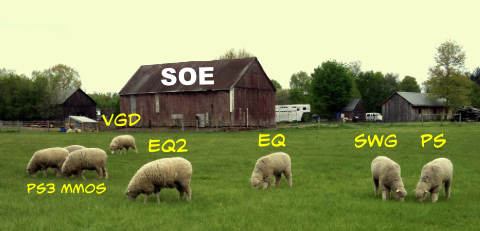
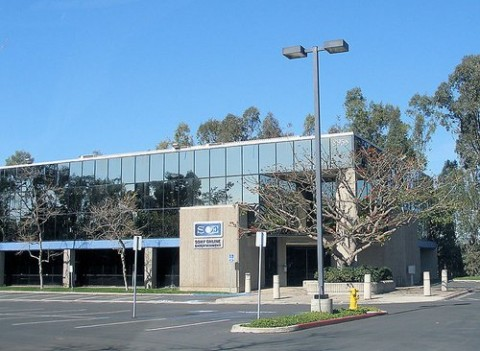

Back to: [West Karana](/posts/westkarana.md) > [2011](/posts/2011/westkarana.md) > [May](./westkarana.md)
# Semi-Annual Blogroll: Sheep may safely graze edition

*Posted by Tipa on 2011-05-12 06:26:31*

[caption id="attachment\_6362" align="aligncenter" width="480" caption="The SOE sheep live in danger"][/caption]

I work a full day in the office, then strap my laptop to my back, pedal home and work a full night as well. It's called crunch time, this is the third month of it, and work people pay me to do is taking priority over writing which nobody pays me anything to do. If I were working on a game, I could excitedly drop hints about it, but the only way you'll see what I'm writing is if you need to be bonded. Or you happened to be a bond agent. BUT! If you ARE, well, we've got something pretty amazing for you this summer :)

On the plus side, that picture is part of my commute. One of the bennies about biking to work is that it's more acceptable to just stop by the side of the road, outside someone's house, and start taking pictures. If someone popped out of a CAR and started snapping shots, well, people would stare.

**The Great Sony Hack of 2011**

Big news these last couple of months has been the hack attack upon Sony's PlayStation Network as well as Sony Online Entertainment's customer data servers. This was a crime, perpetrated upon Sony and SOE by criminals, and they have essentially turned my PS3 into a brick, made them the object of a million rants and they are costing themselves and their partners thousands of dollars each minute the service is unavailable. It's just a tragedy.

I feel Sony, though, is drawing this out needlessly. Sony has the best engineers in the world. I can't believe that they couldn't have saved their forensic data and plugged whatever security holes were used to break in in more than a couple of days. I don't think anyone on the outside has any idea why Sony has floated May 31st as a "go live" date. I just don't know.

But I worry. I worry about SOE and their games. SOE just recently had some pretty massive layoffs. After a strong start, their latest MMO, DC Universe Online, tanked on the PC. That can't be good with such an expensive IP. Now that game is looking at a month and a half of nobody being able to play it. PC players have already abandoned it, and PS3 players will be playing some other game. So, DCUO is likely dead now. Vanguard's handful of players can't be expected to stick around, so that game is dead. SWG only had until SWTOR came out to live, anyway; ironically, pre-NGE SWG might have been different enough from SWTOR to co-exist. Anyway, SWG - dead. 

Free Realms -- unknown. I played it for awhile, but the constant money grubbing turned me off. I think kids will be happy to return to it after a delay, where adults might find something better to do. Plus, it had only barely launched on the PS3, so it's ripe for a relaunch. Clone Wars Adventures - minigame portals like CWA can survive global thermonuclear war. They are the cockroaches of gaming.

Anyone who plays EQ is there because of all the games available to them, EQ is the one they want. It will survive. EQ2... and its F2P cousin, EQ2X... will survive, but look for massive server mergers; perhaps EQ2 will finally fold into EQ2X.

For the games in development, Planetside Next and EverQuest Next... I can't imagine SOE will have enough revenue to continue serious work on these games. They have to focus on rebuilding their money properties right now. I feel SOE's best hope is to separate from Sony, lose the mandate to put their MMOs on the PS3, and focus their efforts on a couple of really high performing games. I think it's long past time for SOE to become Verant once again.

**Skype is Microsoft's new MMO!**

The US Navy, via a program at the Naval Postgraduate School which I have totally visited (yay Monterey!), is soon to launch an online, collaborative brainstorming tool called [MMOWGLI](http://mmowgli.nps.edu/mmowgli), which stands for "I Bet I Can Come Up With A Silly Acronym, Leveraging the Internet". Anyway, "players" will be presented with some real world scenarios and will be able to collaborate with others on possible solutions using a graphical tool. Which is great; all the armchair admirals will finally be able to make their voices heard. Someone at work, when I mentioned this, said in response to the initial scenario of dealing with the Somali pirates that are harassing shipping off the coast of Africa, "shoot them all". That could be an option!

I think it's a great idea. I just hate that the term "MMO", which we've come to use as shorthand for MMORPG - massively multiplayer online role playing game - being applied to any online activity involving more than two people. And what I hate more is the professional gaming press jumping on that same bandwagon, [when they should really know better](http://massively.joystiq.com/2011/05/11/u-s-navy-fights-piracy-with-mmos/).

The worst are those places which try and explain that MMOs are games like WoW, [except for this one](http://techland.time.com/2011/05/11/warcraft-for-real-u-s-navy-launching-mmo-game-to-help-catch-pirates/). Kudos to that writer for also trying to compare it to a MUD, which it isn't.

[caption id="attachment\_6365" align="aligncenter" width="480" caption="My old WoW guild"][/caption]

**WoW loses half a million players, attributes it to a rounding error**

So, news comes that [WoW has lost a small percentage of their user-base](http://www.pcgamer.com/2011/05/09/world-of-warcraft-subscriptions-decline-slightly-to-11-4-million-worldwide-new-premium-mount-soon/), a marginal number of players that would total more than the active base of any other subscription MMO in the world.

Upshot is, their two year expansion cycle just isn't working for them any more. People chew through all the new content in a few months (if that), and then drift off to other games, like Rift.

All these years, Blizzard has told us that this is how long it takes to come up with an expansion's worth of quality content. It can't be rushed, hurried or scheduled. It's done when it's done. But, now Blizz feels it actually could churn the stuff out a lot faster than that if it wanted to. It's vowed to push Diablo 3 out the door sometime this year, instead of somewhere in this decade, their previous estimate. There's a new sense of urgency coming out of Irvine, and I feel it's long overdue. World of Warcraft IS the elder game now, and it has to move fast to keep relevant.

It's not about the money -- they have record profits, and if they ever feel they need more cash, they can add some more mounts to the cash shop and make an achievement for buying them all. For Blizzard, it's about remaining the game that people think of when they think "MMO".

**We Heart Lucent Heart!**

Masively Multiplayer dating sim Lucent Heart's [latest North American beta](http://www.lucentheart.com/news.aspx?nid=57), "B.F.F.", starts today. So here's your chance to find your best guy or girl online, team up and kick some bully butt. I can't say enough about this game. Everyone should play it. WoW-killer.

A fan who won a contest [will be cosplaying at E3](http://www.lucentheart.com/events/E3_2011_5_3/default.html). So if you're there, get a picture taken with her. Remember, if you're lucky enough, you too could someday grow up to be a booth babe. It can happen!

**Argh, so soon?**

Time to hit the road and go to work. I miss blogging :(

## Comments!

**[pasmith](http://dragonchasers.com)** writes: It's a funny old world. I had to get a dog so I could take a walk in the woods without being seem as a potential creep. You gotta ride a bike in order to take lovely pics of a herd of sheep!

One nit to pick: the May 31st date seems to be a misunderstanding of sorts. 
http://venturebeat.com/2011/05/09/bad-information-spreading-on-playstation-networks-return-date-nothing-new-folks/

There's actually been a LOT of bad journalism around this mess; like all the "running unpatched servers with no firewall" stories you saw came from one badly reported piece at The Consumerist and is almost certainly untrue.

Also, FWIW my PS3 works fine, as long as I don't want to buy new downloadable content. I don't do mp though; if I did I'd do it on an Xbox.

None of which negates your main point: that this is a disaster which at this point is seeming more and more self-inflicted. It's crazy that they're still down. The only thing I can imagine is that they're scared to death of what a 2nd attack would do as far as culpability and more billion dollar class-action lawsuits.

---

**[Pid](http://themeatshield.wordpress.com)** writes: I do find it rather odd that the parking lot at SOE is empty...you would think there would be a random somebody around.

---

**[wilhelm2451](http://tagn.wordpress.com/)** writes: SOE is like the MMO world soap opera. Some days you hate them, some days you love them, and some days you just don't know what to think. I just want the damn games back, but I fear that there will a price to pay down the road. Becoming Verant again would be good, but I fear things will go the other way and they'll get the gun to the head from SCEA to make only PS3 titles and dump anything that isn't making good money.

Hope you get through the crunch time okay!

---

**[Callan S.](http://philosophergamer.blogspot.com/)** writes: *For Blizzard, it’s about remaining the game that people think of when they think “MMO”.*

Towards what purpose?

Or is it just, like, religious?

---

**[Sony&#8217;s shattered crystal ball &laquo; Bio Break](http://biobreak.wordpress.com/2011/05/12/sonys-shattered-crystal-ball/)** writes: [...] strong doubt that SOE can even pull out of this at all, and even if it does, it will be hobbled.  To quote Tipa: “But I worry. I worry about SOE and their games. SOE just recently had some pretty massive [...]

---

**[Tipa](https://chasingdings.com)** writes: They have to remain the market leader in order to safely launch their next MMO, Titan. If they are seen to slip, they will have a much harder time of it. All WoW is at this point is a way to keep the cash register dinging while the build the new game.

---

**[Tipa](https://chasingdings.com)** writes: @Pid - that's just a picture I got off the web. I don't know if that was taken recently; probably wasn't.

---

**[Callan S.](http://philosophergamer.blogspot.com/)** writes: And the purpose behind launching another mmo, if it's not about money?

---

**bhagpuss** writes: SoE becoming Verant again would be like a dream come true...

Except, as I'm sure you remember, when they *were* Verant, that name attracted even more derision and vituperation than SoE.

As for EQ2Next/Planetside Next, I wonder if it wouldn't make more financial sense to close the existing games and just concentrate on those two?

---

**yunk** writes: Biking to work is pretty awesome, isn't it? I love it much more than the 1.5 hour commute I had at my last job. Plus, no dealing with traffic or annoying people, or not nearly as much. It's almost like time to myself, especially if I take a path instead of streets.

---

**[Tipa](https://chasingdings.com)** writes: I have to use streets, but at least if I leave early enough, they can be NICE streets. Past week I've been biking in the rain, yesterday was awful, too. So I just go the most direct -- and busiest -- route.

---

