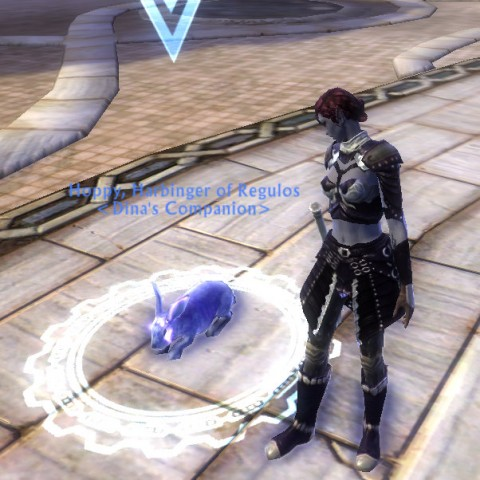

Back to: [West Karana](/posts/westkarana.md) > [2011](/posts/2011/westkarana.md) > [May](./westkarana.md)
# What if Rift was modeled after EverQuest?

*Posted by Tipa on 2011-05-24 07:09:13*

[caption id="attachment\_6373" align="aligncenter" width="480" caption="The awe-inspiring Harbinger of Regulos"][/caption]

If you took all the bullet-point features of Rift and compared them against all the bullet-point features of World of Warcraft as it was before its first expansion -- Rift comes out fairly well. The appearance armor and dye systems which lets my rogue look like I want her to look STILL haven't made it to WoW. And the rift system itself is a real game-changer, and there still seems to be plenty of room to experiment when building a role from souls.

But, I have my vanity pets. There's the mount collecting. There's the warfronts I'm grinding for PvP gear because I can't queue for T2 expert dungeons for reasons unknown to me. There's grinding dailies in high level zones in order to build some faction whose only purpose is to let me buy better stuff. Crafting is the usual AFK system. Macros simplify combat and healing. If add-on support is added on, we can expect Rift to instantly become just as agonizingly simple as WoW, not that either game is all that challenging to begin with.

I have no problem with that. MMOs are really intended to be social games first, and since you can't ship an MMO these days that doesn't cater to solo players of all abilities, challenge had to be left out of the equation.

[caption id="attachment\_6374" align="aligncenter" width="480" caption="Lord Soptyvr in the Beholder Maze"][/caption]

This last weekend I took a nostalgia trip, in EverQuest, from Qeynos to Freeport, walking the entire way. I wasn't level five like the FIRST time I did the run, back in 1999. I brought my level 58 shadow knight along for the trip. It was a fun romp, took a couple of hours (stopping to see all the sights along the way), and I even died once, in Kithicor, because I just didn't expect anything to be able to harm me. I was wrong, so very, very wrong. In keeping with the theme, and being bound in the Nexus, I took the Nexus portal down to Antonica and retraced my steps for a corpse run. This time I kept to Kithicor's edges.

Look, I was just wondering if the dark elf camp in the middle of the zone would like my character, since she was ALSO a dark elf and a shadow knight besides? Short answer: No. They chased me back to Rivervale and I apparently died while zoning into the city.

While documenting this journey on Twitter, [Justin Sanchez](http://twitter.com/#1/js_resetglitch) and I were discussing how Rift failed in capturing the EverQuest feel. EQ had meaningful faction, unique starting cities for every race (Erudites had two -- Paineel and Erudin!), and starting experiences that soaked you in the lore of your particular race before you would ever come to meet someone of another race. The starting zones were built to naturally guide you up through level ten or so, but after that, the whole world opened up. Pick a direction and see what you could find. The first thing you would want to find would be friends.

Rift has taken enough from WoW. If it plans to be inspired further by another MMO, it should turn back to EQ.

Factions. The two faction system is particularly artificial. I know the lore -- the pantheon of the Vigil brings back Guardian players, while the technomagic of the Defiants resurrects Defiant players. But both sides have the same roles and abilities and armor and everything else; it's an entirely artificial distinction, especially considering the game lore states that both sides were equally at fault in bringing about the current state of the world, and if the sides sat down and worked things out, they could probably get an understanding, resolve their differences and, you know, save the world.

Properly, players should be able to switch sides or even join a neutral side. EverQuest allowed this through factioning (on the non-race based PvP servers, anyway). EverQuest 2 even has a formal system for betraying your faction, including the addition of a neutral faction AND a neutral faction city. Well, more of a hideout.

Cities. On the heels of objections to the two party system comes amazement that there are only two major cities, Sanctum and Meridian. This could (and hopefully, will) be solved in expansions. Even WoW only started with four cities, Orgrimmar, Undercity, Stormwind and Ironforge. EverQuest, started with how many? Felwithe, Kelethin, Ak'Anon, Kaladim, Freeport, Neriak, Oggok, Grobb, Rivervale, Erudin, Qeynos, Surefall Glade, Halas -- I feel I am missing some. To those were added Shar'vahl, Crescent Reach, Cabilis, Thurgadin, Kael, Skyshrine, Plane of Knowledge, Katta Castellum, Sanctum Seru, Shadow Haven, and I know I am missing some. Does the castle in Twilight Sea count? The Outpost at Firiona Vie and the matching one in The Overthere. You could even bank and do some other business in Runnyeye if you built up your goblin faction.

It was these wide-ranging cities that gave the world of Norrath much of its charm. You'd leave your racial home, and the beasts would get more dangerous, the world a little darker. Eventually your cheery mood would turn to caution and terror -- and then after a long time, the monsters would get manageable, and you knew you were coming back to civilized lands. If the locals liked you, you could have a new home for awhile -- and if they didn't, you could decide to start helping them and earn admittance and their grudging respect.

Rift's world is torn apart by the intersection of the planes. There are no truly safe places. But as players push back against the darkness, couldn't more cities be uncovered from newly recovered lands? Rift is enough like WoW already. It needs to open up and become a world, with meaningful factions, and varied starting experiences.

## Comments!

**[Jason](http://weblog.probablynot.com)** writes: I wish they would, but unfortunately I imagine they'll maintain where they are, or further chase WoW.

---

**Evrett** writes: Lack of cities, culture and a living world was my #1 reason in my beta review that I thought Rift wouldn't succeed. Does my charecter just fight rifts 24/7 or does he visit a bar once in a while, maybe father a few soulless bastards along the way. Is there anything out there personally worth fighting for or do we go back to being dead after we win? Do these two cities exist as a staging front for the Riftwars or is there commerce and factions and farming and culture etc etc.

---

**[pkudude99](http://nomadicgamer.com)** writes: I don't know that I'd wish them to copy EQ as much as I wish they'd lift a few more features from EQ2 -- not the least of which is that on the PvE servers I should be able to at least /friend my friends who chose to be Guardians so I can know when they're playing and swap to my Guardian toon to play with them.

---

**[ChickGeek](http://chickgeekgames.blogspot.com)** writes: If to speak about an MMO to which Rift should turn for inspiration, my vote totally goes to Vanguard. I don't know if you ever played it, and i never played any of EQ series, but from what you say i imagine both these games being of the same spirit. Vanguard has unique starting sities for every race (and even different starting continents), it has meaningful factions (you're actually choosing a city to pledge your allegiance) and the most meaningful crafting system i ever saw (heard it was head to head with old Star Wars crafting system). 
RIFT crafting is a meaningless "check!" in the list of "features that everyone has, so we should add them too". I see no purpose for it, and looks like not me alone - when playing LOTRO you can make a fortune off Auction house by selling crafting components, but as far as i've seen almost no one wants to buy them in Rift, and no one ever needs the resulting items (at least, not my health/mana potions). So i stopped crafting at all. Of course it would be naive to expect Trion to implement something as complex as Vanguard crafting system, but if they'd at least looked at Vanguard and Everquest crafting systems for inspiration, that would be really great.

---

**[Wilhelm Arcturus](http://tagn.wordpress.com/)** writes: The problem with EQ certainly was not a lack of cities, but perhaps too many over time. The place grew huge and swallowed up the player population. Eventually the PoK became the central hub while the tutorial kept you out of your starter city and people rarely went to the places where we started off 12 years back. Now they are tourist destinations, side trips to the local ruins on anything but the progression servers.

More is better to a point I guess. EQ2 failed on that point with only 2 cities at launch with generic feeling racial subdivisions in each that managed to fail to both at making you feel like you were in a big city and like you were in some special place just for your race.

I will take your failure to mention Thunder Bluff and Darnassus in WoW as proof that you can have too many cities. Almost everybody migrated to the four you mentioned (I remember that night elf right of passage, the level 5 run across the Wetlands), which became the population foci, while the those two were always a bit on the empty side.

---

**[Wilhelm Arcturus](http://tagn.wordpress.com/)** writes: And I should not write comments while on a conference call. You can spot every point where I had to speak up as my sentences change direction.

---

**[Arieltalia](http://www.poesies.com)** writes: I agree completely, even though I never played EQ. :P I was busy playing UO, and there was no way in heck I was going to leave that free open system for a level-based one at that time.

But I know exactly what you mean, since after UO I moved to Asheron's Call and then Dark Age of Camelot. Rift's gameplay is sooooo shallow, and that's why I've gone back to LoTRO even though I've always found the combat engine to be a bit too sluggish for me.

I'll take immersion over gameplay any day of the week. Y'know, I'm even thinking WoW had more immersion than Rift when it released. I think part of it is that Rift's world is just too small (among a great many other things).

---

**[Tipa](https://chasingdings.com)** writes: ChickGeek: Yes, I played Vanguard. It ran poorly on my system so I never really gave it a chance. Vanguard WAS a lot like EverQuest, and it even had the quest hubs and so on. A lot of my friends really enjoyed and still enjoy the game, but I guess even after I got a system that could run it, it just seemed more like work than fun to me. Something people probably could say about EverQuest.

Rift's crafting isn't its best feature. The only things that people really want are the very highest end items from recipes you get in dungeons or with very high faction that require very rare components. Most people are masters of at least one item-producing class. 

I would really like to see some of Vanguard's features brought to Rift -- the Diplomacy feature would fit in nicely.

---

**[Tipa](https://chasingdings.com)** writes: Wilhelm: I have no idea how I forgot the night elf and tauren starting cities. I had characters that started in both of them. Sigh. LotRO is another MMO that provides a decent selection of starting experiences. Rift really needs more options.

---

**[Tipa](https://chasingdings.com)** writes: Arieltalia: World size, at least, is something Trion is undoubtedly working on right this second. But if they choose to only provide more high level content and NOT a new starting experience and perhaps race or faction in an expansion, then I will be very disappointed. They desperately need to fill out their world.

---

**bhagpuss** writes: I'm hardly going to argue with the wish that any MMO should be more like Everquest. EQ remains my favorite MMO and others are largely rated by how much they feel like it, which is why Vanguard is my second-favorite and EQ2 my third.

I disagree, however, that Rift is that far behind. Telara is a much more interesting and detailed world than people seem willing to notice, just as Rift's quests have much more to them than popular opinion would have you believe. Just today, for example, I was in Scarlet Gorge, a zone I have done end to end several times both as a Guardian and a Defiant. I would have said I'd seen every part of that zone, but I'd have been wrong. I found a new area, in a place I'd been before, just by the chance that I had to stop and rest and I happened to look up.

That kind of experience has been happening to me in Rift since Beta 1. It's why I believe Rift is the best MMO for explorer types since Vanguard.

I'd also contend with the oft-made claim that Telara only has two cities. It only has two settlements with banks and Auction Houses, that's true. That, however, is a very good thing in my opinion, and was done entirely deliberately to avoid issues other MMOs have had with the high-level population disappearing off to their own enclaves. 

Neither Meridian nor Sanctum is a city, anyway. They are both bolt-holes to which the beleaguered nations have retreated after the real cities have been lost. It's no wonder they are small - Sanctum is just a monastery, for heaven's sake. I'd say the largest settlement we have access to is Fortune's Shore, a lovely port city. Lantern's Hook is also a proper settlement.

Your main points stand, though. I like Rift a lot now, but I'd certainly like it even more if Trion followed all your suggestions.

---

**Justin** writes: Great post that highlights one of my primary concerns with Rift. I've had a bit of an off and on relationship with it since launch, and I'm actually enjoying it quite a bit at the moment, but it's not without some major concerns.

While it may be true that EverQuest cities could be viewed as tourist attractions at this point Wilhelm, I don't think that's necessarily a bad thing nor a telling sign that you've grown your world to large. EQ is some 12 years in so naturally the starting cities are less integral to the experience, and certainly the newly (ok, old now) implemented starting experience did nothing to help that.

But we're so many years out it's to be expected. That they're even considered something to go visit and see speaks volumes for how well implemented they are. Places like Oggok, Kelethin, Surefall, Qeynos, they all served to flesh out the world and provide a heritage for the races of Norrath. They're worth a visit, if only to take in the uniqueness of each race's locales. In its current state, Rift doesn't have that.

There are little villages sprinkled throughout the world, but how many of them truly are more than a few houses tossed together with some random NPCs?

That's one area where Rift slips up in my eyes; its ability to draw me into the world and make me feel a part of Telara just doesn't seem to be there. Were I able to stumble into Hammerknell (it's getting a raid instance, of course) and see the dwarves at work in their city, or the true culture of the Bahmi, it'd go a long way into fleshing out the world.

I'm not a roleplayer, never have been and I never will, but I do put a lot of weight into MMOs creating a believable world.

And from a raw gameplay perspective, having more than two starting experiences helps replay value tenfold.

Rift is great fun, even if it doesn't entirely lineup with what I look for in an MMO. I only hope the folks at Trion pull some drastic measures via an expansion to make it a world worth adventuring and exploring, rather than plugging away to 50.

---

