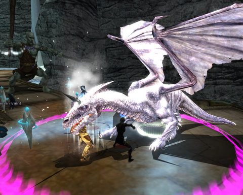

Back to: [West Karana](/posts/westkarana.md) > [2011](/posts/2011/westkarana.md) > [November](./westkarana.md)
# DDO: Rakshasa, Dragons and Many Many Minos.

*Posted by Tipa on 2011-11-09 06:33:12*

[caption id="attachment\_9818" align="aligncenter" width="480" caption="Dragon in the Tor"][/caption]

Modern MMOs have trained me to believe that no matter what class I play, I'll be able to solo anything without trouble. That's the compact MMO devs make with their players. So my natural tendency is to just pick a target and wade on in.

You just can't do that in DDO. You have to know your place, and my place is in the back. This means that sometimes stuff dies before I can get to it, or I have to take out my bow and snipe stuff from the periphery. I just can't take aggro. But sometimes my role means I get to take the lead.

[The Rakshasa Lair](http://ddowiki.com/page/A_Cry_for_Help) was one such; I got to be in the lead. I've been amping up my sneaking skills so I can take on the scouting role more often -- in particular, boosting my "Move Silently" speed so I don't hold the rest of the group back.

Gleek pointed out [in his recap](http://happyduelingddo.blogspot.com/2011/11/rakshasa-claw-rakshasa-claw.html) that we finally got a Rakshasa that was in a shape other than tigerman. But.... he transformed into tigerman once we uncovered him, so there's that.

Though favored soul Ulan was away this week, we decided to take what we'd learned in Gianthold Tor last week and see how far we'd get. We got through to the Gatekeeper quickly, and we managed to summon him using hirelings and me hiding in a corner. My work on sneaking paid off; I was able to survive and sneak out of the room once the Gatekeeper got summoned, but I was toying with death once I joined the fight and two rooms of giant skeletons came along.

We did manage to defeat the Gatekeeper and open the endless killing ramps up to the dragon area. The trick is to kill the dragon and the giant companion within some seconds of each other. The dragon and the giant companion killed us and our hirelings within seconds of each other. So the straight up tanking isn't going to work -- not at our level, anyway. The lair is suspiciously laid out as raised paths in a circle... perfect for kiting next time.

The dragons can drop scales for some pretty significant armor, but you need 25 scales for the armor, and Spode remarked that you need relics to repair it.

[caption id="attachment\_9819" align="aligncenter" width="480" caption="DDO: Battlefield 3 mod"][/caption]

I haven't been playing a lot of games on my vacation, but I went back and played a bit today. I went through my quest log and found a line out of Lordsmarch Plaza, the home of the Coin Lords. The three quests here involve a conspiracy among the monsters of the area. A local medusa boss is making common cause with some monster invaders and a minotaur city and eventually turning things back on the invaders and their medusa ally.

I'm level 14, these were level 12 quests. I got a cleric from the hireling merchant and a fighter and a wizard from the DDO store. Since I was still in the offline group with Gleek and Spode, I passed on a fourth hireling that would have forced me to leave the group. Always a chance one of them would log on and want to join in, after all.

The first quest, [Diplomatic Impunity](http://ddowiki.com/page/Diplomatic_Impunity), was a simple scouting mission. Some ambassadors from a monster country have landed to open up diplomatic discussions with the leaders of Stormreach, but they have been dawdling up on the coast and they need somebody to check it out. Simple fights against monkeymen, panthers and scorpions had me thinking I could have saved my money on the Gold Seal hirelings. I got to the coast and saw an army debarking from troop transports. There were siege engines and more monsters than I could count. I reported back (negotiating my way into passage through a monkeyman village for an optional objective) and was asked to talk things over with the commander of the invading force to delay things while the locals got word to Stormreach about the invasion. I fought my way into the encampment, and tried to draw out negotiations as much as I could, but eventually things turned bad and we all died. I returned and drew the mobs out of the trap-filled audience chamber and killed them without too much trouble.

I went in after and disarmed the traps, but it was too late to get the ingenuity bonus. I don't remember spotting them before everything went aggro... or I would have disarmed them. First I heard of them was when the commander admitted he was going to cheat with the traps.

[caption id="attachment\_9820" align="aligncenter" width="480" caption="Oops"][/caption]

Next up was [Frame Work](http://ddowiki.com/page/Frame_Work). This one took HOURS. The medusa is IN THE CITY and she is rousing up the minos against the good guys. We were going to convince the minos to doubt her overtures by petrifying some random minos in the town. Then we assassinate the mino chief. And done! That's it! Only need to stone one mino and kill another!That's technically possible, perhaps. You can optionally repair some broken ballistas into "spy insertion devices" that will fling you into the city, saving having to fight in.So I was doing the stealth thing, with my hireling parked far away, and was doing pretty well until I was seen. After that, it was just the killing. And the killing. And the more killing. And the still more killing. You keep getting achievements for killing more and more stuff. Toward the end the hirelings got split up and died, and it was back to stealth mode as I gathered up the soulstones and rezzed them at a shrine outside the city.When I got back to the NPC at the start of the instance and told her what I'd done, she was stunned. I was supposed to frame the medusa and take out the chief, not kill every living creature in the city. You get an extra chest for being a cold-blooded killer.

By the time I finally finished and got the optional objectives, my hirelings had all expired so I opted not to finish out the quest series. It's supposed to be simple -- supposed to be -- but I'm dubious.

**Google+:** [View post on Google+](https://plus.google.com/108460561201888322767/posts/EesRQ1sNd1r)
## Comments!

**[Brian 'Psychochild' Green](http://psychochild.org/)** writes: I'm pretty sure they removed the relic requirement for repairing dragonscale armor. You should be able to repair it normally. That was changed a few updates previous.

I haven't gotten enough scales to make any armor, so I can't personally verify it.

---

**[Scott Pease](https://plus.google.com/102035998059408314577)** writes: That is a fun chain, one of the best......I keep going back to play now and then (20 DE FvS and 20 Halfling Sorc)

---

**[Brenda Holloway](https://plus.google.com/108460561201888322767)** writes: Yeah, Frame Work was pretty hilarious and I had fun sneaking through the city. I kept having to kite to get the chief away from the boss-level healer, that's what eventually killed my hirelings.

---

**[Tipa](https://chasingdings.com)** writes: I'd hope so, since the requirements to get the armor in the first place are so insane to begin with. The scales on the auction are going for 100,000 plat and up each.

---

**[Brenda Holloway](https://plus.google.com/108460561201888322767)** writes: This was an experiment. I wrote this post here on Google+ and then imported it back to my blog; this should let comments here and comments directly on my blog work together. I think.

---

**[Gleek](http://happyduelingddo.blogspot.com)** writes: Attack on Stormreach is great, Tipa! One week while you were out, I bought a pass for Spode and had the gang help me finish up the last quest in that series: http://happyduelingddo.blogspot.com/2011/06/attack-on-stormreach-and-house-k-favor.html

Since that time, I finished my epic weapon from Attack on Stormreach: http://happyduelingddo.blogspot.com/2011/06/forging-masters-transmuter-staff.html

. . . And now I farm the first three bosses of that instance for lootz. :)

---

**[Tipa](https://chasingdings.com)** writes: @Gleek -- I'm not sure this is the same quest line. The ones I am doing are from a free module, though maybe the next quest requires buying an Attack on Stormreach adventure pack. The quests so far don't need anything special.

---

**[Michael Birke](https://plus.google.com/103687334769264813247)** writes: I just wondered if the "Draigoch" fight in LOTRO would be something for you! :) (it's a Dragon XXL, just like a Pizza or Burger XXL)

---

**[Brenda Holloway](https://plus.google.com/108460561201888322767)** writes: I do like the dragon killing. I think that is at the very heart of my love for MMOs. Something primal. Once there were dragons and early humans killed them all, leaving humanity searching for a completion it can never have.

---

**Eladrin** writes: In Update 11 we removed all of the horribly painful requirements for repairing dragonscale armor. You can fix them anywhere now. We also reduced the number of scales you need a little bit from 25 to 20.

---

**[Tipa](https://chasingdings.com)** writes: @Eladrin -- thanks for the heads up! I REALLY want that Black Dragonscale armor!! I just need to convince the guys to farm the Tor for a few weeks. Also we need to be able to clear the Tor :P

---

**Eladrin** writes: If you end up one or two short, Sinvala from Mired in Kobolds also has a small chance to drop black dragonscales. The chance is higher in the Tor, though, so you might be happier hunting them there.

Happy dracoslaughter!

---

