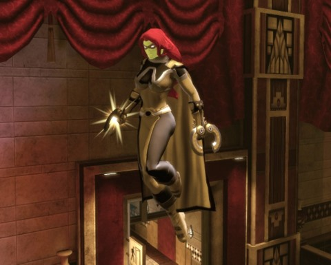
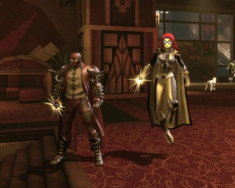
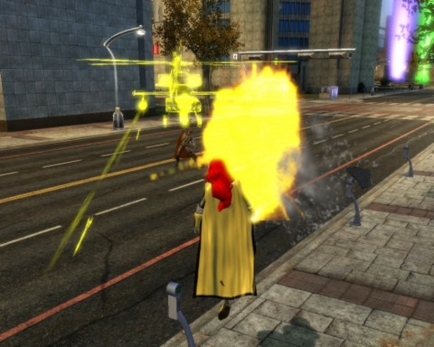

Back to: [West Karana](/posts/westkarana.md) > [2011](/posts/2011/westkarana.md) > [November](./westkarana.md)
# DCUO: It's a hard light

*Posted by Tipa on 2011-11-11 01:21:45*

[caption id="attachment\_9850" align="aligncenter" width="480" caption="Tipara, member of the Sinestro Corps"][/caption]

Okay, so in SOE's DC Universe Online, people are getting random superpowers by being infected with some superpower thing cooked up by Brainiac. You wake up one morning, you have superpowers. Maybe you have to escape from Brainiac's space ship, but whatever.

With DCUO's Lords of Light (or whatever) expansion pack, you can have Green Lantern or Sinestro's powers. Including a power ring. Note power ring on my character below.

Soooooo where'd the power ring come from? 

I played DCUO in beta. I even pre-ordered it and put down a $5 deposit on it, but after working my way through the first quest line, I was so bored I never bought the game, that $5 was just wasted.

It's free now, though, and people I know are playing it, so I told Steam to send it to me while I was off taking pictures of bridges in the rain today (yay!). It was finished downloading by the time I got home. I started it up and immediately got a message from +[Eric Redman](https://plus.google.com/113866940190428695218) asking if I'd be interested in creating an evil, Sinestro-type character and joining his guild.

Well, duh. Being a Green Lantern is the only thing I ever wanted from DCUO, and was a key reason in my disappointment in beta. The Sinestro Corps is just like the Green Lantern Corps, just yellower.

[caption id="attachment\_9849" align="aligncenter" width="480" caption="Tipara and more eviler friend"][/caption]

As a Station Pass subscriber, I even got the Phosphorescent Photons (whatever) expansion free, so I made my character with Sinestro as my mentor (which gave me all his powers and, apparently, his ring, which I imagine he'll miss in a bit), popped into the tutorial mission and kicked butt.

Later on, Lex Luthor stopped by and helped me kick butt. All along I was being shepherded around by a mysterious person who was interested in getting me off the ship for no apparent reason.

I met up with Eric's character. He modeled super outfits for me and shot me with a gunship. You know, he's a bad guy, he does stuff like that.

He helped me out with a small project to corrupt local university students by forcing them into Occupy Metropolis movements, and then infecting them with mutagens. Bwahahaha. That eventually got us joined up with the supervillain Parasite to capture Power Girl and force her to put on some clothing. And steal some of her DNA.

She's the cousin of Superman in this game. I thought Supergirl was Superman's cousin?

[caption id="attachment\_9848" align="aligncenter" width="480" caption="I love the smell of napalm in the morning"][/caption]

Is DCUO suddenly interesting because it is F2P? Well, it was always part of the Station Pass, so I'd never be paying anything additional to play the game. The controller/combo-based gameplay is something I find tiring if forced to do it very long. The game seems designed to be a pick-up-and-play game. Can DCUO be fun for thirty minutes a day?

Maybe.

Will I still be playing it in two weeks?

That's the real question.

## Comments!

**[Tramell Hawkins](https://plus.google.com/103889260268554354920)** writes: I enjoyed it when I played the beta but I couldn't see myself paying 15 bucks for access at the time, I know it's gone F2P with very limiting options but I played it as a single player game guess I can still do the same with a bronze account

---

**[bhagpuss](http://bhagpuss.blogspot.com/)** writes: Even in real life it's possible to have more than one cousin!

I loved DCUO while I played it, which was every day for about six weeks. Once I stopped I rarely thought of it again, though. The best part by far is just roaming around the fantastically detailed cities, taking screenshots and fighting with villains (or heroes) as and when your paths cross.

It's the only MMO I've played where I would unhesitatingly recommend anyone to play on a PvP rather than a PvE server. PvE play does become repetitive and pretty silly too, given that heroes and villains spend most of their time trying to help or hinder the very same NPCs while studiously ignoring each other.

And what is about the Green Lantern thing? I never understood the appeal. I always found them a dull bunch with ill-defined and pretty uninteresting powers. They're no Legion of Super Heroes, that's for sure!

---

**[Callan S.](http://philosophergamer.blogspot.com/)** writes: *He helped me out with a small project to corrupt local university students by forcing them into Occupy Metropolis movements*

lolwut?

I really wonder if I'm living through a shift towards conservative values. Or I'll join the bandwagon: Darn those people who don't realise land is owned rather than just stood on!

---

**[Straw Fellow](http://strawfellow.blogspot.com)** writes: I tried it twice, and each time I got around to level 10 before becoming completely bored and logging off. The most memorable experience in my mind was when I queued up for a dungeon or whatever they call it. Everyone followed directions and completed it, but nobody talked. At all. Even when I spoke to them. 

Yeah, I was on a PC server. That just struck me as completely boring, because I had been solo questing up until then and thought it would get more social with group activities. Apparently I was wrong. It's not a bad game, it's just way too anti-social for me.

---

