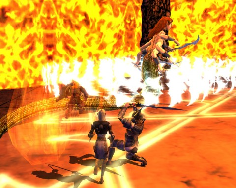
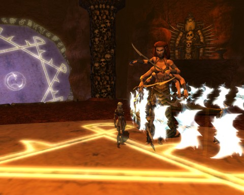

Back to: [West Karana](/posts/westkarana.md) > [2011](/posts/2011/westkarana.md) > [November](./westkarana.md)
# DDO: Tripping the Lailat Fantastic

*Posted by Tipa on 2011-11-21 07:08:34*

[caption id="attachment\_9859" align="aligncenter" width="480" caption="Team Spode vs the Kite Runner"][/caption]

We've been on the rocks the last couple of weeks, progressionally-speaking. Gianthold Tor has given us an extended learning curve as we learn how to become giant and dragon slayers (which will likely involve specific resist gear for each dragon). When we decided to take a break and finish up the Sands of Menechtarun content, designed for level 12 that we thought would be trivial at our levels (14-16), that also kicked our butt.

Experience has been hard to come by. Repair bills, surprisingly easy.

Yesterday, we were going to kill the Demon Queen, and we were not going to leave until she was dead. For certain values of "dead", anyway. You fight her three times; the first time she is just an illusion cast by the Prince of Swords, a Rakshasa tigerman. The second time, she's the real deal, but she escapes toward the end. The third time, she's a raid.

We're experts at decoding the poem at the beginning of the adventure now. We still have a problem entering trap rooms together, though, so typically some subset of the group would be left fighting the Prince of Swords each time. But we got through it.

During the week, we'd discussed our kiting strategy for Queen Lailat (Lailat, laylee la lolcat...) We wiped, but after some spirit cakes and Spode shifting from sword and board to two-handers, we tried again and kited her perfectly.

Back to the shrine to wait the few minutes to rest again, and then in for the second phase.

[caption id="attachment\_9860" align="aligncenter" width="480" caption="Tunnel of Death"][/caption]

The second try is around a much smaller room. Again, we took out the adds and kited her -- flawlessly. We won, and got nearly 10K experience from it.

The quest giver back at base opened our way to the two-group raid, where we could bring lasting hurt to the demon queen. Our clerics had expired, but what the heck. The four of us could probably do it. Who needs healers, anyway?

The raid opens with a corridor of lava death. I feign real deathed my way up it while Gleek, Spode and Ulan took on the waves of demons that spawned as we made our way up. Soon we were face-to-arms with the demon queen.

[caption id="attachment\_9861" align="aligncenter" width="480" caption="Lailat & Frenemy"][/caption]

She laughed us off and poofed away. Demons on pillars separated from us by a void shot us as Lailat teleported around the room firing off spells, including an incredibly hard to avoid roving blade barrier that sliced the rest of the group to shreds. Rogues have high evasion, so not so much me, but once everyone else had died, the demons on the pillars and Lailat herself started bringing the pain my way.

But -- we defeated the non-raid demon queen, we got loot and xp; it was a good night.
