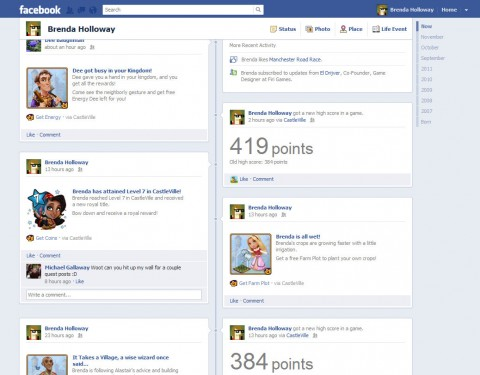
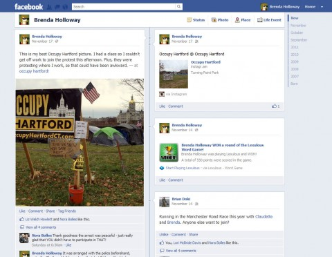

Back to: [West Karana](/posts/westkarana.md) > [2011](/posts/2011/westkarana.md) > [November](./westkarana.md)
# How Castleville Lost Me.

*Posted by Tipa on 2011-11-22 22:23:36*

[caption id="attachment\_9865" align="aligncenter" width="480" caption="The Castleville board."][/caption]

With each new "-Ville" game, Zynga adds something new to their base clicker gameplay. Their latest, Castleville, adds fairly involved crafting to the farming mechanic from Farmville and the town building and creature fighting mechanic from Frontierville. Cityville's trading game and Empires & Allies rudimentary PvP are absent here.

The majority of the Castleville board is hidden beneath a "gloom" that can be dismissed via exploration, that can expose new resources and NPCs with which to expand your kingdom. The ever-helpful NPCs you meet will lead you through the game with quests, as in all the previous games.

I usually give Zynga games a couple months, but it's gone from my Facebook stream now. The picture below tells the story.

[caption id="attachment\_9867" align="aligncenter" width="480" caption="Castleville owns my timeline"][/caption]

Castleville friggin' took over my timeline. I post pictures to Facebook, chat with my family and non-G+ aware friends. When I look at my timeline to see at a glance what is happening, and all I see is Castleville... well, that can't happen.

This isn't the only annoying feature Castleville adds. Recent Zynga games have let you spam only your friends that are also playing the same game. Castleville does not give you this option. You can only select from a list of every friend in your list, or those who have played at least one game at some point (so, pretty much every friend on your list). You can't limit your spam to just Castleville friends, or just Zynga friends.

Castleville by itself isn't a bad game, and the crafting is innovative (though since it uses non- or very slow-renewing resources, you're forced to do most of your harvesting in your friends' kingdoms). You no longer need to click your harvests -- you can just wave your mouse over items to instantly collect them. I'd have liked to have seen that in Frontierville.

[caption id="attachment\_9866" align="aligncenter" width="480" caption="The timeline I wanted to see."][/caption]

I'd have liked to have played Castleville some more. But it's just too damn annoying and way too noisy. Thankfully, removing the app lets you have your timeline back.
## Comments!

**[Jason](http://weblog.probablynot.com)** writes: Off-topic, but... how do you get Facebook to look that way? It looks so... usable! The default view I get is just a cluttered mess.

---

**bob** writes: Check again. At game luanch it does all friends to increase reach. It quickly settles back to target just those of your friends who play. That's what is there for me now. Alos you can set the app preferences so your timeline and other posts only appear to a group of friends you select. I have a group of friends I tag in facebook as 'Zynga' and then set Zynga games to only send to them. try it, works great to address your issues.

---

**[Tipa](https://chasingdings.com)** writes: That's the new timeline view. It will be rolled out to everyone eventually; I opted to switch immediately.

---

**[Tipa](https://chasingdings.com)** writes: I don't like being used in this way,, Bob. I understand the Zynga business model, and I accept that companies need to make money. But then there's just naked, desperate need. That crosses a line.

---

**Lovestar** writes: You don't need to post and share all your stuff in Castleville, you can chose to not share a single thing in your timeline. When the popup comes up you have a big share button below that you have probably clicked on each time but there is also a X in the upper corner and if you just close the popup and dont press share nothing of castleville will show up in your logg. But yes the share button is large and easy to push just saying it doesn't need to take over your logg. You can chose what to share and what to not share.

---

**[Tipa](https://chasingdings.com)** writes: Don't other players need the stuff I share? I don't mind sharing it with them, I just don't want it shared beyond those people who play Castleville.

---

**[Brian Kurtz](http://briankurtz.com)** writes: Here's how I solved the "spammy" problem. As soon as Castleville posted something to my timeline, I clicked on my profile to fine it, then when you hover your mouse over it, you get a pull-down menu appear. In that menu you can selected "Revoke Castleville...". Selecting this stops Castleville from Auto-Posting to your status update whenever you level up or whatever. This means that the few free goodies that become available to those watching your feed are not available, but that's not going to impact the game experience for others who don't get them.

The second thing to do is that whenever you are in-game and it asks you to share something on your stream you can type something in and post. This will over-ride the "revoke" thing I just described. The trick is to make sure that it's visible only to Castleville people. Whenever I add a friend who I play castleville with, I add them to my "Castleville" list. You do this by holding your mouse over the "Friend Request Sent" button after you send the friend request and a drop down will appear letting you add that person to different lists. If you scroll down far enough, you can make a new list. Make a list called Castleville. Then find each of your friends who you play the game with, go to their provile, find the "Friends" button on their profile page, hover over it and add them to the Castleville list as above.

From here on out, when you are asked to post something, type in what you want to say, and look for the little icon which allows you to select which groups that update is visible to. Select Castleville and only gamers will see it.

---

**Sooshi** writes: I agree with Tipa.. It's almost "embarassing" how much I play [or would appear as such] when everything I do is posted to my wall. Yet, I want to share with CV players to benefit both ways between my CV friends and I. I have tried to post to Only Me but have to recheck due to app crashes.

I have attempted to create a CV friends list.. what a pain. First I have to 'remember' each friend to add to the CV list and bounce between windows and restarts. Then, if someone accepts my 'neighbor request' I have to recreate my CV list. If the game crashes, I'm back to the very beginning as if a list was never created.

I love the game. It has all the great features of Farmville and CityVille combined with a twist of role-playing and intrigue. Not just brain-dead "placing as much stuff as you can and then clicking on even more stuff to keep up with your neighbors".. aka friends.

---

**Vic** writes: Tip- if you make "lists" on your Fb you can make sure that only the people who play the game or want to see the posts get them. You can also use the lists to sort through the posts that other people make. So if you have a "games" list, then you can select which friends of yours you only want to see game feeds from. Then when you click on this list they will all be in a central location. You dont have to filter through them all. You can also make family or close friends lists. This way you can click those and see only what they posted. It works really good if you have certain people whom you want to see everything they post and then others that you only want to see status updates or games etc. Hope that helps.

---

**Kheyo** writes: In regards to not being able to isolate gifts/request to castleville friends, Im assuming your talking about direct requests like gifts, I don't know how the button's visibility is determined, but I have had it since nearly day 1

---

