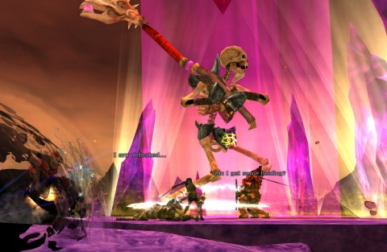

Back to: [West Karana](/posts/westkarana.md) > [2011](/posts/2011/westkarana.md) > [October](./westkarana.md)
# DDO: Baby I'm A-maze-d

*Posted by Tipa on 2011-10-10 06:58:40*

[caption id="attachment\_6558" align="aligncenter" width="480" caption="Grand Skellie Poo-bah"][/caption]

Last night we were down two people; Ulan had real life relatives over (who could have popped in and played healers because WHY THE HECK NOT?), and Lessah continues to be mysteriously disappeared (we hope everything is okay with her). Since NOTHING can stop Team Spode, we headed straight into the ruins of Gianthold to see what kind of damage a team of three could do.

The second dungeon of the night was Madstone Crater, a long, long labyrinth of death winding its way around and through an active volcano. Which technically makes the area a caldera, not a crater. But be that as it may. The basic goal here is to a) not step in deadly lava pits while b) freeing giant yeti-like "seers" from the mental control of c) giant skeletal enchanters. The seers, once freed, will insist on playing Dance Central in front of their ~~XBox~~ giant glowing crystal while the adventurers fight off a never-ending wave of troll and minotaur attackers.

What we didn't know at the time was that you don't need to kill the attackers, just buff and heal the dancer (though Gleek caught on to the buffing part toward the end). Me, I was clueless and useless. Without using my armor break ability, I couldn't hit any of them, and since respeccing to pure rogue from rogue/fighter, I lost the feats to wield my super skellie killing hammer.

We ended at the feet of the mad wizard skellie that had been mind-controlling everyone with the magical heat of the Madstone. Apparently every troll, bugbear and mino we met was just under the influence of the Madstone (they thanked us, every one, for freeing them from the influence as we killed them). So, you know, we killed two hundred innocent creatures.

Got some loot, though!

[caption id="attachment\_6557" align="aligncenter" width="480" caption="Maze of Madness"][/caption]

We started out the night, after some random killing death stuff in the open part of Gianthold, finishing a dungeon we started last week -- the Maze of Madness. There's groups of levers all through the place. One lever raises a gate to proceed. The other levers will unleash deadly traps -- unless you have a rogue. Finally, a place where I can shine! It didn't take us long to get through the place; we were stumped looking for the last Agent of Insanity until we (finally!) discovered a secret door, and things went easily after that. Didn't get much experience from it, but the Madstone Crater xp would more than make up for it.

While I DID enjoy a rogue-focused dungeon, I have to wonder about the creature that designed this dungeon.

If I were designing a dungeon and I really didn't want people bugging me, I wouldn't close my monsters behind gates they could not open. I'd have the dungeon entrance open into a central room with all my monsters in open rooms around the edge. When an adventurer popped in, hundreds of monsters would kill them immediately.

I'd also remove all the shrines in my dungeon. That's just coddling people.

Otherwise, I just have to think that the dungeon denizens want you to kill them.

Weird.
## Comments!

**[pkudude99](http://nomadicgamer.com)** writes: You can't UMD a Master's Touch scroll to use that hammer?

Granted, they're kinda hard to get unless you have access to the Portable Hole, but once you do have access... buy stacks of them and UMD away! Assuming your UMD is high enough to use Level 1 Arcane srolls, natch.

---

**Sirhyl** writes: What server are you guys playing on?

---

**[Tipa](https://chasingdings.com)** writes: @pkudude99 -- never heard of a Master's Touch scroll! I'll have to look into it! (reads) Hey, that's a sorc spell! I bet I could get Gleek to cast it on me! Thanks!

@Sirhyl -- we're playing on the Cannith server. If you have a level 12-15 character on Cannith, we might have a spot open!

---

**Sirhyl** writes: I am just starting the game, saw you might need a healer?

---

**[Tipa](https://chasingdings.com)** writes: Well, we're pretty far into the game. You'd need to get to 13 (or 14 even better) within a month or so. But if that's something you can do, we probably have a spot.

---

**[pkudude99](http://nomadicgamer.com)** writes: Hm. I have toons on Canntith, but I haven't played on that server in forever. I may have to change servers. . . . .

And yeah, Master's Touch is awesome for those non-Martial classes. Between MT and a Divine Power clicky or 3 (usable by level 9, usually) you fight like a fighter without needing to splash levels. Works nice!

---

