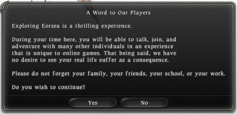

Back to: [West Karana](/posts/westkarana.md) > [2011](/posts/2011/westkarana.md) > [October](./westkarana.md)
# Daily Blogroll Oct 19: Time enough to learn to swim edition

*Posted by Tipa on 2011-10-20 05:00:04*

If you were given six months to live, you wouldn't spend it leveling up a new character in some MMORPG. You'd want to do something that gave your life meaning. Six months at the end of your life isn't more valuable than six months right now. In fact, six months right now is way better. Truth is, your friends and family don't care that you leveled a character. They care about the time you spent with them. (Fact is, it's almost certain nobody in the world cares about your achievements in video games, and in a couple of years, neither will you).

People all around me are getting older -- old! An old friend died (ten years ago! some friend, eh? but I just found out!). Another friend had a heart attack last week, nearly died. Yet another friend is getting radiation treatment on the west coast.

I discovered recently that I love life and that the world is a beautiful and wonderful place. Years ago, in the depths of my EverQuest addiction, a warm sunny Saturday just meant I'd have to keep the blinds closed so the sun wouldn't wash out my display (maybe I would type to the guild, "Beautiful day out today!"). Now I bike, I hike, I do things. I don't play many MMOs, and when I do, I play casually. I want desperately to live in the real world.

It was with some trepidation that I read about Damion Schubert (lead systems designer for SWTOR) and his talk at the recent Game Developer's Conference about [turning casual players into hardcore addicts](http://schedule.gdconline.com/session/6182/Double-Coding%3A_Making_Online_Games_for_Both_the_Casual_and_the_Hardcore). From the capsule description:

> Hardcore gaming isn't dead -- all of the big 'mainstream' successes (WoW, Starcraft, Wizards 101, Facebook games) have a hardcore path, and work hard to convert their casual gamers into hardcore gamers. But doing so may require rethinking your definition of 'hardcore', and what it means in your particular game.

I still love games and I still love MMOs and I still plan to write about them -- but I'll have to enjoy the sixteen hour raids and repeated nights after nights of failures against a big boss until eventual victory makes it all worthwhile in other people's writings.

Time for the blogroll? Sure, why not!

**The Winter of Our Discontent**

I guess I'm not the only one feeling a little malaise at the current state of online gaming. Spinks of Spinksville tells a story from the spring of her gaming career, as a member of a Spring covenant in Ars Magicka. Nowadays, even though every month brings dozens of new MMOs to market, she notes that [bloggers are pinning their hopes on just SWTOR and Guild Wars 2](http://spinksville.wordpress.com/2011/10/19/long-dark-winter-of-the-mmo/) to bring them back to hardcore-ness; otherwise losing interest in the genre.

I have believed and still believe that it's a conscious *choice* to become immersed in an MMO. No MMO is going to force you to play it or seduce you into spending time there against your will. If bloggers are turning away from MMOs, it's not the fault of the slate of MMOs. People are just not so willing to be seduced by a new game (unless, apparently, it is SWTOR or GW2). (And I predict GW2 will still end up as a fringe game).

**Star Wars: The Old Republic**

Via [Corellian Run Radio](http://corellianrun.com/2011/10/19/press-embargo-lifted-tomorrow/) comes news that the *press* embargo for articles about SWTOR [will be lifted this morning](http://pc.ign.com/articles/121/1210147p1.html), so we'll finally be through the drought of articles about Bioware's new RPG. Regular non-press players still have to keep their stories to themselves, but they can feel free to pump their fists and yell "YES!!!!" as they read the press stuff.

Syp of Biobreak really, REALLY [wanted to play Admiral Ackbar](http://biobreak.wordpress.com/2011/10/19/swtor-we-dont-serve-their-kind-in-here/) in SWTOR. CLEARLY it is a travesty that only fairly human appearing races will be available at game launch, notwithstanding its MMO predecessor, Star Wars Galaxies, offered many less human races.

Well, even if you can't BE a Wookie, [you can at least KISS one](http://www.swtor.com/info/holonet/biographies/bowdaar). Is sex with a Wookie legal in the Republic? Or is that a Sith thing?

**World of Warcraft**

Wilhelm of The Ancient Gaming Noob [is still trying to give away a sparkle pony](http://tagn.wordpress.com/2011/10/19/not-the-sort-of-wow-travel-poster-i-had-in-mind/) for the best travel poster urging people to spend their vacation in beautiful Azeroth! Don't you WANT a sparkle pony? I'm here to tell you now that you are good enough and special enough to get a celestial steed for your very own. All you need to do is take a screenshot, splash some text on it, then e-mail it to Wilhelm. Easy peasy!

**Mythos**

Via [Rock Paper Shotgun](http://www.rockpapershotgun.com/2011/10/19/well-myth-it-mythos-europe-soon-dead/), we learned yesterday that Mythos, the improbable action MMO that went from a tech demo to a breakout fantasy game to oblivion to resurrection in Asia and Europe ~~to North America~~, is now [well and truly dead](https://forum.mythos-europe.com/showthread.php?t=31948). Redbana had the rights to bring it to the US, but they've not had a word about that for years. The death of Mythos Europe likely seals that deal forever.

It was definitely a cute and quirky game, and it lives on in its close cousin Torchlight and its more distant relative, Diablo III.

Real reason it died? All those passwords. Luckily the second one was the same as the combination on my luggage or I'd never have gotten in twice.

**EVE Online**

Professional MMO gadfly Syncaine spins [the recent CCP layoffs](http://www.ccpgames.com/en/public-relations/press-releases/article/2990/ccp-focuses-on-the-eve-universe) and the shift of focus off MMO-in-development World of Darkness [as a GOOD thing](http://syncaine.com/2011/10/19/what-the-ccp-layoffs-and-refocus-tell-us/)... and I suppose it is if you're an EVE pilot. Not so much if you were one of the 120 CCP employees laid off.

With EVE Online, CCP has all their eggs in one basket. Clearly this isn't sustainable forever. This news brings the focus back to their main egg and doubles down on the PS3-exclusive shooter Dust514, a ground-based tactical FPS in the Halo vein that ties seamlessly to the space game.

"PS3 exclusive" is a code phrase that means "Sony is paying us to make this game". Seriously. That is what 'exclusive' MEANS. Look it up. So they really couldn't drop THAT one -- it must already be making them some money even in development. World of Darkness is the real gamble -- another MMO in a market crowded with them. It's not at all clear if the high-profile crime, corruption and diplomacy that keeps EVE in the news is even possible in WoD.

**Star Corsairs**

Brian "Psychochild" Green wrote up [a fantastic interview with indie MMO developer Dave Toulouse](http://psychochild.org/?p=1099) of "Golemizer" and "Star Corsairs" fame. It's just fascinating what you can do if you just have a dream and the fortitude to make it happen no matter what gets in the way. Well worth the read. 

On the same theme, Ars Technica is running [a three part "insider" story](http://arstechnica.com/gaming/news/2011/10/i-think-theyre-mad-inside-the-48-hour-battle-to-build-the-best-video-game.ars) on a 48 hour game development contest run recently in Australia on the theme "Badgers, Suits and Keys". 20 teams -- 10 pro and 10 indie -- make a finished, polished game in just two days.

(I am definitely going to take a week off for the next 7DRL competition... the one game jam I ever participated in!)

More tomorrow? Sure! Sorry for the delay here, but I had to finish Vernor Vinge's "[The Children of the Sky](http://www.goodreads.com/review/show/221138320)". Can only do one thing at a time :( Look for another drought when I pick up Neal Stephenson's "REAMDE"...
## Comments!

**[SynCaine](http://syncaine.com)** writes: "With EVE Online, CCP has all their eggs in one basket. Clearly this isn’t sustainable forever."

Why not?

Isn't 7+ years basically 'forever' in videogame land already? Why do we just assume that all MMOs have a certain shelf life, and that they all must eventually fade away? Why don't we expect more and say "you know, if you keep making this better, I'm going to keep paying you for making it better"?

(Side note: Why don't I get your ping-backs...)

---

**[Tipa](https://chasingdings.com)** writes: Well, at least you aren't blocked any more :)

Single product companies live and die with that product. You can't assume your single product will be able to sustain the company forever. EVEN IF IT DOES. It's just a bad bet. 

Every product has a life cycle.

---

