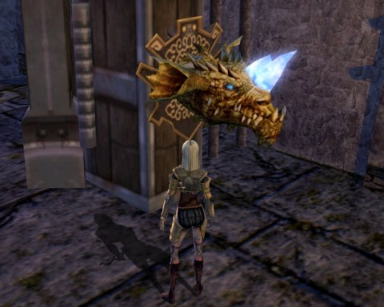

Back to: [West Karana](/posts/westkarana.md) > [2011](/posts/2011/westkarana.md) > [October](./westkarana.md)
# DDO: Arthur Miller's "The Crucible"

*Posted by Tipa on 2011-10-24 07:03:16*

[caption id="attachment\_6589" align="aligncenter" width="480" caption="Horn of Agility"][/caption]

Once I understood the story behind "The Crucible", I knew what to do. Immediately upon entering the dungeon, I accused all my group mates of being witches and consorting with the devil. They were taken away, forced to confess, and executed. I alone lived. Nobody will say anything, either, because I might accuse them of being witches at well! I am very good at sniffing out witches... as proven by my success in exposing my group mates.

Frickin' mana users.

I am mad at myself. Throughout the whole, long dungeon, I took only one screen shot, and that one only because I'd JUST FINISHED the part of the dungeon designed for a rogue. You have to race through two rooms of traps in a very short amount of time. Rogues can pretty much ignore mechanical traps, but the route required speed and precision jumping as well as the simple ability to survive the trap gauntlet. So that took a dozen tries, with Gleek keeping me hasted.

Having the lowest wisdom stood me in good stead with the Horn of Instinct. People aside from the least wise member of the party get true hints as to the location of the untrapped room of the six; the most foolish gets a false hint. As the fool in the party, my hint -- Death awaits you at the door closest the entrance -- was false. After a couple of others -- Ulan and Spode, I think -- had triggered traps on other doors, I opened the closest door and there it was, the Horn of Instinct.

Being able to ignore traps was again useful in the underwater maze of the Test of Endurance, where a powerful current pulls you through trapped tunnels.

It wasn't all rogue heaven, though. I was content to let Gleek solve the maze in the Test of Cunning and the puzzle area on top of the maze. And for the final arena battle, I think we'd all agreed that I should stay out of confusing, rogue-killing melees and plink stuff with arrows from the edges. That worked out great.

With the completion of The Crucible, we have been flagged for all three giant factions. Now we have to finish collecting the ancient relics -- nine each of the giant, dragon and elven relics. I turned in my giant set last night. I am nowhere near on the others.

This would be a great opportunity to do some solo relic collecting... if I thought I would live. Things are looking up, though -- I checked in during the week and started finding upgrades in the auction house. Turns out I don't need dexterity on all my gear. It ain't WoW.

## Comments!

**[Yeebo](http://yfernbottom.blogspot.com/)** writes: I'm still having a lot of fun in DDO these days as well. The crazy lemmings/ kobold mining mini game was honestly one of the most entertaining events I've ever experienced in an MMO. I can't wait for it to come back around.

---

