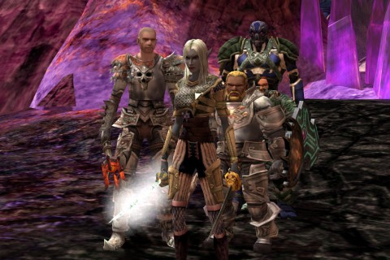

Back to: [West Karana](/posts/westkarana.md) > [2011](/posts/2011/westkarana.md) > [October](./westkarana.md)
# DDO: The girl who lived

*Posted by Tipa on 2011-10-31 19:35:05*

[caption id="attachment\_8592" align="aligncenter" width="480" caption="My bot army"][/caption]

We don't have to play on off days in our DDO static group, but most of us do. Since you have complete control over your leveling, you don't have to really worry about outleveling everyone... though DDO goes by the D&D rules here, and you can only gain one level at a time. High achievers like Our Gleek become perpetually stuck at the top end of our range, earning no xp until the rest of us laggards catch up.

I used to really enjoy soloing stuff now and again. I'd rent a cleric hireling, head out and have some adventure. Eventually no hireling could keep me alive. I tried all of them -- fighter, cleric, favored soul. Each looked like they would work for awhile, and then I'd hit a named and BOOM. Two ghosts hovering over our soul stones.

I think it was Spode who, while talking to Gleek I think, happened to imply that you could have more than one hireling. He was saying that you could save money on Gold hirelings (ie, bought from the DDO store with real money) if one of your hirelings was one hired through the in-game, platinum-powered currency.

Soooooo......... you can have as many hirelings as you like? As long as you have the cash to purchase them?

We've been working through the Ruins of Gianthold module. DDO has a million currencies; the currency for Gianthold is called "ancient relics". There are three types, Ancient Giant Relic, Ancient Dragon Relic and Ancient Elven Relic. They drop randomly in the chests after a boss is killed, and you need nine of each to gain passage into the final dungeon. Plus more to get the special armor.

Through grouping, I'd gotten the nine giant relics, but I was still short the other two. The others had done a fair amount of soloing in the Gianthold exploration zone, but me + one hireling couldn't play that game.

But me + four hirelings could. I rented a fighter, favored soul and a wizard from the DDO store and bought a cleric from the regular hireling vendor, stepped inside the exploration zone, summoned them all and -- went. to. town.

Well, went to open the map and kill named and stuff. I did go back to town -- a shaman cast a sleet spell on me that wouldn't leave and could not be dispelled, though the cleric and favored soul continually tried. And my fighter got depressed and refused to move after awhile. Had to go back to town and log out to fix the sleet. Resummoned my crew inside and finished the place off. 

So that was a good feeling. It takes a full group to keep me alive.

[caption id="attachment\_8593" align="aligncenter" width="480" caption="Mirror, Mirror"][/caption]

I got two giant relics, a dragon and an elven. I was able to turn in some giant relics for another dragon relic, and Gleek, Spode and Ulan donated their extras so I could get Gianthold Tor access. Very cool of them :)

First dungeon of the night was the Foundation of Discord, where the good guys (us) have to take out a bunch of dirty capitalist swine (them). Yeah, we went all "We are the 99%" on our "Occupy the Aurum Encampment" movement. The dungeon was nothing special, except for the end. The final boss was encased in some sort of crystal that could only be broken by ringing six gongs positioned around the room that would break the floor beneath him so he could be killed.

Which is just... okay. I'm this rich dwarf banker, and my foolproof security system is to pen myself into an unbreakable prison. Wow. Genius. But. I have carefully placed the only thing that can destroy my sanctuary around the VERY ROOM so that all a thief/tireless crusader for social good needs to do is TOUCH them and BOOM.

Not particularly smart, these dwarfs.

[caption id="attachment\_8594" align="aligncenter" width="480" caption="Gianthold Tor"][/caption]

That took next to no time at all. Why not try the big bad final instance, Gianthold Tor? Does anyone know anything at all about it? No? Let's find out.

Once in, a "DM" instructed us to stand in the circle in the middle, which was helpful of him. We did that. Eventually portals spawned around the room and giants shuffled out. We did pretty well, but eventually there were too many giants and too few us. Once our hireling clerics went down, things only got worse. We released, healed up and returned to the Tor, expecting to start over (on "casual" this time!), but the instance was still up so we went back in. While wondering if this was one of those tricky things where you keep being attacked until you do something, the flood of giants stopped, and we were allowed further in.

We hadn't gone far until a fleeing kobold introduced us to the "crack" system. See, most of the Tor is well-secured by the giants, but we could use cracks in the foundations to move through the walls and get around the security. All we had to do was find them.

Which we eventually did, and turned the levers and was let into the next section, where we were supposed to awaken the Gatekeeper, who would let us in to the place where the Dragons dwell. We need to kill dragons to get the dragon scales to make the epic armor for this module.

We still had absolutely no idea what we were doing. We came to a corridor with a runed room on either side. Standing in one did nothing. Standing in another did nothing. Ulan suggested we split up and stand in both. THAT did something. That walled off the rooms and summoned huge skeletons in each one. If we left the runed pads, the walls would fall and we could all kill skeletons. We guessed that what we really needed to do was to just try to keep alive, keep the skeletons controlled, until the Gatekeeper woke up.

And even though we split into two groups (two people + a hireling), that wasn't enough.

We're not even sure we have to kill the skeletons. Maybe just staying hidden or something is enough. One thing is for sure, though -- if we have to be farming this instance to get scales for our armor, we better figure out what's going on, quickly.

There's got to be a trick. We have a debate going on on whether or not to spoil this with the wiki, but I think we could figure this one out ourselves.

Gleek, as usual, has [the official take on the adventure](http://happyduelingddo.blogspot.com/2011/10/relic-up-and-get-down-gianthold.html) :) 
