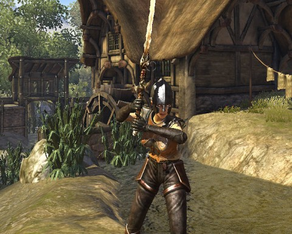

Back to: [West Karana](/posts/westkarana.md) > [2011](/posts/2011/westkarana.md) > [September](./westkarana.md)
# Divinity II don't care what class you are

*Posted by Tipa on 2011-09-21 06:00:08*

[caption id="attachment\_6529" align="aligncenter" width="480" caption="Your basic Divinity II spell slinger"][/caption]

Just because my character is wearing plate armor and swinging a two-handed sword doesn't mean she isn't a mean spell caster, because she is. Magic users in Divinity II: The Dragon Knight Saga would kick a D&D magic user's butt to the gates of hell and back. It's okay to make an entirely unbalanced character in a single player RPG; you are, after all, expected to save the world at some point.

It always comes down to saving the world.

The story in Divinity II is that my character isn't starting from scratch; the process that gave her Electric Glowing Slayer Vision removed her memories of her years of training, so essentially she is just remembering what a bad-ass she was the day before she stepped off the zeppelin.

She's okay with a sword, but her main power comes from magic missiles. They kill, they cost almost no mana and they don't need to be aimed. Melee is a matter so far of aggroing mobs, then ducking around a corner or behind a tree so that they can't range you to death. Standing in one place for long in Divinity II means death.

I've just gotten about as far in the real game as the demo took me; level 6 with just a couple more quests to complete in Broken Valley, which should level me enough (I hope) to buy the level 8 magical armor for sale before I head out to the deadlier world.

[This is a repost from Google+. I've been criminally ignoring my blog and posting stuff on Google+ last couple of months. But! You too can join! It's open beta! Join the conversation! Anyway, background on this, the gamer circle has been working lately through Divinity II: The Dragon Knight Saga, so after I finished with Dragon Nest, I started on this. Original post is [here](https://plus.google.com/108460561201888322767/posts/9RLnukVaDEj "Divinity II adventures").]
## Comments!

**[bhagpuss](http://bhagpuss.blogspot.com/)** writes: Thanks again for the invite to Google+. There was a tiny paragraph in The Guardian today saying that Google+ is now out of beta and available for public use. I presume they actually meant it's in open beta.

I'd kind of forgotten about it. No-one to whom I sent invites chose to use them, and after a few days I stopped looking at it. The handful of bloggers I follow who'd mentioned it stopped talking about it and as far as I can tell you're the only one who's posted less often than expected since Google+ appeared.

I found it pretty hard to understand, to be honest. I couldn't work out how to see who was on it and I found it difficult to follow what people,were saying. I'll have to take another look and see if it's got any more understandable.

---

**[Tipa](https://chasingdings.com)** writes: G+ has an issue with discovery; you don't really get the full effect of G+ until you have the kind of people discussing the kind of stuff you want to talk about in your circles, and you in theirs. Until that happens, you could have the correct impression that great conversations are going on that you aren't seeing. But once you get past a certain tipping point, then it all flows together.

---

