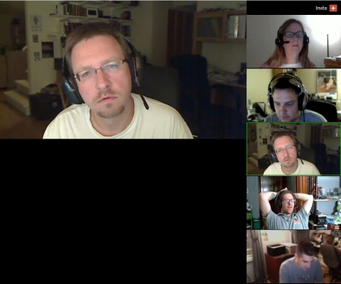

Back to: [West Karana](/posts/westkarana.md) > [2011](/posts/2011/westkarana.md) > [September](./westkarana.md)
# D&D 4E: All fun and games until someone loses connection

*Posted by Tipa on 2011-09-22 06:52:11*

[caption id="attachment\_6533" align="aligncenter" width="480" caption="Hanging out on Google+"][/caption]

Last night was the second meeting of our intrepid crew of D&D 4th Edition (D&D 4E) adventurers. If the internet was made for porn, surely social networking sites were made to play D&D. One of the first ideas \_anyone\_ gets is, hey, I can't find folks to play D&D with locally, but all my online friends want to play... maybe I could use MySpace/LiveJournal/message boards/forums/Google Wave OR WHATEVER.

We all remember sitting around a table with our friends from high school or college and just acting out bizarre scenarios which would make us pariahs to the mundanes... who would watch on in bemused merriment... but that was okay. We were not only in our own little world -- we MADE our own little worlds.

And had fun doing it!

It's been hard to recreate that sense of playing with real people ever since. But Google+ has this neat "Hangout" feature, where up to ten folks can gather together and just do whatever. There are music performance hangouts where people play music for each other or collaborate on new stuff. Cooking hangouts. Storytelling hangouts. And D&D4E hangouts.

I know we're not the first. It was such an obvious idea.

[caption id="attachment\_6534" align="aligncenter" width="480" caption="Fantasy Grounds"][/caption]

Chris Smith of [Level Capped](http://www.levelcapped.com/ "Level Capped") offered to host a game online, do all the work to get a campaign made, host what needed hosting and so on. A handful of us signed up to be ~~guinea pigs~~ ~~sacrifices~~ players, and we got to ordering our dice and player handbooks ($$$) while Chris figured out just how we were going to bring the tabletop into our hangout.

Chris found a suite of free tools from [RPTools](http://rptools.net/ "RPTools") that seemed to solve the problem. There was a map maker, a character builder, a dice roller and so on. In our first session, we connected to Chris' server and played around with the tools while we rolled up our characters.

Last night, we were going to go on an ADVENTURE!!!!

If... we could all connect to the tool. There were issues getting our characters into the character builder. We couldn't all connect to the map server at once. Some would get right in, some would sit at a "Connecting..." screen forever. It just wasn't working for us.

So... we went to a paid alternative, [Fantasy Grounds from Smite Works](http://www.fantasygrounds.com/ "Fantasy Grounds"). For $24, Fantasy Grounds promised a much better player and DM experience, with real 3D dice rolling (thankfully I had my 3D glasses with me), automatic handling of attacks and damage and powers and so on.

It took us most of the evening to figure out how to enter all our information. They have this cool parser which takes spell and ability descriptions, verbatim, from the player handbook and figures out what to roll and save against, all that boring paperwork stuff.

Once we seemed ready, an Ancient White Dragon attacked and killed us all.

Well. It tried to attack. It didn't get so far on the killing us all bit. We tried to attack back. We didn't get so far on the dragon slaying, either.

In a poof of greasy black smoke, the dragon vanished and a weak kobold stood in its place. We could hardly do a thing to it.

So... it was getting a little late and we left the Lord Dungeon Master to figure out how combat worked beyond rolling pretty dice.

Next week: The party will be ambushed by a group of monsters that will come as a complete surprise to us! The PERILS OF SCREEN SHARING!
## Comments!

**Joshuha** writes: I am a big fan of Fantasy Grounds and always happy to demo to your GM how to use it to run a game. However, one thing I will say is sometimes it better not to focus on all the bells and whistles and have a virtual tabletop do all the automation. Just roll the dice and RP just like you would around a table. Sure you can have auto-saves, and targetting, etc. but you don't need all of that until you are ready to use it.

---

**[Tipa](https://chasingdings.com)** writes: It would be nice to know how to do it right, though. It's up to the DM. I just want to kill stuff.

---

