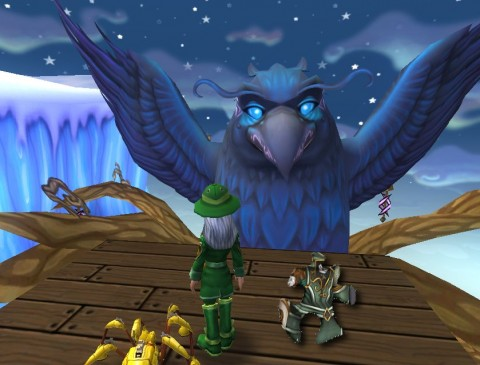
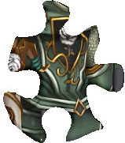

Back to: [West Karana](/posts/westkarana.md) > [2012](/posts/2012/westkarana.md) > [April](./westkarana.md)
# W101: Interview with a Raven

*Posted by Tipa on 2012-04-03 21:39:36*

Whenever I get confused or overwhelmed in Wizard101, I head to Wintertusk and talk with Mother Raven. These mysterious puzzle pieces had me puzzled... I guess... so I headed over the rainbow bridge to the Wintertusk barge, threaded my way through the slow-moving vultures, worked my way up the root of Yggdrasil and asked her if she could fit these puzzle pieces together.

She said nothing. She just gave me another piece. I had a feeling from her that it would all fit together in the end, but ... who can tell? Who can know the future?

Only Mother Raven. And she's not telling.

This puzzle piece looks like it's below and slightly to the left of the previous puzzle piece. Where that previous piece looked like something that was being held, here we're seeing, I believe, a little bit of the person that is doing the holding.

One more piece to go!

