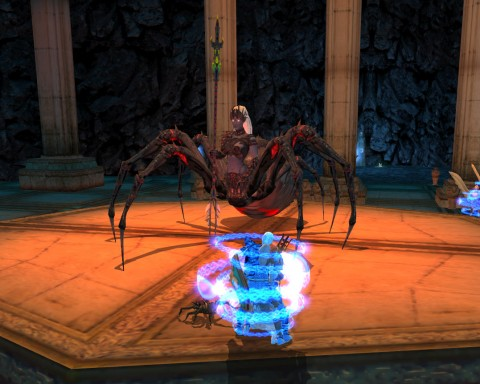

Back to: [West Karana](/posts/westkarana.md) > [2012](/posts/2012/westkarana.md) > [April](./westkarana.md)
# DDO: Web of Chaos

*Posted by Tipa on 2012-04-06 23:20:58*

[caption id="attachment\_10194" align="aligncenter" width="480" caption="Helpless!"][/caption]

What I want to know is, if the Spinner of Shadows could "hold person" everyone in the party instantly, with no saving throw, for as long as she wanted, anytime she wanted -- how did we win the fight?

Not to say that it wasn't a fun fight -- it was. The whole Web of Chaos arc was a lot of fun, for all that the last adventure turned into an extended advertisement for the expansion, giving some reason for the sudden merger of the world of Eberron and the world of Forgotten Realms.

The Spinner of Shadows adventure was, in particular, pretty fun. The adventure had a raid-like complexity. We split the party in two, with Gleek and Ulan keeping the Spinner busy while Spode and I raced around killing spiders for shards with which to rebuild the Spinner's prison.

Spoiler alert, we fail, and Lolth is summoned from the Underdark into the plane of Khyber (if I am remembering this right). Well, we succeeded in the adventure, and failed.

With Lolth freed, we were treated to the trailer for the next expansion, and were then ejected back into Stormreach Harbor to report our failure to the Silver Flame guardians who did not welcome our news.

[caption id="attachment\_10195" align="aligncenter" width="480" caption="Ophiga"][/caption]

Fact is, I play a drow, and I'm not sure why I would not welcome Lolth into this plane of existence. We spent the entire night killing Drow, and I felt a little uncomfortable about that. Why couldn't we have killed something that really deserved it, like gnomes?

Sometimes it's hard playing a good drow. I guess that's why my fellow drow and driders usually try to kill me when they see me. Still, I struggle on. Far from Vulkoor's solace, driven from the Underdark.

At least I can meet my ex-drowfriends as a more skillful rogue. While working through the Web of Chaos arc, I reached level 17 at long last. I got a new rank of sneak attack, and Rogue Sneak Attack Training IV. I just need one more point for Rogue Sneak Attack Accuracy Training IV, and then it's just a hop, skip and jump to level 18 and Assassin III. Then I get two levels where I can choose levels in some complementary class. Since my last lesser reincarnation, I have become a strength-based rogue, which will allow me a little more leeway in choosing other classes. I'm thinking Fighter (for the weapon skills), Ranger (for ranged skills natch) or Bard (because... just because).

The glowy weapons I am wielding in the picture above come from the Web of Chaos arc. I didn't get all the ones I wanted, but if we run the arc twice more, I'll be able to select from all the options available, which is rather cool. That's something just added with the most recent update.

Exciting times. Spode and Gleek have already maxed out their experience. Ulan and I are the laggers-behind, both now at 17. I really do want to get to 20 before we leave for Diablo 3, but levels come so slowly that I am not sure that's realistic.

I've said it many times -- I would enjoy DDO more if I didn't have to spend real money to form a group to play on non-group nights. On the other hand, I like playing a MMO which was intended for group play. It doesn't make any sense, I know. I guess I could join pickup-groups, but then there's the fear that I am a terrible player and would enrage the members of any group I joined, since I care little for having the best armor, weapons or enhancements.

Back in EverQuest, the designers had this concept of camps. When you first came to a new dungeon (or even outdoor zone), there would be the "easy" camps for people with lesser equipment, levels, or ability. As you gained confidence, you'd move through the zone to harder camps, and as you gained a reputation, increasingly you'd be asked to come to a camp. That social web thing.

Now it's all whirlwind speeding through a dungeon with people you will never see again. WoW, EQ2, Rift, DDO -- all the same. 

I treasure my static group :)

## Comments!

**[Rift Planar Attunement](http://riftplanarattunement.com/)** writes: This is one concept that I couldn't keep with DDO is that it didn't let you play the character the way you should be able to. Who wants to play a good alignment Drow and betray your people?

---

