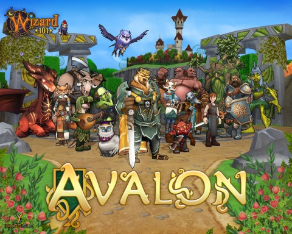

Back to: [West Karana](/posts/westkarana.md) > [2012](/posts/2012/westkarana.md) > [April](./westkarana.md)
# W101: The Puzzle revealed -- the Rise of Avalon!

*Posted by Tipa on 2012-04-09 22:24:26*

[caption id="attachment\_10201" align="aligncenter" width="480" caption="Avalon"][/caption]

Sure, everyone had this figured out awhile ago, but finally it's announced -- the newest world on the Spiral is Avalon. 

Professor Greyrose writes:

> Avalon is the silver city, a medieval fantasy world of knights, goblins, giants, and dragons. Merle Ambrose was born here, and gained a reputation as a fierce Wizard. Merle helped the young warrior-bear Artorius become king of Avalon. However, once King Artorius fell in the final battle slaying his archrival, Malory, Merle decided it was time to leave Avalon – Merle left to found Ravenwood School of Magical Arts and teach magic to any Wizard who wanted to learn it in the Spiral. 

Avalon is a large world with 15 expansive areas to explore. Young Wizards who are a minimum of level 70 and have completed the quest "Through Glass, Darkly" need to speak to Merle Ambrose who will send you off on your adventures with a quest named "This Little Light of Mine".

I pretty much keep returning to "knights and dragons" because, YUM. Anyone who knows me knows that if there's a dragon to be killed, I am TOTALLY THERE. That desire for dragonly death held me from TSR's [DragonStrike](http://en.wikipedia.org/wiki/DragonStrike_(video_game)) game, through EverQuest, World of Warcraft and the rest.

Time to get leveling!

Here's the last puzzle piece, for completeness' sake:

