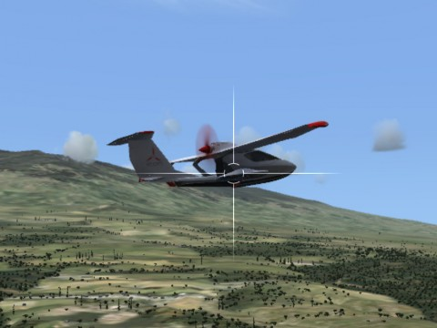

Back to: [West Karana](/posts/westkarana.md) > [2012](/posts/2012/westkarana.md) > [August](./westkarana.md)
# Microsoft Flight in the crosshairs

*Posted by Tipa on 2012-08-01 22:09:12*

[caption id="attachment\_10249" align="aligncenter" width="480"] Microsoft Flight[/caption]

Is [Microsoft Flight](http://au.pc.gamespy.com/pc/microsoft-flight/1218068p1.html) even a game? It's barely even a flight simulator. Whatever it is, it's dead now. Released to lackluster reception last spring as a free download with day 1 DLC, it was [officially killed a couple days ago](http://seattletimes.nwsource.com/html/microsoftpri0/2018777858_microsoft_grounds_microsoft_flight_project_columbi.html).

I downloaded it when it went F2P. You don't get much for nothing; a light sport plane (the [Icon A5](http://www.iconaircraft.com/)) and the big island of Hawaii. Microsoft eventually released the rest of the Hawaiian Islands as DLC, and eventually Alaska as well; better performing aircraft cost extra. You supposedly get to fly a Stearman biplane if you join in with Windows Live, but it requires a product code and I don't have one. For me, Microsoft Flight was just flying from airports to grass strips and back and buzzing landmarks.

Microsoft Flight gamified the whole flight simulator experience. You could take on odd jobs at various landing strips, like ferrying a chatty passenger to another airport for a "$100 hamburger" -- $5 for the hamburger, $95 for the fuel to get there and back.

Completing jobs and tutorial missions, finding hidden "aerocaches" and completing challenges all earned you experience, which opened up more jobs and challenges with which you could... well, it all was pretty much just giving you a reason to fly from A to B.

Who needs a reason? I just needed a game that I could play while watching Hulu. Flight simulators have always been the go-to game for that. Take off, point in the direction of the destination, climb to cruise altitude, then wait, wait, wait, wait and eventually throttle back, lower the gear, make your approach, land, repeat....

Microsoft Flight was outclassed in every way by [X-Plane](http://www.x-plane.com/), which gives the entire world, a bunch of planes, and a free editing system for making new planes and adding detail to the world. Granted, it isn't \_free\_, especially if you want to get a flight stick, but if you want to fly a gyrocopter around your home town, it's really the only choice.

So. Microsoft Flight. Brainless. Small. Perfect for wasting time while you do something else. And unsupported -- Microsoft laid off everyone in the Vancouver studio that developed it.

