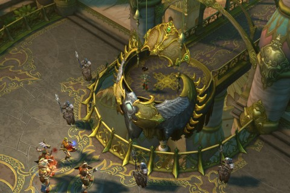
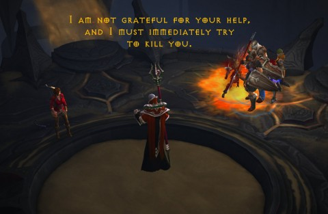

Back to: [West Karana](/posts/westkarana.md) > [2012](/posts/2012/westkarana.md) > [August](./westkarana.md)
# Diablo 3 Hardcore: The Lord of Lies, Part 1

*Posted by Tipa on 2012-08-06 07:03:35*

[caption id="attachment\_10252" align="aligncenter" width="480"] Dude, where's my Belial?[/caption]

I don't know \_anyone\_ who, upon first meeting the child emperor in Diablo 3 Act II, didn't think they'd be battling him at the end of the chapter.

We left off last week with Stingite, Spode and me (witch doctor, barbarian and monk) at level 23 and Calrain as a level 10 barbarian, still recovering from a death. Nearing the end of Act II, we had only to find the body of the malevolent spirit Zoltan Khull and re-animate him.

He would clearly be grateful for our help and not immediately try to kill us.

[caption id="attachment\_10253" align="aligncenter" width="480"] This is the thanks we get.[/caption]

Unfortunately for Zoltan, Leah's mom had sealed away the power of the captured lords of Hell in the Black Soulstone, hiding them from Zoltan's use, and making him rather trivial to kill. The only one who could possibly unseal them would be Leah herself, but I'm pretty sure she will never betray us and attempt to kill us.

Soon we were saving busy bazaar shoppers from hordes of marauding snake-men and heading into the castle to take on Belial and save the child-emperor.

[caption id="attachment\_10254" align="aligncenter" width="480"] No more lies.[/caption]

Turns out the child-emperor had been possessed by Belial himself. Who knew?

We cleared out Belial's henchmen without trouble, and then Belial himself. Then he underwent a horrific transformation and grew many times his size, like Rita Repulsa whenever the Power Rangers got too annoying.

He started tossing out pools of poison but we mostly deftly avoided them and wore him down.

For a couple of seconds, anyway. Calrain and Stingite were nearly insta-killed during a poison bomb run, leaving Spode and I to complete the final stage of the fight while the other two cheered us on from the sidelines.

With some close calls we made it. Belial was tuned to be fought by four of us, but Spode's defenses and my vitality (due to my ill-gotten auction house gear) held us through.

[caption id="attachment\_10255" align="aligncenter" width="480"] Cheevs[/caption]

Calrain was back in the game almost immediately with a level 9 demon hunter he'd had in his back pocket, but Stingite's witch doctor had been his backup. He quickly created a new witch doctor and we restarted Act II to try and get them both some quick levels.

Stingite died to a random mob, though, and after restarting again (as a wizard this time), we headed back to Act I to take on the Skeleton King for xp and loot. With two relatively high level characters leading the charge, taking on the game's first boss was without any sort of risk, and we got an achievement for killing him in less than 20 seconds.

Night ended with Stingite at level 5, Calrain at level 10, and Spode and I both at level 25.

Because we didn't trigger the transition into Act III before we moved back to an earlier place in the game, we'll all have to face Belial again. This time, we'll be ready.

We'll definitely want to have everyone up to the same level before we face Asmodan in Act III, though -- and when we face Diablo, minimum level 30 all around, please.

Total hardcore death count is -- six, I think? Three each for Stingite and Calrain.

## Comments!

**[stingite](http://thefriendlynecromancer.blogspot.com)** writes: Ahhh crap! We're keeping track of my deaths now?

---

