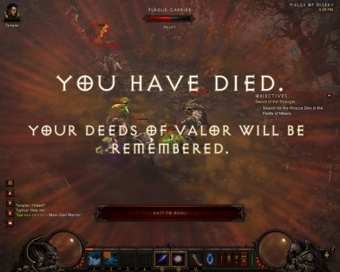
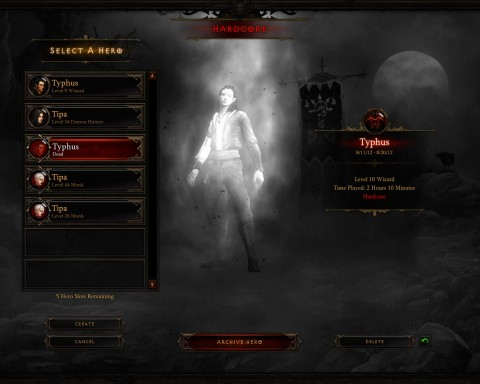

Back to: [West Karana](/posts/westkarana.md) > [2012](/posts/2012/westkarana.md) > [August](./westkarana.md)
# Diablo 3 Hardcore: The Last Death

*Posted by Tipa on 2012-08-20 22:03:56*

Hardcore in Diablo 3 is fun and exciting and in a group, it's a heck of a chance for group dynamics to come into play.

Well, until someone dies. And then the person that died has to make another character, try to level it up solo on the off days, only to still be below the level of the group, which are now running old content because stuff one-shots the re-rolled character if we just run current stuff, and in any event, the person playing the re-rolled character rightfully resents being babysat.

And then dies again, re-rolls again....

Last week, Calrain died about a quarter way through Act II, which we'd restarted to give him a chance to catch up from the week before. Nobody was happy about that. Spode started telling stories of the fun everyone (else) had in Diablo 2 when they just leveled for fun and ran around grabbing loot like maniacs and chatting and playing the game was just an excuse for getting together and having a good time.

Nobody was having fun when we got together on Sunday nights any more. It got to be one step forward and two steps back. When Calrain died because he was hunted down by stray mobs from someone else's fight, it was silence.

Calrain asked if he should re-roll. We all agreed he should re-roll -- as a softcore character, and so would all of us.

So we re-rolled. We shifted characters. Stingite went monk, Calrain went barbarian, Spode went with witch doctor, and I went with wizard. Wizard was going to be my back-up character if my main character, a level 26 monk, happened to die.

The reason I needed a wizard is that I'd secretly been playing my back-up character and now she was 44. Er, 45. And repeating bits of Act II Nightmare to level up to meet Belial for the second time.

So anyway, I made a wizard, and was having some fun with it in hardcore mode, so when we all went softcore, I volunteered to go a-wizarding.

This gave me permission to do the one thing I could never allow myself to do, something I had spent hours and hours on the auction house and on D3 forums preventing.

I was going to kill my hardcore wizard and find out what happened.

[caption id="attachment\_10265" align="aligncenter" width="480"] You Have Died![/caption]

It would have been really indelicate for me to ask Stingite or Calrain what had happened when their characters had died. I tried to fit it once into conversation, but the pain was still too fresh, I think.

Losing your hardcore character once is tough, losing it six or seven times, well, you start questioning why you're playing the game. Sure, if you're solo, you can just see how far you got and try to do better next time, but dying in hardcore in a group is like throwing a brick through a window. Not fun.

I removed all my hardcore wizard's gear and set out on my quest to retrieve the bits of Tyrael's sword. Confident the Templar would keep me safe.

In seconds we were mobbed. I lobbed low powered spells at the skeletons, drakes and goat men. They killed the templar (he sounded shocked and betrayed) and then came for me.

I lasted longer than I thought I would.

[caption id="attachment\_10266" align="aligncenter" width="480"] Ghost Typhus[/caption]

Yeah, his name was Typhus. You remember the Greek god Typhus, right? Heroic Typhus, god of lice-born disease. The new softcore wiz is named Typhus, too. 

Anyway, Typhus the ex-Wizard looked reproachfully at me from the shadowy realm beyond the screen to which I'd consigned him by forcing him to go fight monsters in the nude just to see what would happen when he died.

I felt terrible, really awful, so I archived him. Moved him from Limbo to Purgatory. Christian imagery comes easy to a game which is set on a fantasy world which nonetheless independently came up with the same visions of Hell, though with a different vision of Heaven.

[caption id="attachment\_10267" align="aligncenter" width="480"] Typhus the Immortal[/caption]

So, back to Typhus. As a softcore character, he can't die. None of us can. We've had our last party death and our last restart. Now that hardcore has taught us to all get on board with the auction house, probably we won't even fail boss fights very often. I sold some stuff from my 34 demon hunter and got a nice bankroll, not just to twink my character out, but to get things on the auction house so I could go bargain hunting.

Since items never decay, I can sell whatever I buy for more than I paid, plus whatever rares or legendaries I win, and it's just going to be smiles and rainbows until we finish Inferno.

And then? Who knows!

## Comments!

**CWM** writes: I enjoyed the writing in this one, Tipa. Keep up the good work. =)

---

**[Tipa](https://chasingdings.com)** writes: Thanks :)

---

