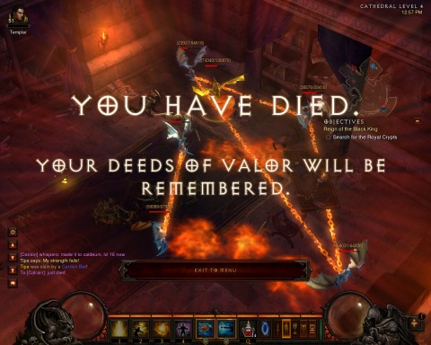

Back to: [West Karana](/posts/westkarana.md) > [2012](/posts/2012/westkarana.md) > [August](./westkarana.md)
# Diablo 3: Rise of the Immortals

*Posted by Tipa on 2012-08-27 22:36:46*

[caption id="attachment\_10271" align="aligncenter" width="480"] Headed to the Butcher[/caption]

When we went "softcore" last week, I wasn't sure I'd have anything to \_write\_ about. Sure, Sunday we made great progress, ripping through the Skeleton King and on to the Butcher, killed him without a death, rolled on to Act II.

And it was fun, of course it was, because Stingite, Calrain and Spode are fun. But it wasn't memorable. There's no risk, no danger, we'll log in and do all these things every week and honestly, it's an endurance contest. How long can we keep it up before we get bored?

The real game... is the Auction House.

Now that most dedicated players have multiple characters at high levels, money for twinking is plentiful. Even with lots of funds available, of course, nobody wants to waste money. There might be a fairly nice article for 350 gold. In the last three minutes, a bidding war will drive it up past 20,000 gold. The sorting changes that came with the latest patch make it trivial to see which items are expiring soonest.

To actually win something, you have to consider your anonymous opponents; spread your bids around; bid up some items to hopefully draw attention away from the bit you really want.

It's fun! A little time consuming, now that you actually have to be present at your computer and logged in to Diablo when an auction is about to expire to win, or to bid far more than the item is worth so that everyone else drops out (after running up your bid for you). But it's a part of the game.

I learned the pointers soon enough. Never post a buyout bid (or if you do, make it like 1,000,000 gold, just to see if someone will pay it). Start the bidding fairly low, to get people interested.

A piece of level 10-16 armor with my wizard's preferred stats -- Intelligence, Vitality, Experience and Life Regeneration -- typically goes for between 20,000 and 30,000 gold in the softcore auction house. Prices are cheaper in the hardcore auction house, but I'm not playing that particular game any more.

[caption id="attachment\_10272" align="aligncenter" width="480"] Dead, dead monk.[/caption]

My level 52 monk sailed through Acts III and IV of hardcore nightmare mode. There were a couple of iffy bits, but I didn't feel any real danger until Act I, hell mode.

I nearly died a few times, so I was working on a less stand-and-tank strategy, more of a kiting strategy. Things were going fairly well; I was working my way through Leoric's castle to my final confrontation with the Skeleton King, when I was ambushed by two elite champion groups at once, plus a dozen or so lesser mobs. I lasted quite awhile but my damage was too low; my 22,000 health points were eaten up and I died, character deleted.

I didn't feel bad about it; I could tell Hell difficulty was going to be the end of my monk. I'd hoped to make 53, though -- I was so close that if I'd survived the battle that killed me, I'd have dinged -- but 52 isn't bad for a crappy player like myself. Calling it a win.

It doesn't make me terribly eager to make a new hardcore character.

My level 26 monk, the one I had for grouping, is still fine, and now has 650K gold available for playing the auction house should we decide to go back to hardcore mode. Calrain has caught up with his new hardcore character. We could do it.

I'm really hoping we do.
## Comments!

**[Braving the Elementalist](http://bravingtheelementalist.blogspot.ca/)** writes: I never had the guts to play Diablo 3 in hardcore mode, I played regular Diablo 3 up to 60 with a barbarian but grew tired of it when it became the "get stomped by everything" game in inferno mode. Not to mention, I don't really like the "auction house game" I don't have any interest in being rich in the game, I just want to kill stuff and have fun.

---

