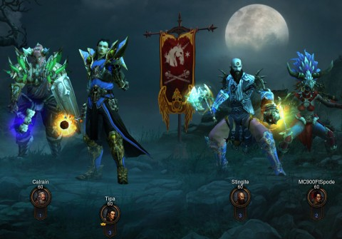

Back to: [West Karana](/posts/westkarana.md) > [2012](/posts/2012/westkarana.md) > [December](./westkarana.md)
# Diablo 3: Spode's Inferno

*Posted by Tipa on 2012-12-05 06:49:35*

[caption id="attachment\_10482" align="aligncenter" width="480"] The Fab Four and the 70,000,000 hit point trash mobs[/caption]

We've been trundling forward with Monster Level set to 10 for awhile now. This gives the most monsters with the most hit points, but it was doable, and so much loot dropped that we were skipping picking up blues and only picked up yellows, and were still forced to return to the Bastion to sell every few minutes.

Even at the maximum power, neither Azmodan nor Diablo gave us much trouble, though with our paragon levels, monster power and max stacks of Nephalem Valor, you'd have expected one of us would see a legendary or set item, but no. Diablo 3 was tuned to give you piles and piles and piles of useless loot. D2 would give you the occasional set item, but I am absolutely unsure how so many set items and legendaries can be on the auction house when we have been playing throughout the entire game, normal, nightmare, hell and now inferno, and not one has dropped during our regular sessions over the past six months or so.

Anyway. We started Inferno right after we finished off Diablo in Hell mode and watched the movie. We usually just kill right through the trash mobs at the beginning, open up New Tristram, and sell and repair and stuff.

Good luck with that on ML10 Inferno. The trash mobs all had north of seventy million hit points. I play the wizard, the highest dps in the group, and I only put out 62K a hit. It was taking us several minutes to clear each encounter -- each TRASH encounter.

We FINALLY made it into New Tristram and ended for the night.

Spode and Stingite did some tests, and it looks like the difficulty curve goes exponential at Monster Level 3, so we're going to run at ML2 for awhile. I played a bit at ML2 and it seems easy enough. Maybe we can adjust this up a couple during this, our last run through the game.

I don't see us hitting a tenfold increase in power during this run. We've all been level 60 for awhile. We have some paragon levels. I've seen what's on the auction house, and there's not going to be a lot of DPS improvement. People get excited about gear with resists and other important stuff, but we're where we're going to be, dps-wise, for the foreseeable future.

With ML set low, the loot spigot has been turned off. In my run through the first few quests in Inferno at ML2, I only got a few blues, not the bags and bags of yellows we've become accustomed to. Less of a chance for finding an upgrade for any of us.

I can maybe get some more dps by experimenting with my build, but I think the higher monster levels are out of our reach. But I do like that Blizzard put monster level in. It made Hell mode a lot more fun. Put some challenge back into a game which was mind-numbingly easy without it.

I'm going to miss it.
