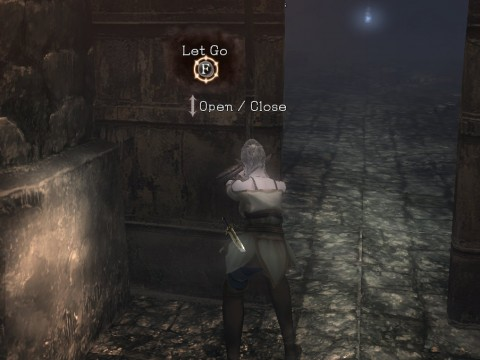
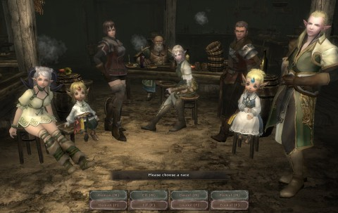

Back to: [West Karana](/posts/westkarana.md) > [2012](/posts/2012/westkarana.md) > [December](./westkarana.md)
# Wizardry Online: Are You Experienced?

*Posted by Tipa on 2012-12-05 23:25:34*

[caption id="attachment\_10486" align="aligncenter" width="480"] Back to back in a healing circle, enemies all around[/caption]

Gamepot's Wizardry Online (published in North America by Sony Online Entertainment) wants you to know that it is a hardcore MMO. With permadeath. If you play this, you will die. In real life. Really. Unless you're hardcore enough. Permadeath.

This might intrigue you. They aren't lying. This is a hardcore game. There is permadeath. But the game is also somewhat... annoying. Still, it may be your cup of mead, if you long for the days of another hardcore MMO, one called EverQuest.

The two games share a lot of features. In EverQuest, trash mobs outside the city gates could hand you your lunch. In Wizardry Online, I couldn't even get through the tutorial dungeon until I died (what? no permadeath? No, it's not that easy to lose your character). Once I died, I blundered around until I leveled while drinking from a health fountain, spent some skill points, and was finally able to kill the mobs. Then the dungeon timed out and I had to restart, and finished it, easily.

The first open dungeon was, like EverQuest, dominated by people forming groups at the entrance and taking on the trash mobs that spawned there. Since you don't normally regenerate health or mana, moving in deeper was a perilous thought, especially since running isn't an option. Mobs will follow, you will run into other mobs, and eventually die tired.

[caption id="attachment\_10487" align="aligncenter" width="480"] You Die.[/caption]

If, or when, you die, you become a disembodied soul. Your body lies where you died, where it can be looted by anyone who comes across it. (If you have not given permission, the looter may be branded a criminal, but they still get your stuff). Your soul must make it to a Guardian Statue within a certain amount of time. If you take too long, your soul turns to Ash. If you find the Guardian Statue and touch it, it gives you a balance showing the percentage chance you will be revived, which can be influenced by donating magic items at the same time. If you fail at revivification while a Soul, you will become Ash. If you fail while Ash, you lose your character.

Permadeath isn't easy, but it can happen.

So; quests are way above your level, grouping is vital, and your body can be looted and you can lose all your stuff. Original EQ.

Wizardry Online STARTS there... and then gets harder.

I mentioned no innate health or mana regeneration. There is a third stat, OD, used for shield blocking and dashing, which does regenerate over time. But for the others, you either have to imbibe potions, buy and use "camps", or leave the dungeon and rest at an inn. Resting for free brings you only back to half health and mana. Getting full health and mana requires paying gold.

I ran the first dungeon with a pick-up healer (my character is a mage). We killed a lot of stuff and received about six gold, plus two unidentified pieces of armor for me. Resting at an inn for full health and mana requires 300 gold. So most of the time, you're going to be only at half strength.

[caption id="attachment\_10488" align="aligncenter" width="480"] Open, Sesame. Wait, Close, Sesame. CLOSE, DAMMIT.[/caption]

Wizardry Online does have a cool door mechanic. You grab on to it, then shove it open or closed a little at a time. You could send your party thief out to pull, close the door on them, then have them struggle to open it from the other side with monsters beating on them while you hold the doors closed. When your friend dies and the monsters wander off, loot their body. Easy money.

The game does warn you that your fellow adventurers may turn on you. Their recommendation: become very strong.

This is the key to Wizardry Online. Grind mobs until you can one-shot them, then move a little deeper into the dungeon, and so on. Don't expect to breeze through content just because a quest tells you to. You'll die. Even in a group.

Patience.

[caption id="attachment\_10489" align="aligncenter" width="480"] Character creation[/caption]

Character classes are the typical four you'd expect -- fighter, mage, priest and thief. The races are also standard -- jacks of all trades humans, magic using elves, fighter/priest dwarfs and gnomes, and tiny race (Porkul) thieves. Any race can become any class (and even change classes later), and you can keep re-rolling your stats to get better ones. In fact, this is something you need to do.

Especially important since, as you level, some of your stats can DROP. As a mage, my vitality slowly drained away as I leveled. There was another stat I lost, too. Strength? Don't remember. But as you grow into your profession, you move further away from your base stats, so best make those best stats as good as possible.

[caption id="attachment\_10490" align="aligncenter" width="480"] Puzzles![/caption]

The game, however, has a lot of little annoying things. Cut scenes type out conversations with agonizing slowness. After the third or fourth, I began to fear cut scenes. Regular NPC conversation can be clicked through, but not the cut scenes.

Movement is Asian standard -- you move forward and hold down the turn keys at the same time. It's not hard to become used to it, but WoW, EQ2 and others have defined a normal set of keys, why not use that?

Zones transitions are slow and frequent. There is a cash shop merchant in every zone. The one item they sold (for real money) was a superior camp site, for better, faster healing in dungeons. You will not be able to do dungeons without camp sites. You will be buying them with real money.

It's a free to play game. Didn't pay for the box, didn't pay for a subscription, Gamepot and SOE need to get you to pay for \_something\_. And that something is going to be healing, or better gear to help you survive better. Just relax and expect it. Things are bought with SOE's "Station Cash", on which they have frequent sales.

Don't want to pay to make your life easier? Just take it slowly, level up on mobs at the zone, run out to take a unrefreshing nap on the floor of an inn for free, and hesitate to move into a dungeon until it is trivial enough for you to one shot everything on the way there (you can port out of a dungeon to town once every twelve hours, so maybe you won't have to fight your way back out again).

I can't say I had fun in the couple hours I played, but I did feel challenged. With a patient group, this could be a good alternative to Turbine's Dungeons & Dragons Online.
## Comments!

**[Wilhelm Arcturus](http://tagn.wordpress.com/)** writes: Did they drop the NDA? Are we free to write about it now?

---

**[Tipa](https://chasingdings.com)** writes: Yes.

[Beta NDA is now lifted!](http://forums.station.sony.com/wo/index.php?threads/beta-nda-is-now-lifted.521/ "Beta NDA is Now Lifted!")

---

**Rob** writes: Did Sirtech sell off their rights to the Wizardry license? Seems like every couple years I see a new Wizardry game coming out of the East.

I get a very "Demons/Dark Souls" vibe from the perma-death system and the way the game's "hardcore-ness" is being put out there as a selling point. My favorite thing about those games is that they force you to slow down and be thoughtful of your tactics going into a new situation.

PvP in games has never been something that I lose myself in. Its usually more of a fun distraction if anything. However, I love the idea that other players and grouping up being a good thing is not a foregone conclusion.

---

**[Tipa](https://chasingdings.com)** writes: I think they must have? But they use the old Wizardry logo. I wonder if Sirtech even exists any more. Wizardry Online tries very hard to point out the ways in which it is similar to the original Wizardry, but without the party management aspect which I liked best about the original game.

---

**[An Unfiltered (and Unfair) Impression of Wizardry Online &laquo; The Ancient Gaming Noob](http://tagn.wordpress.com/2012/12/07/an-unfiltered-impression-of-wizardry-online/)** writes: [...] you want somebody who gave the game a fair shake, Tipa has you covered. (She also has you covered if you want to read something about DOMO.)  And there is the official [...]

---

**[Egat](http://orcpawn.com)** writes: This interests me but I fear I'd leave it in frustration.

---

**[Tipa](https://chasingdings.com)** writes: Do it with some friends, probably would work out better. Patient friends.

---

**Linaryan** writes: Sir-Tech went up in smoke shortly after the release of Wizardry VIII. Their Canadian company (Sir-Tech Canada) lasted about 2 years longer before the same fate. The Wizardry license floated around for a short time before being picked up in Japan. Strangely enough, the Japanese people lusted after Wizardry style game-play. Therefore, Wizardry has not only survived, but actually thrived in Japan beyond what it ever could have States-side. There's quite an extensive list of games released in Japan under the Wizardry title. So far as the title/logo remaining unchanged, "if it ain't broke, don't fix it". Right? Well, it's remained a corner stone for the series thus far (more than 30 games later, US & Japan combined), so obviously it is highly recognizable. 

As an avid fan of the series, and yes I return to nearly each game of the US series (and several Japanese ones) rather often, I find the way SOE has put the world in to true 3D and semi-openness a nice advancement. They've done so without straying too far from the original anchor points. Is the game hard. Absolutely. Can this make it very frustrating. Naturally. If you ever played "Proving Grounds of the Mad Overlord", or worse yet, "Return of Werdna", you will understand that Wizardry was NEVER about exploring while killing monsters, effortlessly, until you got through a dungeon. It was ALWAYS about being hesitant about taking that next step; about putting thought and consideration in to all possible outcomes of your next action, even camping! I mean, how would you feel if you were attacked while asleep and your entire party was slaughtered? 

From what I've played on Wizardry Online thus far, I am enthralled. I will, however, say that if you aren't into the Wizardry style, don't bother playing. Or if you try it, at least don't bash it like I've seen so much of, especially pre-release. Just keep in mind that there are MANY Wizardry 1-8 die-hards out there that would part ways with a body part just to get another game in the series. My friends, I believe this is as close as we will ever get. In all honesty, this is an RPG. The difference is that this game forces one to take the ROLE of the character they're PLAYING by making things very tough and more 'real-life' like in terms of outcomes, unlike most games that are boringly easy {cough WOW cough}. Happy hunting. Good adventures. And maybe I'll see ya' in a dungeon somewhere.

---

**[Tipa](https://chasingdings.com)** writes: I do think, with willing friends, that Wizardry Online is the game people who are nostalgic about EverQuest would really enjoy. It is not for the casual MMO butterfly by any means.

---

**Septus** writes: The PvE difficulty is reminiscent of EQ, but that's where the similarities end. I think you failed to mention that camps/inns are dirt cheap (costing about 1/10 or less of the drop off a single mob), and serve more as a handicap for players, forcing you to get through an area in one piece before hiding in a corner and recovering hp/mp. 

And the open PvP makes for a COMPLETELY different game than EQ, not to mention active dodge. Honestly I don't think some one who dies in the opening dungeon has any place to comment, as they clearly are not the intended audience.

---

**[Tipa](https://chasingdings.com)** writes: You mean, the tutorial dungeon? Yes, I died there, came back and owned the place. I don't think that makes me not the intended audience. The inn prices I saw were very expensive, but the hours I spent playing were mostly in dungeons and not much getting to know the game. I never claimed to be any sort of expert on the game from just the time I played. I, however, did think it would be the perfect game for someone looking for a real challenge, and I think that was on the mark.

---

**Septus** writes: Remember that the inn prices are static, so as you level up and "harder" mobs drop more gold, the prices become much more manageable. The camps you get as quest rewards were more than enough to get me there (in fact I had many simple camps left over, and they become pretty much worthless once you have > 200hp/mp, don't recover nearly enough). 

In terms of difficulty, it manages to be hard without being a grind which I appreciated. I only shy away from the EQ comparison b/c there is that PvP element to consider (although you could go to an underpopulated channel, I haven't run into a single PK without actively looking for one in the main channel). 

In terms of intended audience, spatial awareness and puzzle solving need to come easily; if you can't remember where you're supposed to be going or how to get there, the game will feel impossible, or annoying. But if you DO intuitively get those things, then running the gauntlet is really entertaining.

---

**Septus** writes: *and re: inn prices, you only need to pay 60g to fully recover hp/mp, I don't think that's expensive even in level 1 terms (though I don't remember how much gold the mobs in caligrase drop). Most easy mobs I fight drop 200g.

---

