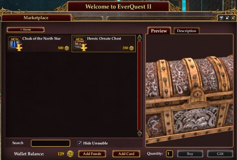
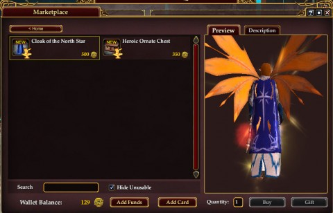

Back to: [West Karana](/posts/westkarana.md) > [2012](/posts/2012/westkarana.md) > [December](./westkarana.md)
# EQ2: Player Foundry -- goldmine or lost opportunity?

*Posted by Tipa on 2012-12-16 11:15:55*

[caption id="attachment\_10517" align="aligncenter" width="480"] Player made Heroic Ornate Chest[/caption]

***I've been told that the item designers set their own target price for these items. So... that changes this article somewhat.***

SOE has been touting an initiative to let third party item designers design items for their games -- they're calling it a Player Foundry. Designers submit fully textured 3D models of items to be sold in the SOE cash shop, and if accepted, they designer gets a cut of the proceeds; 40%, I believe.

I'm calling the submitters designers instead of just players because the quality of the work is just outstanding. Check out that item above -- subtle details make it obvious that this brass and wood box with silver filigree is a priceless heirloom for your characters, and the contents would be -- phenomenal.

I'm loving the item itself. What I'm not loving is what happened to it once SOE readied it for the game.

For 350 Station Cash (we'll call it US$3.50), you get what you see -- a house item. It doesn't act as a sales display, as I would have immediately thought. It doesn't open (unless it does, and it was just not in the description). It doesn't have any sort of magical glow to it. It's just a house item that few people will actually see.

I have bought items this expensive, many times, but for me, it's usually been characters that I used when I was doing my One Panel Comix a couple years back. So it was worth it to me, and there will likely be people who find a use for this. I feel SOE could have made this a lot more desirable, and should have.

[caption id="attachment\_10518" align="aligncenter" width="480"] A cloak of just one color[/caption]

This is the other item newly offered, a cloak with featherfall on it. Cloak of the North Star, going for 500 Station Cash or US$5.00.

Featherfall isn't a rare ability for cloaks these days; I have a bunch of cloaks with that ability, or the similar ability of Glide. It definitely is a nice to have feature. It is not a $5.00 feature. While the pattern is nice, it's hardly remarkable, and I doubt anyone would look twice at someone wearing that, perhaps choosing to cover it up with one of the many cloaks with more interesting patterns or designs. My character is currently wearing, as a back appearance item, a red woolen scarf that wraps around to the front, looks warm and comfy. It's a craftable item from Frostfell. Costs no cash.

[caption id="attachment\_10519" align="aligncenter" width="480"] A free scarf[/caption]

Problem isn't with the items themselves. The chest looks incredible. The cloak looks ordinary but it's a cloak, what do you expect?

The issue is both the price -- way too expensive -- and the effects. The chest should be no more than 100 SC. It would be a great impulse buy for a home or guild decorator. I might buy one. The cloak needs a dramatic effect, like an inherent port to any mariner bell in Norrath. Now, THAT might be worth 500 SC to someone.

The designers did good work. It's up to SOE now to make the items worth purchasing.

## Comments!

**[belghast](http://aggronaut.com)** writes: Based on a thread over at EQ2Flames (http://www.eq2flames.com/general-gameplay/94332-player-studio-submission-heroic-salesmans-crate-pic-5.html) it sounds like the author intended the box to be a salesman crate. However for whatever reason SOE decided to nix the functionality and just make it a pretty box. I plan on buying a few anyway, just because I love the look, but not until I start working on my houses again :)

---

**[Tipa](https://chasingdings.com)** writes: Hey, thanks for the link! There's some good insight on the process contained there.

I still get a strong whiff of WTF from the cloak, shared by some in that thread, but I guess the WTF-ness was more on the part of the designer than on SOE. Unless the designer had some special role in mind for the cloak that was just ignored.

---

