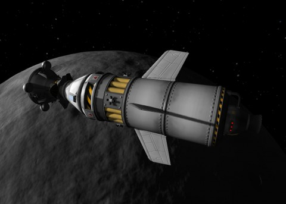

Back to: [West Karana](/posts/westkarana.md) > [2012](/posts/2012/westkarana.md) > [December](./westkarana.md)
# Kerbal Space Program: To the Mun and Back

*Posted by Tipa on 2012-12-17 07:45:40*

[caption id="attachment\_10526" align="aligncenter" width="480"] Docked in Munar orbit[/caption]

It's not that there's not a lot to do in Kerbal Space Program; it's that it takes so long to do.

Just like real space flight.

I've been doing work on my heavy lifter, the Munar Exploder. My goal here is to get into Kerbin orbit with a full stage of fuel left. I was hoping to ease the need for fuel by skipping the Kerbin orbit and just burning straight for Mun, but the necessary burn took too long and pushed me past the apoapsis, sending me on an inescapable trip back to the ground, strapped to a hundred ton bomb.

I couldn't even MAKE orbit with the engines I had on my third stage, so those needed upgrading, and of course stronger engines need more fuel, which means more weight, which means more engines...

Anyway, work on the M.E. continues. Since this version of the Exploder carries a Munar lander, for one test I sent it off to Mun. I used all the lander fuel getting to a Mun transfer orbit; I had to let Mun capture the capsule, then use RCS thrusters to enter orbit.

While I was there, I figured it would be fun to dock with the orbiter I'd sent there a few days ago. I'd practiced meeting another spacecraft in orbit on the "Marooned" mission, but this was different: I was going to try a dock, so it wasn't going to be enough to just get really close. I was going to have to get everything lined up exactly.

Docked first try. After about an hour and a half of orbit matching and slow, slow positioning.

Once the craft were mated, I took the orbits down to 10,000 meters for some surface skimming fun, then used the remaining fuel in the orbiter to escape Mun orbit, used RCS from there to return to Kerbal, though it took a few orbits to do so.

[caption id="attachment\_10527" align="aligncenter" width="480"] Landing[/caption]

Both craft splashed down safely within meters of each other.

If this reminds you of the Apollo spacecraft, well, there's a reason. I've been working from the Wikipedia page of the Apollo and the Saturn V heavy lifter, trying to figure out how to get these things working in game. The Saturn V was a huge rocket; KSP does not seem to be able to construct rockets that powerful. Even that giant rocket took three stages to get to Earth orbit.

Planetary exploration still seems out of reach. I've not even managed to deliver a fueled-up lander to Mun, yet.
## Comments!

**[flosch](http://randomwaypoint.fajs.de)** writes: These Kerbal story really got me interested. It sounds like an interesting type of game, even though I haven't really understood yet where the challenges are. (Not saying that it sounds like an easy game, far from it; but I'm curious how much math support you get, for example, to figure out how you have to guide your rockets).

I'll be without a PC over Christmas, all I'll have is my work Macbook, which we officially are allowed to use for whatever private stuff we want. Just checked, and the game is even available for Macs! I guess I'll check my Steam library again this week, and then decide whether I want to buy it.

---

**[Oakstout](http://www.oakstout.blogspot.com)** writes: I think there are some modified rockets and fuel containers available for download that might not only have more thrust, but hold more fuel.

---

**Tipa** writes: Flosch -- there are orbital tables on the wiki that do the math for you. I mostly just eyeball it, though. The math is important if you have a space station to meet, or you're lifting fuel for an interplanetary voyage. The latest version has help for calculating orbit changes, so you don't have to calculate thrust vectors unless you're doing a direct burn with turnover, which would be an issue with ion engines. 

Oak -- still have yet to delve into packs. I think I should be able to do a land and return on Mun with the base game. Just have to perfect my lifter.

---

