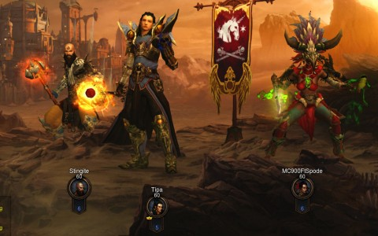
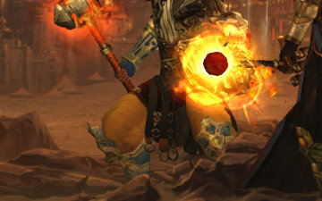

Back to: [West Karana](/posts/westkarana.md) > [2012](/posts/2012/westkarana.md) > [December](./westkarana.md)
# Diablo 3: It's an Inferno out there!

*Posted by Tipa on 2012-12-31 12:59:31*

[caption id="attachment\_10545" align="aligncenter" width="480"] At the Start of Act II[/caption]

Our Barbarian was missing again this week, leaving us a Gang of Three as we moved into Act II, Inferno, Diablo 3. You may remember that we'd flown through Hell mode in Monster Level 10, which made the game just a little more difficult, while adding loads and loads more loot and cash to the monster drops.

This being Diablo 3, the vast majority of the loot was trash, differing really only in the background color (clear, blue, yellow) that determined how much it would sell for to its only buyer, the merchant at the camp.

The auction house in game is nearly dead now; items that used to sell readily now no longer sell at all, and a bit of the fun has gone out of that part of the game. I ended my auction house career with about 2.5M gold in the bank, but all upgrades cost many, many millions of gear more, clearly put there by those brave few who still think they can make a killing transferring gear to and from the real cash auction house.

Too bad. I can't even access the real cash auction house because I haven't gotten an authenticator for my account. Not that I would ever spend real cash on Diablo 3 items.

Anyway, ML10 on Hell was fun and added a little necessary challenge to the game. ML10 on Inferno was so bad that it took us fifteen minutes to clear the introductory trash mobs before we got to the first NPC in Act I, Inferno. We dropped the difficulty to ML3 and continued on, getting some decent loot for the first time -- some legendaries, even.

As we progressed through the first act, though, we started dying a lot. Down we went to ML2, still died a fair amount, but we made progress. When we came to the Butcher fight, the boss of Act I, we had to step it down to ML1. That wasn't quite enough. We removed it entirely, and the fight was easy.

I did finally have a reason to change my spells from a Disintegrate-based build to an AE Blizzard-based build. This was a suggested build from the forums, but I was happy sticking with the all-destroying Disintegrate laser beam as long as it worked.

[caption id="attachment\_10546" align="aligncenter" width="360"] Let's zoom in a little[/caption]

Spode was gleeful over how much more green his witch doctor was; she now even had green smeared over her thighs!

Yeah, pretty icky, but speaking of thighs, OMG, LOOK AT STINGITE'S LEGS! His monk must be more than a little bit FROG.

He could squeeze Volkswagens to death between those thighs. And so that was the theme of the night, as Stingite took the lead, crushing whole groups of monsters to glowing ketchup between those massive thighs of doom. Stingite, Lord of the Thighs.

We talked about raising the ML up to 1 or 2 again, but in the end decided to leave it at zero and just finish the game. We did the complete Act II -- we're so damn good at this game, now. We'll probably take the standard two weeks to finish the game, and then move on to the next game.

I THINK that might be DC Universe Online. It's one of a number of F2Ps under discussion. (And I should remember to add The Secret World to that list, now that it's F2P). People have suggested cool games like Planetside 2, but there's not much of a plot progression to that; can't really claim to ever come to an end of that game.

Though we never did come to an end of the plot in DDO; we just stopped playing it when Diablo 3 came out, which was always the plan.
## Comments!

**[Stina](http://chainmaildress.com)** writes: I love the monster power system that Blizzard added. I leveled my Demon hunter who I had abandoned at like... level 40 something, all the way to 60 playing on monster level 10. It made the game so much more fun/rewarding. But in inferno, the huge jump from MP0 to MP1 has been slightly discouraging, so I beat inferno on MP0 and then just started farming the paragon levels on the higher monster levels. Glad you are still enjoying the game. :)

---

**[Tipa](https://chasingdings.com)** writes: I gotta agree, the Monster Level stuff was a game changer. The game was way too easy without it. With it, there was some challenge, and the loot was more what you would want.

ML in Inferno was a LITTLE BIT of a shock :)

---

**[bhagpuss](http://bhagpuss.blogspot.co.uk/)** writes: From how you describe the adventures of Team Spode I think DCUO might be a good fit. It has a similar combination of limited open world and repeatable instanced gameplay to DDO. DCUO is a much better game, though, in my opinion.

It would be intriguing to read about Team Spode in The Secret World. While there aren't a huge number of instances, the idea of you all working through investigation quests together is quite delicious. Regardless, I would strongly recommend you try it - if there's a better-written MMO anywhere I haven't been fortunate enough to play it.

---

**[Tipa](https://chasingdings.com)** writes: I have tried TSW, actually. That probably was during the time I was not blogging, which was unfortunate, because I really liked the game. I wanted to continue, but Paypal somehow screwed up my payment and they cut me off after my free month.

I know Spode is on board with DCUO; I think Sting is, too, or he might want to go back to DDO. Calrain, I dunno. Haven't heard back from him yet.

---

**Sirhyl** writes: I started playing TSW when it went free to play. It has been a lot of fun so far. I like the leveling system and the setting is a nice change from the usual MMO. Let me know if you start playing it.

---

**[Jaffa](http://dailyanimals.net)** writes: How to play D3 auction house: farm inferno until you find that one item that will sell for 100 million plus, and then you have won! I found a Natalya's Mark on the day before the patch that introduced all new versions of the class sets, and it sold for 140 million. So now I have the complete class set for my witchdoctor and he can clear inferno at ML5.

---

**[Tipa](https://chasingdings.com)** writes: Yeah... all about the auction house. Tell me, what's the point of playing after you've beaten the game on Inferno? It's never going to change, and you clearly already have the gear to win the game.

It seems the only true winning condition in Diablo 3 is to find something you can sell for real money to some mark with cash.

Anyway, we're done with it. Clearing the game on all four difficulties was our goal. We wanted to do it on Hardcore, and there might be people who could do it (and there are), but it was impossible for four of us to do that, and the constant restarts made it impossible to make much progress in the game.

Blizzard would be very smart to patch in PvP at this point, because I can't see any other reason to keep the game running. Since it is online only, Blizzard can and will, at some point in a few years, shut it down. And then what happens to all the legendaries and set pieces people spent real money for?

---

