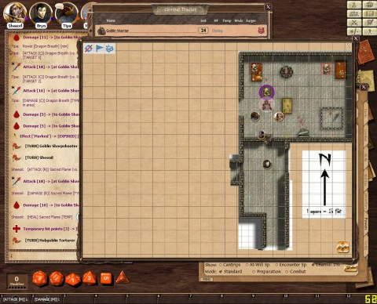

Back to: [West Karana](/posts/westkarana.md) > [2012](/posts/2012/westkarana.md) > [February](./westkarana.md)
# D&D 4E Shadowfell Keep: Rats, and other pets

*Posted by Tipa on 2012-02-06 21:48:14*

...and that was when the Death Star landed right on top of us. No? I'll get to the meaning of the mysterious shadow in the screenshot above in a bit.

Chris, the DM, had been cackling quietly to himself in the corner, muttering "kill them... kiiiilllll themmmmm.... KILL THEM AAAALLLLLL!!!!!" for the past couple of weeks. We were thinking he was about to sing a couple verses of "Alice's Restaurant" or something. We weren't coming out of Shadowfell Keep until the place was mapped (that being our mission). No popping out for a rest. No coming back to Winterhaven for a shower. Just us, our 10' poles, and our iron spikes...

OMG. We didn't have any IRON SPIKES! Back in the old AD&D v1 days, spiking doors shut was just what you did before resting in a dungeon, given no more thought than we would think about switching off a light. Time for bed, spike the door, set a guard, sleep without worry. So, I bought some.

Bryn maps the room.

We set out from Winterhaven for the ruined keep. Not for the first time; every other time, though, we'd end up getting sidetracked into other adventures. The kobold population may take years to recover. The well trod road became an overgrown path. We pushed our way through a wall of brambles that would make Sleeping Beauty homesick to a clearing. The stunted walls of a ruined keep guarded the center. Crude stairs fell into a thick dark. Clawed, humanoid footprints led into the darkness. Very few seemed to lead back out again.

Good thing we have a halfling to show us the way.

Bryn maps the entrance.

Wenner became one with the shadows and crept down the stairs. After the halfling called the all clear, Bryn summoned light on his staff, and the rest of us followed. The light was unnecessary, though, as we came to a room at the bottom of the stairs lit with flickering torches.

The rogue crept a little further in, saw floor to ceiling pillars around the room and corridors leading off to the south, east and west. Just a little farther in to look for more traps -- and the floor fell away. Wenner tumbled into the pit. Around him, a swarm of rats chittered and snickered, sharp teeth glinting redly in the uneven torchlight.

Bryn maps the pit.

Wenner, dazed, stood and struck out at the rat swarm. The swarm divided and dodged his blow. Bryn tossed a magic missile into the pit, hitting the rat swarm.

Called by the commotion, a goblin sharpshooter rushed in from the south, followed the magic missile back to its source ("tracer round!"), and fired his crossbow at the wizard. Miss! I tied a rope to a pillar and tossed the other end into the pit. Wenner clambered out. The swarm of rats chittered in frustration.

We had bigger ~~fish~~ goblins to fry, though. 

I tie a rope to a pillar and lower it. That uses my standard action, not about to go into heroic efforts to kill rats, so I pass my turn.

Sheeoil sacred flames the rat swarm, misses. Rat swarm divides. Wenner yells MAGIC MISSILE! MAGIC MISSILE! Bryn elbows his way to the pit, EXCUSE ME. Swarm counts as a single entity? Technically yes says the DM. Bryn strikes one with a MAGIC MISSILE!

A goblin sharpshooter comes from the south corridor, takes aim at Bryn.... Bryn's magic missile was like a tracer round. Sharpshooter hits a crit, he is standing next to me so Armor of Bahamut saves him from a crit. Bryn's "shield" fires as he gets hit.

Goblin warrior comes up next to the other one. Tosses a javelin at Bryn but his "shield" knocks it off.

Wenner gets hit by the rats, takes a hit and misses, shifts over to the rope and grabs on. I yank him out, run to the goblins and acid breath. Hits the sharpshooter, misses the warrior.

With goblins running away and popping back, we soon were chasing them blindly around the corridors. We let the rats live -- mostly because it would be too much work to kill them. They could have... diseases! Or something! And diseases!

We take our lives in our hands just having a halfling in the team!

When everything quiets down, we've not explored the entire first level, but we have found some pretty suspicious stairs leading down, and explored a storeroom closed by an exquisitely thick tapestry.

[caption id="attachment\_10060" align="aligncenter" width="480" caption="Half of the first level"][/caption]

There's still blank spaces on the map, though. Wenner and Sheeoil head to one of them, and Bryn and I follow. 

Loading, please wait...

We come to an empty hall. The floor shows traffic between the west corridor and the room to the north. The door to the room is closed; behind it, we can hear many voices.

Well, they can just stay there while we explore the rest of the level. I spike the door. It makes a TERRIBLE noise. None of this quietly locking the door and settling in for a nap in the middle of a dungeon. Everything within a huge radius hears the noise. The creatures behind the door are incredibly angry about this.

Something tries to open the door -- but \_can't\_. I stand in front of the door, ready to catch whatever comes through. Wenner stays hidden to one side of the door; Bryn and Sheeoil to the other. After several fruitless rounds, we hear the creature on the other side back up, get a running start and come crashing through the door.

A goblin warrior looks at me dazedly. I grin. Wenner does all sorts of damage to its unprotected flank and I finish it off with a Bolstering Strike. I'm remembering to use my "at will" powers now. There's a goblin sharpshooter not far behind him, a couple more warriors and sharpshooters around the room, and a hobgoblin torturer guarding a strapped table.

Quick survey of the group uncovered no hobgoblins, so we felt we were pretty safe from being tortured. Teeth gnashing in frustration, the torturer decided to deal with us the old-fashioned way. With red hot pokers, fresh from the furnace.

[caption id="attachment\_10061" align="aligncenter" width="480" caption="Oh, the hot irony..."][/caption]

By keeping a "mark" on the torturer, I kept its attention. Wenner perfected a move where he slides up, plants a knife in the torturer and hops back, staying out of melee range. Sheeoil and Bryn picked off the outliers. The torturer made a mad dash at me, knocking me back and taking my spot (the patented #OccupyTipa movement, you know). I kept my feet and struck back with my shield.

Wenner and Bryn had been banged about by the sharpshooters, but they were still on their feet due to Sheeoil's sacred flames and everything else was dead.

Due to the splintered door, spiking it shut so we could take a rest was out of the question, and with so much of the map still blank, something was certain to come. We heard whimpering down the west corridor, which proved full of cells, mostly empty, except for one that contained a very frightened hobgoblin.

Bryn maps the cells

We explained that the torturer and his cronies were dead, and happiness came to his twisted face. I used a lay on hands on him and gave him a ration, which he devoured. He hugged each of us, then came around and hugged us again. With his pidgin knowledge of the common tongue, he let us know that he owed us his life and he was ours to command.

Oh good. A pet.

His name is Splug.

Since none of us were eager to get locked into a cell for safety, we elected to just end the night where we were, since we hadn't used any dailies and we still had a good number of healing surges left between us.

After we got our xp for the night, most of us were just shy of third level. So we went back to the beginning, took that thick drape that once hung in front of a passage, set it on fire and tossed it onto the rat swarm in the pit. 31 xp! DING!

Bryn maps the rat pit

At level 3, characters gain one encounter attack power. Mine will likely be Righteous Smite. Attack CHA vs AC, same benefit as normal melee STR vs AC. If it hits, it does double damage plus my charisma mod (+4), and me and every ally within five squares gets 5+1 temporary hit points. Another benefit to staying pretty close to me!

Also note just how vital playing on a gridded battle map is to fourth edition D&D. In range or out of range -- it's pretty important to know at all times exactly how far creatures are from one another.

This is not always a good thing. It forced Bryn and Wenner to stay pretty close to Sheeoil and I if they want to get all the free heals -- and right next to me if they want to take advantage of my feats (both of which aid allies next to me), lay on hands and so on. Bryn would much rather be very, very far from the action, and Wenner wants the freedom to poke about and explore and swoop in for a devastating attack from stealth, none of which is possible if they're hanging about with me, in melee range of the mobs. Easy targets.

## Comments!

**[Blue Kae](http://bluekae.com)** writes: Mapping is important work!

And I actually didn't mind having to stay near you or Sheeoil. Having the critical protect was pretty handy and I was enjoying actually getting use out of my Shield spell for a change.

---

**[Toldain](http://toldaintalks.blogspot.com)** writes: Nice. I DM'ed this module about a year ago, and it's really fun to read someone else doing it. It's the same story, enacted differently.

---

**[Tipa](https://chasingdings.com)** writes: Have you posted about it online?

---

