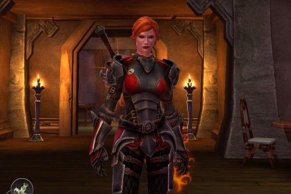

Back to: [West Karana](/posts/westkarana.md) > [2012](/posts/2012/westkarana.md) > [February](./westkarana.md)
# KoAR: Fem-Shep goes Medieval

*Posted by Tipa on 2012-02-08 08:08:38*

[caption id="attachment\_10069" align="aligncenter" width="480" caption="FemShep strikes a pose"][/caption]

Last summer, [Electronic Arts held a contest](http://www.pcgamer.com/2011/07/25/mass-effect-vote-lets-fans-decide-femsheps-face/) to decide upon the iconic face for the lead character from Mass Effect 3. Though the lead character, Shepard, can be male or female at the player's choice, Mass Effect and its sequel were marketed with a male Shepard. Fans had been yelling for a more prominent role for the female version, known as FemShep for short.

By playing through the Kingdoms of Amalur: Reckoning demo, you unlock many items useful for low level adventurers -- including FemShep's famous armored spacesuit. Even though I haven't actually \_played\_ any of the Mass Effect games, I wanted FemShep to leave the airlessness of space for the lushness of Amalur for awhile. And so FemShep was born.

I've only played for a couple of hours, so this can't be a full review. The game seems very different from the demo, or perhaps that's just because I'm not racing against the clock. I've already found myself pulled way, way beyond the newbie fields to where the fights become somewhat challenging, leaving loads of unfinished quests behind me. I've had to go back and work on those.

Based again on the demo, I turned aside from my usual style of a stealthy, rogue character and sunk most of my skill points -- you get three each level -- into the "Might" tree. One of my free gifts from the demo were a pair of chakrams, a mage weapon. I sunk a point in to the "Sorcery" tree to get a special chakram move, and now use that instead of a bow against monsters that are reluctant to close, like wolves. I've sunk several points into the "Finesse" tree. After another level, I'll be able to choose the "Duelist" destiny, a hybrid fighter/thief that specializes in melee damage with high crits. I might visit a fateweaver at that time to go completely rogue, but then I wouldn't be able to wear the cool Shep armor!

Well, I've started finding stuff just as good, and soon will start finding better armor. EA was never going to let new players have end-game armor from the start. I'd have liked some way to keep it as appearance armor, though.

In fact, I'd love to have some means of storing things I'm not using at the moment. If there's a bank or a trunk or a box somewhere to store stuff, I haven't found it.

The game is fun enough. You can get carried away exploring, and that is A Good Thing. It's a pretty world, and you quickly accrue a lot of combat moves; your character will adapt to your playstyle, whatever it may be, and it's easy to fix bad decisions -- unlike Skyrim.

The quests so far have been unexciting. I started out letting the NPCs talk their story out, but then started skipping the dialog (I read way faster than they talk) and now just scoop up quests and do them according to the distance of the quest objectives on the map.

In Kingdoms of Amalur: Reckoning, the combat is the draw. The quests just give reasons to fight.

## Comments!

**[Warsyde](http://rpgwire.blogspot.com)** writes: The armor is actually quite nice for starting out and I've been happy with it. I was quite disappointed with the "fate-touched" weapon pack pre-order bonus though, as by the time I reached the box they were stored in I had already gotten weapons nearly twice as good as drops.

While I understand (and approve) of making pre-order bonus items only useful for a limited time, I definitely don't approve of them never being useful at all. The only thing that was better than something I already had in my inventory was the bow, and that was only by 1 damage point :P I don't regret pre-ordering, since Amazon gave me $10 off for doing so, but still.

Hey, are you going to do a Khitomer Accord walkthrough? :) I found the first two very useful and finally did some STFs . . .

---

**TheRemedy** writes: F9 fixes bad decisions in Skyrim. And it is actually quite difficult to make bad decisions in Skyriml as there aren't many repercussions for your actions.

---

**[Tipa](https://chasingdings.com)** writes: @Warsyde I *am* going to do a Khitomer walkthrough; I have the screenshots and everything for it. Maybe tonight. It's pretty complicated :P

@TheRemedy I was thinking bad decisions like, "I shouldn't have spent all those points in blocking", stuff like that.

---

**TheRemedy** writes: If you're on pc you can fix that with console commands. You still even unlock achievements after being a dirty cheater! I know... I tested. :P

---

**[Tipa](https://chasingdings.com)** writes: lol... well as long as it's tested :) I want to start over anyway with mods and the new graphics.

---

