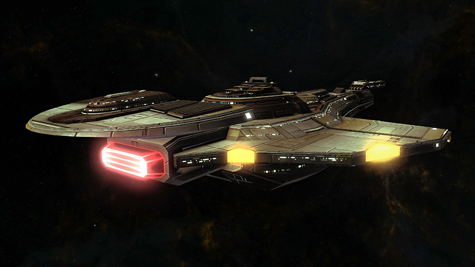

Back to: [West Karana](/posts/westkarana.md) > [2012](/posts/2012/westkarana.md) > [February](./westkarana.md)
# STO: Red Gift Box, v2. Now with more cash needed!

*Posted by Tipa on 2012-02-09 07:49:57*

[caption id="attachment\_10073" align="aligncenter" width="475" caption="It'll cost you to open this box."][/caption]

At the winter holiday event. Cryptic dangled a Jem'Hadar starship in front of the players. "Run the race in Q's Winter Wonderland," went the line, "and you will win a gift box that could contain this highly desirable ship!" The chance of that race dropping one of the red gift boxes was less than 1%. The chance that the red gift box, once obtained, would have a ship inside was far less than 1%. You could \_buy\_ gift boxes for $1 each. On the forums, people reported spending between $50 and $200 for red gift boxes until they obtained one of those ships.

Most ended up with stacks and stacks of useless items, and no ship. I was one of those; I only spent about $30 on red gift boxes. That was my wake-up call. All that money for nothing. Never again.

At least there was a really, really small possibility of obtaining the ship for free.

Along with the new feature episode this weekend comes the [Cardassian Lock Box](http://www.startrekonline.com/node/2864). This will drop as loot in the game. The lock box can contain:

 * A box with a Cardassian Galor class cruiser starship.

 * A box with a powerful cross-faction starship console.

 * A box with a Crossfire Tribble.

 * A Duty Officer Pack just like the ones sold in the C-Store.

 * A Large Commendation Boost

 * A smaller Commendation Boost

 * A Skill Point Boost

 * A box with a shuttle pet.

 * A box with a Dilithium Horta companion pet

 * A box with a Sehlat Cub companion pet

 * A box that when opened unlocks the Deep Space Nine Federation Costume Pack for the account.

 * A Shield Pack box. This box contains a random blue or purple quality shield for a starship or personal shield for ground use.

 * A box with a stack of Gamma Quadrant commodity items for use in Duty Officer missions.

 * A box with a stack of double bonus consumables

More detail on these options [at this link](http://www.startrekonline.com/node/2864), but it boils down to boxes containing the ship, and boxes not containing the ship. You can certainly expect you will open boxes not containing the ship hundreds of times before opening a box that contains the ship, the Cardassian Galor-class cruiser.

The boxes drop for free. But opening them costs cash -- 100 CP per master key. That's a bit over a dollar per try. How much is this ship worth? A week's wages for something that is pretty comparable to the Excelsior-class ship already in the C Store.

[caption id="attachment\_10074" align="aligncenter" width="475" caption="The Cardassian Galor-class cruiser"][/caption]

it's not a bad ship, the Galor ([full details here](http://startrekonline.com/node/2866)). It's appropriate to put it in the cash shop, the game having gone free to play, after all. What I object to is the lotto aspect of it. If you think the average player will spend $100 (random number pulled from the air, likely on the low side) on this ship, put it in the cash shop, charge $100 for it, and everyone who wants one can send the benjamins your way.

Trying to \_trick\_ players out of their money, though -- that's low. Yes, it's done in lots of other F2P games, and it's low for them as well.

The forums are, predictably, on red alert. [61 pages of stunned and angry players](http://forums.startrekonline.com/showthread.php?t=252981) as of this writing, many still reeling from the Red Gift Box scandal and wondering how Cryptic could pull the same stunt twice in a row. They're hoping to trap the new F2P users, say the conspiracy theorists.

Longasc of the German fleet Rhodanjugend (not the real fleet name) plans to sell the boxes on the exchange to people with too much money, and perhaps earn enough to BUY the ship outright from those who choose to sell them after they finally win them. Sounds like a plan to me.

## Comments!

**[Werit](http://www.weritsblog.com)** writes: While I may buy a few keys (I pay nothing for the game after all), I don't find it tricky at all. I don't really need anything from those boxes. The ship would be nice, but nothing is going to force me to spend more than a few dollars on it.

---

**[Tipa](https://chasingdings.com)** writes: You and I aren't the targets for this. The Red Gift Box was the most profitable item ever sold on the C Store. The reason was "whales" -- people who cannot control their spending. These are the people every F2P game developer lives for. People who form an emotional attachment to something they do not have and will eventually spend almost any amount to get.

I don't believe in gambling -- even in casinos, I feel it's just a tricky way of separating people from their money. I don't like that game. It's said that if you put a frog in a pot of boiling water, it'll hop right out. But if you put it in a cool pot and slowly heat it, you'll cook it alive.

Is that really how a game company should be treating its players? Like a frog in a pot?

---

**[Scott](http://pumpingirony.net/)** writes: Whether we as the gamers (ie. the consumer) want to see it and believe it or not, this is all a business. Everything they do -- the existence of the game itself -- is to separate us from our money.

I don't gamble, not because I can't afford to, but because I find it all incredibly boring. I'm not going to load up every F2P game I have installed to verify, but I do know that several of them have lottery boxes going on at all times, usually multiple lottery boxes. They are obviously attractive to certain people. One difference that separates this from outright gambling is that you *always* get something, just probably not what you wanted. You're paying for pixels, and you get some pixels but there's a very low percentage chance of winning the pixels you wanted. Real-life gambling you pay up, but you either win something or nothing whatsoever. 

And quite frankly, I don't feel the need to be anyone's financial therapist or caregiver. If someone has a spending problem or an addiction, that's their problem, and they're not going to change until they look in the mirror and acknowledge they have a problem and do something about it. I'm all for that, go out and better themselves and their lives, but in the meantime I have no problem being the beneficiary of their addiction. If it helps fund more content for me to play, they can whale away. Chances are, I have more money than most of the whales but you don't see me becoming one myself. I don't "need" pixels, but I'm willing to pay for things that I "want" like inventory or bank slots, stuff like that.

---

**[bhagpuss](http://bhagpuss.blogspot.com/)** writes: I don't have an issue with gambling. It's both legal and socially acceptable where I live. I also don't have an issue with people spending their disposable income, legally, however they choose, even if it's in a way that I would consider asinine.

I do, however, have a problem with exploiting people with genuine mental health issues and I suspect that there are legal authorities who might have a problem with unlicensed, unregulated gambling. 

On the former, companies are playing with fire by exploiting "whales". At some point there is going to be a lawsuit from someone, somewhere alleging systematic abuse of trust related to this kind of behavior. It's going to be very bad publicity even if the claim fails and if it's attached to a well-known I.P. like Star Trek it's going to be very big bad publicity.

On the latter, it takes legal systems a long time to catch up with technological innovation and changes in social behavior but they do inevitably get there in the end. Virtual items and ownership is on the legal radar already but this particular wrinkle is much easier for authorities to grasp than most. The boxes are clearly analogous to both lotteries and scratch cards, both of which have existing legislation attached.

There will be consequences. Eventually.

---

**[Scott](http://pumpingirony.net/)** writes: You can also enter the lottery box game with the same frame of mind some people enter a casino: walk in the door with a monetary limit and stick to it.

For example, if you really really want the Galor, and it's comparable to the Excelsior, you could limit your key spending to whatever the C-Store cost of buying the Excelsior is. Maybe you'll get the Galor, maybe not. I guess, for me, the other frame of mind is every time I click "Purchase" I have to say "I'm supporting a game I like" or "I'm supporting a company I like" or whatever does it for you, instead of "please God, please let there be Galor pixels."

---

**[Warsyde](http://rpgwire.blogspot.com)** writes: The lotto nature of the gift box is especially irritating given that the Galor is not just similar to the Excelsior retrofit, it's better. It has a bridge officer layout and turn rate (10!!) that make it ideal for cruiser damage output, coupled with the best shield modifier a cruiser can get (even better than the recently best-in-class shielded Odyssey). The "penalty" it pays is a much lower than average hull value which I understand is important in elite STFs and PvP, but a relative non-issue for standard PvE content. As far as combat capability, this thing easily outstrips the brand new Federation flagship, the Odyssey.

It's also usable at level 40, despite being superior to the VA ships it's being compared too :P

Do I want one? No, I think it's ugly. Do I wish they'd put a Fed cruiser with stats like that on the C-store? Yes.

---

**Yarr** writes: I just don't understand how these types of gambling (because that is exactly what it is) haven't already come under investigation by government agencies yet. Heck, SOE is doing exactly the same thing in Free Realms (a game with a player base mostly made up of teens and younger, by SOE's own figures) with their Mystery Chests that can only be opened with keys you have to buy; not to mention the gifting tree in the past which was another gambling item. At least this time SOE is giving members a free key each month and I was lucky, got the jet boots on the third one I opened. :) I won't be buying any keys though, either sell the items outright or don't bother.

---

