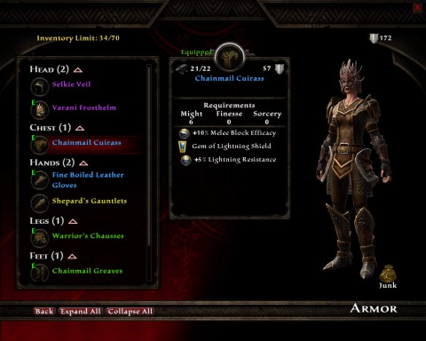

Back to: [West Karana](/posts/westkarana.md) > [2012](/posts/2012/westkarana.md) > [February](./westkarana.md)
# KoA:R -- What class are you supposed to be, anyway?

*Posted by Tipa on 2012-02-10 08:00:50*

[caption id="attachment\_10082" align="aligncenter" width="480" caption="Your basic fighter/rogue"][/caption]

I really have come to appreciate Reckoning's \_adaptability\_. 

I started out as a pure fighter-type, all my points into Might. This gave me fantastic scores in blocking and swordfighting, eventually making me a master of the greatsword. This was all very cool stuff. The armor looked amazing. My ranged skills were sub-par, though, even though I gave up the chakrams for a bow. I really would rather play a stealthy type.

Plus, I got these really wicked unique daggers from a dungeon and I just wanted to play. So, I visited my local Fateweaver and told him to reset my points. It cost a bit over 2,000 gold to arrange, and I imagine that amount will increase each time I have it done.

I put all my points into Finesse, chose a full-on rogue destiny and... realized I was dressed in tatters. All my armor required Might to wear. I went to the forge and salvaged every bit of gear I had, but that didn't give me enough components to make a full set of decent rogue armor.

This is where I loaded up my latest saved game and tried again...

[caption id="attachment\_10083" align="aligncenter" width="480" caption="Worth respeccing for!"][/caption]

I needed seven points of Might to wear all my current armor, so I dutifully put seven points in Might, for shield blocking, because that's fun to do. The rest into daggers, faeblades and ranged prowess on the Finesse screen.

The hybrid might/finesse destinies seem very much designed for players who want to switch between a stand-up fight and a sneakier approach. I like that. If it doesn't work out, I can switch again.

I just replaced the last bit of my Mass Effect 3 armor, the gloves, with a pair I crafted. Still would like some way of keeping the appearance of that armor with the stats of the stuff I'm now wearing.

