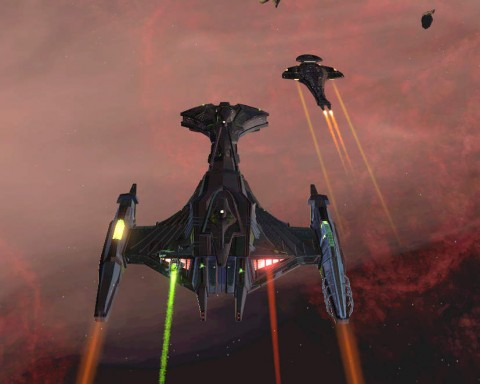

Back to: [West Karana](/posts/westkarana.md) > [2012](/posts/2012/westkarana.md) > [February](./westkarana.md)
# STO: A Case of Galor Envy

*Posted by Tipa on 2012-02-13 20:33:08*

[caption id="attachment\_10101" align="aligncenter" width="480" caption="Cardassia is MINE!"][/caption]

Okay, no, this isn't MY Galor, but that of my good friend Longash. I'm not quite sure on all the details, but I believe he borrowed money from an honest looking Ferengi to get the ship. Anyway, like the holiday Jem'Hadar Bugship, the Cardassian Galor cruiser has a custom bridge, along with some uniquely Dominion design features such as no chairs. Except for the captain.

[caption id="attachment\_10100" align="aligncenter" width="480" caption="Bortas and Galor"][/caption]

The slippery thing moves like a FISH. Long got consoles and doff powers and whatnot to give the ship an incredible 21 degrees/second (366 radians/kilosecond metric) turn rate. That's a tighter radius than most escorts. Combined with unique weapons and all the powers normally reserved for big, massive ships like the Bortas I'm flying here, this is one heck of a ship.

[caption id="attachment\_10102" align="aligncenter" width="480" caption="Narad@Heretic, Krontar@Tipa, and Longash on the bridge of the Pandora"][/caption]

Special enough that a dev -- Heretic -- came by to visit. He was getting a bridge officer trained by Longash. Because (as Heretic pointed out) even devs need their bridge officers trained. Yeah, but how much did he pay for his ship? His Galor is running with a complete Cardassian crew, from captain down to ensign.

Prices for the Galor have fallen from 800 million energy credits to about a tenth that today. Soon everyone who wants one will have one.

I'm still holding out for the bugship.

## Comments!

**[Tesh](http://tishtoshtesh.wordpress.com)** writes: I'd be happy with either, but I'm not shelling out cash for lottery tickets. I might get one Master Key with C Points from the Dilithium exchange for the single Gold lockbox I got for killing an Undine, but that's about it.

...but I'd almost pay, say, the more-or-less going rate of 1200 CPoints for either of those special ships. I just don't like the lottery mechanic.

---

**[Tipa](https://chasingdings.com)** writes: I used all my spare Cryptic points on keys -- no luck. I don't think I want to spend money on this, especially with ship prices falling so rapidly.

---

**[Ardent Defender](http://Ardentdefense.wordpress.com)** writes: I spent points on 3 keys and no luck, at that point I catch on real quick that opening those boxes is a bit a crap shoot. So been stacking them up in my bank at which I now have 24 boxes so far. I refuse to get sucked I to buy any more keys for Cryptic Points. 

However that's a pretty tricked out ship that Long has and impressive enough a Dev even came by as well. Quite awesome.

---

**[Warsyde](http://rpgwire.blogspot.com)** writes: I've opened 4 boxes and gotten nothing but the new DOFF components which are nearly worthless compared to the CR cost of opening the box. For 100 CR I was able to sell the box of components for a measly 39,000 credits each, or 156,000 EC for 400 CR. Or I could have spent 400 CR on a caitian bridge officer and sold it for 3,000,000 EC, turned around and bought 70+ boxes of components if that was something I wanted. Worthless.

That said, the Galor is a fairly OP cruiser, especially considering it can be used at level 40. I'd be kind of sad if I got that at level 40 really, as it would mean no real upgrades at level 50. I'm thankful I think it's ugly though, as it kills any desire I have for the thing. I'd love for them to put a Klingon and/or Fed cruiser with similar stats on the c-store though.

---

