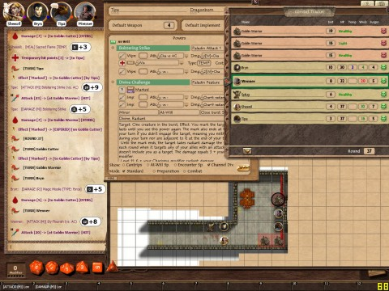

Back to: [West Karana](/posts/westkarana.md) > [2012](/posts/2012/westkarana.md) > [February](./westkarana.md)
# D&D 4E Shadowfell Keep: Splug is the hobgoblin of little minds. Part I.

*Posted by Tipa on 2012-02-18 00:15:31*

[caption id="attachment\_10113" align="aligncenter" width="480" caption="Does this ring a bell?"][/caption]

"You all so good people, give all you hug many time," whispered Splug to Wenner. The hobgoblin moved a little closer. The stench was overpowering to the halfling, and he'd been close to some heroic stenches in his day. "But you my favorite," said Splug, "you hairy like me. Maybe hobgoblin and halfling cousin, yes?"

"I think not," said Wenner, edging away. "Don't you have some hobgobbling to do?"

"Oh, no, put hobgobbling behind, me. Adventurer now, kill bad guy, snick-snick! Save poor hobber, shivering in cell, scared sound from room mean torturer get ready to come for Splug! Adventurer save, adventurer good, adventurer still alive, hobbers and gobbers dead, no need be halfling to see which way fate turn, now me adventurer! Carry pack! I carry your pack!"

Splug, true to his word, yanked Wenner's pack clear off him, then went and gathered the packs of the rest of the party where the other adventurers -- dragonborn Tipa, wizard Bryn, and elvish healer Sheeoil -- had dropped them while they fought the torturer and his minions. Splug staggered, but managed to stay upright.

The other members of the Adventure Company looked from Wenner to Splug and back again. "You're cleaning the litter box," grumbled Tipa as she finished wiping her sword and shield clean.

"Time to get mapping," muttered Bryn impatiently. "Keep focused. Mapped eight rooms. Eight rooms. Seventy percent of dungeons take more area as they descend. Estimate twelve rooms next level. Must map." Bryn's fingers grabbed spasmodically at his charcoal and parchment. The pages were filled with carefully rendered floor plans, diagrams of each entryway, richly detailed drawings of floor decorations and dense, arcane script that writhed on the page.

With Splug taking the rear, the party left the cell area and went through the splintered door of the torture chamber to the entryway. Quick examination of the room to the west showed only goblinoid rations. Wenner stuffed some goblin jerky into the pack on Splug's back. "You'll wish you'd done the same," said Wenner to the others as they turned away.

As the others further explored the entryway, Wenner hung back to destroy the crates. "It's a tradition," muttered Wenner. "What are we without tradition? See a crate, break a crate." He joined the others in the outer room.

They were gathered at a thick door; it opened easily and silently to their touch. Beyond the door stretched a long corridor, lit here and there by dimly flickering torches that did more to blind than illuminate. Guttural yelling echoed down the hall, but from where, nobody could see.

Sheeoil stepped into the hall; his keen elvish eyesight told him only that the hall ended in a dimly lit room; he could see nothing more. Coming back, he asked Splug what was down the hall. Splug only shrugged. "Guard, me think. Many guard."

"It's Wenner time," muttered Wenner. Back flat against the wall and alert for traps, he slid down the hallway, melting from shadow to shadow. The voices -- goblins now, he was sure -- got louder, but they didn't sound as if they were aware of the adventuring party just around the corner.

The thief peeped around the corner at the end of the hall. Two goblin warriors were slapping crude playing cards on the table from hands clenched in dirty fists, yelling at each other at full volume, their faces only inches from one another. One stood up and slammed his fist against the other's face; the second goblin replied in kind.

Wenner spied a bell on the table, clearly meant to call an alarm. Grab that, and ... no alarm. With the two goblin warriors at blows, Wenner had this one chance. He snuck to the table, grabbed the bell, and ... silence.

Two goblins were looking at the halfling, disbelief crinkling their expressions. The nearest dove at Wenner.

Wenner was already gone. He tore around the corner and down the hall at high speed.

"INCOMING!!!!!"

Tipa was already on her way; readying her sword even as she leaped over the halfling running the other way. Sheeoil had his mace out and was just steps behind Tipa. Bryn hung back as he settled into the arcane mindset from which he cast his deadly magics. Splug struggled to keep up.

Wenner slid to a stop and followed Tipa into the room. They found just one goblin warrior there; it died quickly. The other warrior could only have gone through one of the curtained doorways for help. Things were about to get real.

Tipa struggled to move the table in front of the hallway; with Wenner's help, they got it to the hallway and tilted it over. Instant partial concealment. Tipa, Sheeoil, Bryn and Splug crouched behind the table. Wenner stayed in the room, against the wall, waiting for something to come through a door.

In came two goblin cutters. Wenner's quick knifework left pink mist in the air where they'd stood.

"No halfling is going to take all the glory," yelled Tipa, vaulting over the table. 

The room filled with cutters and warriors. The room was too small to let Bryn cast his most powerful spells, so he settled for precision attacks against the strongest goblins. Sheeoil spent divine power freely, keeping Wenner and Tipa in the fight. Starting from opposite ends of the room, Wenner and Tipa slayed their way through goblin, meeting in the middle. Tipa, bloodied, wept blood in rivulets. Sweat streamed down Wenner's face. They thought there could be no enemies left alive on the floor after that battle.

They were wrong, of course.

Part II tomorrow.
