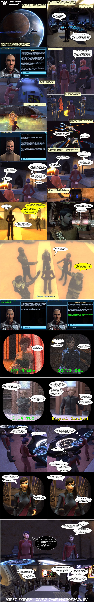

Back to: [West Karana](/posts/westkarana.md) > [2012](/posts/2012/westkarana.md) > [February](./westkarana.md)
# STO: "Of Bajor"

*Posted by Tipa on 2012-02-21 00:50:13*

Haven't done a comic in forever!

## Comments!

**[Tesh](http://tishtoshtesh.wordpress.com)** writes: Nice! I love the Vulcan Death Grip bit most. :)

---

**[Warsyde](http://rpgwire.blogspot.com)** writes: Nicely done :)

I have to say, I found the episode somewhat annoying. Not the content, which was fine as a break from endless combat, but rather that when doing the holodeck training the Jem'hadar dreadnought was able to 2-shot my Galaxy X from full health/shields and caused ship damage that I had to run off and repair.

So my ship in orbit took damage from a battle on the holodeck on Bajor.

Ooo . . . kay.

---

**[Tipa](https://chasingdings.com)** writes: @Warsyde undoubtedly tachyon feedback from the exotic matter nanoparticles setting up a standing subspace distortion field of the exact same frequency as the ship it was simulating............

---

**[Tipa](https://chasingdings.com)** writes: @Tesh I just find Captain Kurland to be a real jerk. Makes me run around doing menial stuff on DS9, then gives up on the negotiations, flees the station and abandons his first officer to die with the station. Then he's busy doing important stuff on Bajor while I run around taking care of all the hot spots, doing maintenance, lighting candles and so on. Once I figure out the secret frequency to get in touch with the Ferengi in Quark's Bar and get an update on conditions on the station, THEN Kurland shows up, tells me to keep out of the way, only to just throw up his hands and demand I prove to the Vorta that the war is over.

I really, really despise Captain Kurland. Captain Kurland whom I OUTRANK.

---

**Vulpis** writes: Heh. I can tell you're running an Engy just from this comic. ;-)

Yeah, the actual tasks in this episode were...kinda stupid (I to need to point out that you get an accolade if you read *all* the books--and you can go back after the task and ask to read them again), but the best thing about the episode is the new art assets--Hathon is a rather nice looking town, and even has a day/night cycle. It's definitely nice to see *new* architecture (or archi-textures, at least) rather than remixes of the existing stuff.

Judging from your comment, I'm obviously not the only one reeeally aggravated with how your fellow Starfleet officers are coming off in this FE set. I dunno if they play out the same in the other classes or in the KDF side of things, but I wanted to rip the stripes off of both Kurland *and* Shon by the end of Second Wave--I mean, the one guilt-trips me into fixing his broken-down ship for him, and the other one hides in the bathroom and then gives the absolutely most *snobbish* 'Well, do *you* have anything to contribute to this discussion?' line ever. Worse, when the solid waste material impacts the rotary atmosphere distributor, the two of them stand around twiddling their thumbs with Mr. Holoporn and Mr. Slave-booze, leaving me and the lovechild of BRIAN BLESSED and Godzilla to do the actual fighting. What, did you two sleep through Kirk 101: Unarmed Combat and Tasteful Shirt-ripping?? Gah.

S'taass is my favorite out of all the characters--he barks a lot, but he's still a big scaly teddy bear with a sense of humor ('I'm not eating the furniture....yet.') and not much needed to stroke his ego (No side mission for him, and the diplo approach basically boils down to 'We *need* a big guy who can kick a**, because except for me toting the assault gun, the other Starfleet NPC are helpless pansies)...who also happens to be a freaking *steamroller* in a fight. I'm humping heavy assault guns here, and I think he *still* was out-DPSing me with his bare fists... I hope we get to see more of him in later episodes. :-)

---

**[Tipa](https://chasingdings.com)** writes: S'taass is my absolute favorite character from Second Wave; he's pretty fun on the Klingon side. Still unanswered: Why he doesn't see the irony inherent on arguing for the Klingon Empire's imperial ambitions...

I swear, if Kurland doesn't step up in the next episode, I'm just writing him off. Sacrifice him to the Prophets or something.

---

**Ril** writes: From what I read on the forums and a podcast, S'taass was sent because the Klingon's thought it was a waste of time ... and no better way to insult the Feds then by sending a second class citizen to "play diplomat." Which is why S'taass was a bit over the top defending the Klingon's honor or lack of.... At least as a fellow Gorn that is what we heard on the grapevine.

---

**[Tipa](https://chasingdings.com)** writes: Better a Gorn than a Nausicaan, I guess :) I really can't stand the Nossies.

---

**[Wininoid](http://www.nerniandfriends.com)** writes: Hahahah! Very well done!

---

**[Tipa](https://chasingdings.com)** writes: Thanks! :)

---

