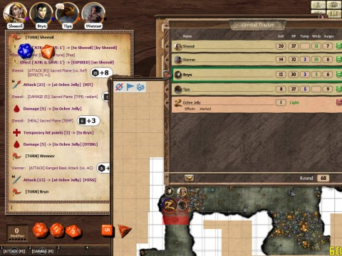

Back to: [West Karana](/posts/westkarana.md) > [2012](/posts/2012/westkarana.md) > [February](./westkarana.md)
# D&D 4E Shadowfell Keep: There's always room for pudding!

*Posted by Tipa on 2012-02-29 23:46:34*

It was a cursed night when we came across the Pudding...

Huh? No, a PUDDING!

Mmm closer, not quite there...

That's it.

[caption id="attachment\_10132" align="aligncenter" width="480" caption="The Battle of the Pudding"][/caption]

It's hard to get a restful sleep in a dungeon, especially when you just KNOW a murderous, stinking, backstabbing (literally) hobgoblin had all the time in the world to go through your things before he took off to undoubtedly lead some sort of hobgoblin insurgency against your humble company of naive adventurers who want only to map some old ruins...

Who at one pointed wanted only to map some old ruins, but now have a second goal. We will map the ruins... and kill Splug. Splug, the mastermind. Splug, who upon hearing us outside the torture chamber, quickly stripped to his breechclout and hid in a cell so we would trust him, embrace him as a refugee. Splug, whose halting command of the common tongue lulled us into complacency. Balgron the Fat? That was Splug, I'm sure of it. Karacel? Undoubtedly Splug. Lord Orcus of the Nether Regions? That would be our man Splug.

Splug Must Die.

Still, he *did* carry our packs for us. Wenner grumbled as he shouldered his load. I barely even noticed the weight of mine. I could have carried Wenner's without noticing it. I could have carried *Wenner* without strain.

Not that I would.

We unspiked the door and headed down, down through Fatty Balgron's room, down past the excavation, down to where Splug was last seen. There was another stair, but Splug hadn't gone down that other stair.

> You get to the bottom of the rickety old stairs and find yourself in a natural cave. The ceiling is thick with stalactites. The rocks and debris littering the ground grow thicker to the east and the west, with only narrow passages in those directions.

Bryn's charcoal made angry squeaks on the parchment as the wizard mapped the room. Wenner sniffed the air; there was a musty scent to the room, no particular direction. Bryn summoned light to his staff. There are no tracks to be seen; the debris of rock fallen from the ceiling make tracking impossible.

That scent though... that scent was worrying. Wenner slid against the wall at the bottom of the stair, checked for traps -- no traps. Bryn takes a closer look at the debris, and finds it isn't natural to the cave, after all. It's debris from above, possibly left behind when the keep was built.

There's skittering from the debris piles; giant rats. We play cat and rat with them for awhile, occasionally getting lucky enough to stab/magic missile/burn one before it can disappear into the heaps of rubbish once more.

We probably killed ten rats all together.

~~We start moving toward the narrow east passageway.~~ Bryn, Sheeoil and I start moving toward the narrow east passageway, while Wenner heads west.

To the northeast, we find nothing but an empty room with occasional rat. To the west, Wenner finds a corroded metal door, green with age. Words are scratched into the fungus.

Having reached a dead end in the northeast, we decide to join Wenner in the west. Two rats appear behind Wenner. Turning away from the door to meet the rats, Wenner doesn't notice an enormous orange-red slime drip from the ceiling and reform silently in his footsteps. If the halfling had been wearing boots, he might not have even noticed the ochre jelly until he was swallowed up by it. Looking down, he gave a yelp and shifted out of the way. The jelly flowed swiftly in pursuit, swallowing one of the giant rats as it sniffed out tastier prey.

I'm running, passing too close to a debris pile hiding a rat, who bites and misses. I burn a standard action and take another move, climbing over a debris pile and ending up next to Wenner. Roaring, I leap into battle... but with what? What hurts jelly? Any adventurer knows you never CUT a jelly... that just makes TWO jellies. And poking it does nothing. Sword, halberd, javelins, useless. What's left?

The holy symbol we found in the dig. Bahamut's divine presence fills my heart. Faith is my weapon.

Bryn thunderwaves two rats and heads to join Wenner and me in the western passage. Sheeoil intends to join us, but a giant rat drops from the ceiling. Sheeoil swings at it with his morningstar... and misses. Sheeoil uses sacred flame against the rat -- one hit would burn the rat to oblivion -- and misses. Wenner shifts slightly more away, quite hurt.

Shouting a prayer to Bahamut, I summon divine strength and call upon radiant delirium, my daily. It hits. Divine wrath sears the surface of the jelly, but it folds itself over the wound and continues to attack. Bryn runs over the debris, just barely in range to fire an acid arrow at the jelly, which absorbs it without damage. The wizard uses an action point and fires a force orb at the jelly, which does damage.

Sheeoil and the rat face off for another round. The cleric is sorely needed at the pudding factory but cannot break free of the rat.

When my turn comes around once more, I have nothing -- radiant delirium was my only non-melee attack. Wenner suggests throwing rocks at it. So I throw a rock at it. Hits, does minor damage. The jelly will not be killed by rocks. I lay hands on Wenner and take away some of his wounds.

Sheeoil tries to hit his rat and misses. Sheeoil uses his move action to shift away from the rat, then uses an action point to move and join the group. Wenner throws a rock at the jelly, epic miss. Bryn casts thunderwave on the ooze, it misses as well. I throw another rock, miss! But I mark it. Rat is coming for Sheeoil; Sheeoil ignores it and casts a beacon of hope on the jelly. It misses! Sheeoil uses his Elven Accuracy to try again, and this time it hits. Damage done to the jelly, and healing pulses out to the group.

Wenner steps back a space and easily dispatches Sheeoil's rat.

The jelly splits in two.

We panic.

Bryn tries another thunderwave, which misses. He offers me his old quarterstaff; I waste no time pulling it from his back, turn, swing and strike at one of the jellies -- a hit!

Sheeoil summons a healing strike on the jelly which hits and heals Bryn, leaving a floating mark above the creature.

It takes a few more rounds for both jellies to die; it's the hardest fight we have had so far.

The words on the metal door are written in common: "Stay Out. Really."

Wenner checks out the door and finds no traps. It isn't even locked; it swings open to his touch. Sheeoil heals Wenner up, and we follow Bryn around the room, filling in the map. There's only two ways out of this room -- through the door, or down a passage leading to the south.

We creep silently south, come to a room and gasp as we see a -------

We'll find out Thursday night.

