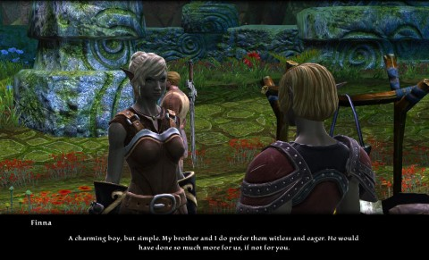
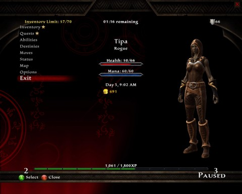
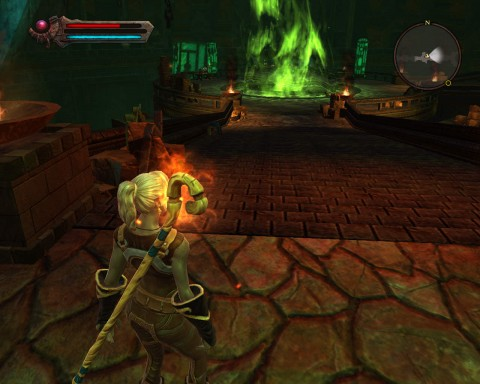

Back to: [West Karana](/posts/westkarana.md) > [2012](/posts/2012/westkarana.md) > [January](./westkarana.md)
# Kingdoms of Amalur: Reckoning: the Demo

*Posted by Tipa on 2012-01-21 19:29:25*

[caption id="attachment\_10018" align="aligncenter" width="480" caption="Cinematic dialog"][/caption]

The "Reckoning" is a special mode you can get into where you become extremely deadly and suck the Fate right out of your fallen enemies. Just in case you were wondering what that was. It's one of the more distinctive bits of a fantasy RPG that Electronic Arts hopes will be compelling glimpse into the world of Amalur for eager fans awaiting its unveiling as a fully-fledged MMO.

"Reckoning", developed by Big Huge Games, was originally going to be an RPG with entirely different lore. 38 Studios bought BHG and "Reckoning" as a platform for the assets, lore, and setting for the world R.A.Salvatore and Todd McFarlane developed. A world of deep fantasy, innate magic and twisted beauty.

You wake up on a pile of rotting corpses, in "Reckoning". As your lifeless corpse is being carted to the incinerator, the gnome corpse handlers discuss the finer points of your well-preserved carcass, giving you (the player) an opportunity to customize your character and set your name "for the records".

But you aren't actually dead. Well, not any more. The Well of Souls, an experimental machine, has plucked your spirit from the aether and given you a new body. This trick has never actually resulted in a living being -- until now. You're the first. And now everyone wants to kill you, unless you put your faith in some gnomes.

I recall an interview with R.A. Salvatore where he mentioned that there was finally a game that bothered to give an explanation as to why your character could bounce back so easily from death again and again. But single player RPGs don't generally do that. You die, it's game over, load your last save. It's clear from this that Reckoning truly is meant to be a prelude to the larger game yet to come.

[caption id="attachment\_10021" align="aligncenter" width="480" caption="Note the thin paths between zones. Open world this is not."][/caption]

The tutorial equips you and instructs you in the arts of the three main archetypes (Fates), Warrior (Might), Rogue (Finesse) and Mage (Sorcery), though these are by no means set in stone, and you can change them at any time by changing your gear or by choosing a new Fate, once you have unlocked the ability. Fates are unlocked by purchasing or upgrading abilities on the talent tree when you level. You can choose to stick with one line, or mix two or even all three fates in any way you like. Each combination has its own unique powers.

I chose the Finesse tree (mostly) for the demo, though a bug in the talent tree UI had me spending points in a tree I didn't expect. Even though I went with Finesse armor and weapons, nothing prevented me from keeping a fire staff ready and casting a spell or two.

BHG only gives you a couple of hours to play the demo before it kicks you out. In that time I completed a few quests, killed dozens of monsters and explored two dungeons. I also unlocked a lot of items for use in the retail game and in Mass Effect 3. You get a Reckoning-theme weapon in ME3 for running out the clock in the demo... so that's something to watch for.

I went through the demo wondering where I'd seen this game before. Then it hit me: this game looks so much like Sony Online Entertainment's Free Realms. The PC models are more realistic (if that word has any meaning in a fantasy title), but the world itself -- I'd spent time there.

[caption id="attachment\_10020" align="aligncenter" width="480" caption="Not the character creation screen"][/caption]

**Character Creation**

Your character can choose from four races -- which correspond roughly to what would be human, barbarian, high elf and wood elf in other RPGs -- but aside from a point or two in a different place in your starting talent tree, your race doesn't make a material difference in the story. My character, a wood elf, came across a human who claimed to be on an errand for powerful, mystical, rarely seen Fae. Considering that the "Fae" would turn out to be wood elf bandits, same race as me, you'd think that human would have taken one look at me, muttered a curse beneath his breath, and simply returned home that very moment.

**Combat**

Combat is a hybrid between the click to target and you hit what you aim at methods. The game will pick out the likeliest target automatically based on which way you are facing, your weapon and distance to target and that will be your target, even if it means it has to swivel your character to point off screen and attack something you hadn't seen. Instead of the enemy in front of you.

You can and should dodge enemy attacks, or pull out your shield to block. Holding up a shield while the enemy does a 1-2-3 hit and then unleashing a melee barrage while they recover is the way to win any battle. Kill enough and you can unleash the "reckoning", which puts you slightly out of phase with the world, sends everything in slow motion, and lets you just become a killing machine, ending with a showy finishing move (that can be enhanced through a quick time event; watch for it).

Players can learn combo attacks and dodge out of the way of almost any attack.

All characters can block with a shield, cast spells or enter stealth. Spending points in the appropriate trees enhances these. Choosing appropriate fates even more.

Reckoning's version of a stealth archer is pretty far up the Fate list. I like playing stealthy roguely types, the hallmark of the Rogue fate. Sneak up behind someone fast enough and wait for the UI to signal the special Backstab move. Nigh instant death. That works if you can get behind them before they see you, anyway. Mobs typically are positioned so that they are staring right at you as you enter the room, so stealth wasn't that useful for me. The higher level Fates seem to address the problem, eventually, but you'll want to be relying on other talents until stealth becomes useful.

[caption id="attachment\_10022" align="aligncenter" width="480" caption="The Well of Souls"][/caption]

**Questing**

I haven't seen a Kill Ten X quest in the demo; all the quests further the story in some way (the dark elf Tuatha are invading the land in order to destroy the Well of Souls and just cause general mischief). Or introduce the land and the lore. Escort quests seem to be an early favorite. I also got a "collect ten lost things" quest, so, generally, Reckoning doesn't break any new ground in questing.

**The Pros**

The developers of BHG have definitely done a good job with the assets of Amalur, telling the story, introducing the races, the gods, the magic system and the lore. Quest objectives are marked on a map, fast travel is available, difficulty can be adjusted and the graphics are low fidelity enough that it should (*should*) "run on a toaster". 

The combat closely resembles the hybrid combat found in RPGs such as Dungeons and Dragons Online. The armor and weapons look appropriate and impressive. The "fate" system is an intriguing way of implementing classes, of which there are many.

Though as the player is unique in the world in having no fate and therefore being able to pick and choose their fate, the implication is that everyone else in the world is born with their eventual class pre-determined by their unchangeable fate.

The giving and continuing of quests using in-game cinematics might be a pro or a con, depending on how you feel about them. I'm leaving it in the pro side. It adds to the atmosphere of the game and they can be skipped.

The game can be played, on the PC, with either mouse or keyboard or a game controller. The UI shifts between the two control methods based on which one you most recently used, moment to moment. It's actually rather neat.

**The Cons**

I couldn't play the game at first; I asked for help and was told to bring down my graphics settings. That worked, but there were still graphical glitches elsewhere in the game. Presumably all these will be sorted out by the time the game goes live (and I have read they are already fixed; we're running old code in the demo).

Rogues seem a little weaker than the other main paths in the demo.

The game is, graphically, flat and decidedly old school. This could be because I had to lower the graphics to get the game to run or a deliberate choice, but it doesn't stand up well to modern RPGs like Skyrim or Dragon Age II. Again, this is entirely subjective, and you might well prefer this style. The most popular MMORPG in the world uses it. Can't argue with eleven million players.

While an online connection doesn't seem to be required, it is necessary to be connected to log achievements and so on.

As in many newer games released both on consoles and the PC, the UI strongly favors a game controller. Looking at inventory, equipping gear, changing weapons and spells and so on all require navigating through menus. Hopefully this will be modded out as Skyrim's similar design decision allowed.

**Buy/No Buy?**

If you're eager for a peek at 38 Studio's "Copernicus", which shares a setting with Reckoning, this has to be a day 1 buy for you. If you're after a fun RPG with a good story, Reckoning will likely fill the bill.

Last year my single player RPGs were Dragon Age II, Dungeon Siege III and Elder Scrolls V (Skyrim). Sequels all. Reckoning starts a new franchise in an expansive world. It's no Skyrim, but not every game has to be a Skyrim. It's a clear sight better than DS3 and DA2, if you set aside Reckoning's relatively shoddy graphics (which, again, may be a bug that has already been fixed).

I'm giving it a cautious recommendation.

## Comments!

**[Yeebo](http://yfernbottom.blogspot.com/)** writes: You had me at "The combat closely resembles the hybrid combat found in RPGs such as Dungeons and Dragons Online." This post single handedly put this game on my radar, I love the combat in DDO.

---

**[Tipa](https://chasingdings.com)** writes: Give the demo a shot!

---

**[Tramell](http://www.gamerbc.com)** writes: Played a bit of the Reckoning demo myself and I love the combat especially when I got dodging down. It takes a bit to get use to with the slight delay when you use while performing combos. I would also agree that the UI gives off the old school feel, i don't mind it but it could be jarring for some.

I also had the issue where I would get the black screen upon starting up the game as well as, overlapping subtitles and whatnot. Just turned off post-proccessing like you did and everything was gravy. Hopefully that was just a bug in the demo build since they usually use an older build of the game for demos.

The only thing I did not like was the customization options. I love making the perfect character but it was a bit barebones for me.

---

**Neesha** writes: Downloaded the demo Friday night when I saw Steam had it...had the black screen which the forums say is fixed in the retail. 

Played a rogue...it was alright, stealth/sneak was hard with all the multiple encounters that I saw.
Played a fighter...was more fun, combos were coming alive. Good stuff.
Played a mage...omg, super fun with spells and combos and then 10-15 minutes before the demo was done, I got some chakrams and leveled up to 4 so was able to put some points into chakram abilities. Felt like Xena out there flinging my chakrams around all over the place. Great fun.

If I get the retail version and I will when it comes down in price a bit - $60 seems a bit much - would have to play the mage in hard mode as groups of enemies were going down w/o coming near me. Only chance they had was when my mouse would bug out and I was facing a different direction than what my camera angle showed. That's gonna get some getting used to.
PC ui and the assumed linearity of this game appear to be the only negatives I saw playing the demo.

Side note - story sounded so familiar to Rift except I am the only "ascended" since this is single player. Being resurrected in the life "factory", not knowing anything and having super awesome powers.

---

**[Tipa](https://chasingdings.com)** writes: I'm thinking the same. Wait for a sale and buy it. I was pretty disappointed with the rogue, though the fate descriptions made it sound like the intention is for stealth to be useful at some point. The teleportation ability should help there.

---

