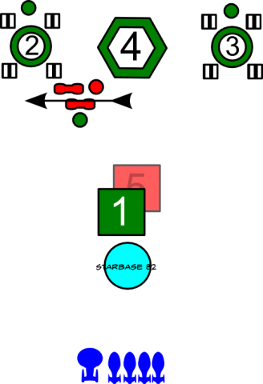
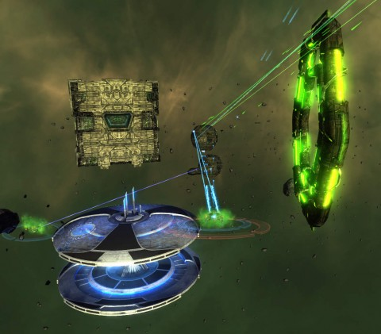

Back to: [West Karana](/posts/westkarana.md) > [2012](/posts/2012/westkarana.md) > [January](./westkarana.md)
# STO Special Task Force walkthrough: Infected (Space)

*Posted by Tipa on 2012-01-23 00:24:46*

[caption id="attachment\_10029" align="aligncenter" width="480" caption="Infected Space (Elite)"][")](../../../uploads/2012/01/GameClient-2012-01-20-20-48-26-73.jpg)[/caption]

Infected (Space) is very simple. There's only one thing you have to do. And that is all focus and kill the nanite spheres and probes when they pop. That's all. Infected (Space) is a test of teamwork. If someone goes off on their own, the optional is all but lost.

There are two optional objectives. Complete the entire task force in fifteen minutes, and don't allow any nanite sphere or nanite probe to heal one of the transformers. If any nanite probe or nanite sphere gets close enough to heal a transformer, the optional is instantly lost.

The strategy is pretty simple. If you see a nanite sphere or nanite probe, kill it. One ship can easily take the probes, but unlike Khitomer Accord, they don't come alone. They come mixed with tougher nanite spheres and very tough sphere escorts. Additionally, random spheres come to defend the transformers.

Kill the transformers in order. Trying to kill both at once will launch an unkillable wave of spheres and probes.

[caption id="attachment\_10030" align="aligncenter" width="328" caption="Infected playbook"][/caption]

There's a lot of different strategies to winning Infected, especially the elite version, where the transformer guard spheres are replaced by cubes. I'm going to write down the way it's normally done in normal mode.

You start facing a tactical cube threatening a Federation starbase, Starbase 82. Like all tactical cubes, it has very strong shields, strong hull, strong weapons, and heavy plasma torpedoes that can take down an unprotected ship in one hit. It has two sphere guards which will try to tractor you so the cube can kill you.

It's pretty annoying.

Once the cube and the spheres are dead, move to the transformer marked with a (2). It is healed by four generators. Kill the guardian sphere (or cube in elite), the generators and then the transformer.

While this is going on, nanite spheres, nanite probes and regular spheres will arrive through the gateway. Break off and kill them. Seriously. Continuing to damage the transformer may cause another wave of probes and spheres. If any of the nanite spheres or probes heal the transformer, it will instantly lose the optional. Additionally, since they are healing damage to the transformer, it will take longer to finish the mission which means more waves of spheres until you have half a dozen circling around.

So when you see a sphere or probe while you're killing a transformer, take a break and help kill them. Position yourself in front of the transformer. Burn it down. When enemies come, swivel 90 degrees, kill them, turn back and continue the assault.

With that down, go to the transformer on the right side (3) and do the same thing.

[caption id="attachment\_10032" align="aligncenter" width="480" caption="The cube and gateway"][/caption]

With the transformers down, a tactical cube will arrive to guard the gateway. Both the cube and the gateway must die to get the optional. The cube takes longer to kill and does more damage, so I would kill the cube first, then kill the gateway. Some suggest killing the cube right at the gateway, so that the cube will damage the gateway, but that's pretty hard to arrange, and it puts ships in range of the gate's guns. Getting on the far side of the cube keeps everyone out of the range of the gate guns.

If everyone works together to kill the adds as they spawn, this special task force comes down to raw damage. Unlike Cure and Khitomer Accord (walkthrough still to come), nobody has to do a special job, Just kill enemies, then kill the gates, repeat until finished.

## Comments!

**Longasc** writes: A wise choice to stick to the normal mode for now. If people would do it like that all the time all but the very poorly equipped can even make the bonus in time.

(I am keeping log how often the various "10%, then kill all at once to spawn less spheres/probes" strategies resulted in the terrible horde of mobs people actually wanted to prevent from spawning. I think the strategy should be damned, as it has a track record of not working with the usual PUGs.)

---

**[Warsyde](http://rpgwire.blogspot.com)** writes: I appreciate your walkthroughs on this stuff. Hopefully I'll have the time to give them a shot in the near future. At least if I know what I'm doing I can only fail based on poor performance or gear, rather than ignorance :)

---

