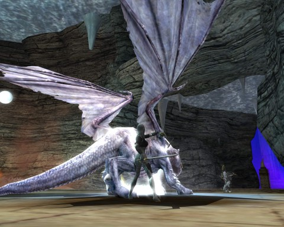

Back to: [West Karana](/posts/westkarana.md) > [2012](/posts/2012/westkarana.md) > [January](./westkarana.md)
# DDO: Unfinished business in Gianthold Tor

*Posted by Tipa on 2012-01-23 07:13:39*

[caption id="attachment\_10035" align="aligncenter" width="480" caption="Go ask Alice, when the white dragons fall"][/caption]

None of us was happy about the way we left Gianthold Tor; expert at getting through the dungeon and killing the Gatekeeper, unable to kill the three dragons at the end. We'd all gained a level since we left the Tor, though, and the Harbingers of Madness gear was a literal game changer for most of us.

The rewards for grinding Gianthold Tor for rare dragon scales are not that great, given the effort involved. I estimate it would take killing a dragon thirty times in order to get enough scales to make a piece of armor. We were never going to spend half a year farming this instance.

But the dragons had to die. Last night we returned to Gianthold Tor and we killed the dragons.

[caption id="attachment\_10036" align="aligncenter" width="480" caption="The Death of the Black Dragon"][/caption]

All the dragons have a giant protector, and both dragon and giant have to die within seconds of each other. For this, we split the group. Spode tanked the dragon, Ulan the giant, and Gleek and I would switch from one to the other to keep their health balanced as we took them down.

We'd all acquired special cold resist gear when we were here before. We suited up, potioned up and buffed up, went in, and died pretty fast. Came back, changed our positioning a little -- dead dragon. Between the four of us, no dragon scales.

Next up: the blue dragon, whose power was lightning. Since this was said to be the easiest of the three dragons, we'd tried this one a few times before. The room gradually becomes more electrified as the fight drags on. If you can't kill everything in two minutes, the room itself will kill you.

Again, first time failure. Second time we kept the clerics near to the wall, outside the worst of the electricity, and won. One blue dragon scale between the four of us.

Gleek challenged us to kill the black dragon in his room full of acid pools the first time. This trick requires keeping the clerics and everyone else on one of the islands floating in the acid pools. And we did it -- first try. Two black dragon scales among the four of us.

Three dragon scales out of twelve chances = 25% chance at a scale. If I'd need 20 black dragon scales for some decent light armor, I could expect to kill the dragon 80 times (on normal mode). I'd get some scales from other people in the group in trade for the ones I wouldn't need, of course, but that's still going to be a significant number of kills required.

We're happy we killed the dragons, but I don't think any of us see any reason to go back.

## Comments!

**Eladrin** writes: That's unfortunately one of those remnants of "this used to be capped content, but isn't any longer".

I'm having one of my guys adjust those rates, so when the expack hits there'll be a 100% drop rate of a scale on Normal, 1-2 on Hard, and 2-3 on Elite. (This way it'll only take a few runs if people are consolidating the scales.)

---

**[Tipa](https://chasingdings.com)** writes: Very cool! Thanks!

---

