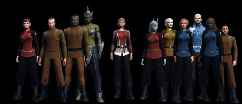

Back to: [West Karana](/posts/westkarana.md) > [2012](/posts/2012/westkarana.md) > [January](./westkarana.md)
# STO: Picture Day

*Posted by Tipa on 2012-01-28 01:06:25*

[caption id="attachment\_10046" align="aligncenter" width="480" caption="Admiral T'pral's crew"][/caption]

I noticed today I'd gotten my monthly allotment of C Store points in Star Trek Online (I get some each month for being a subscriber). There wasn't anything I particularly wanted to \_buy\_... I have all the ships I need. Maybe some of the uniform options.

There are \_lots\_. Most of the time, you're the only one who sees your bridge officers. How they're dressed has no effect on the game. But it's \_fun\_. I broke down and bought the Bajoran militia uniforms that Odo and Major Kira wore on Star Trek: Deep Space 9.

Then I decided I really needed a changeling on my crew. I brought my Romulan bridge officer kicking and screaming to the tailor, lightened his skin, shaved off a lot of sharp edges, partially melted him, and I had me my changeling.

All the males on my crew got Odo's uniform. All the females got Kira's, but in Starfleet section colors. You can see all my bridge officers above. Not all of them are thrilled with their new look. I guess they liked the regulation thigh-high boots of the old uniform.

[caption id="attachment\_10045" align="aligncenter" width="480" caption="T'pral's Fleet"][/caption]

Not much of an admiral without a fleet; after collecting all the bridge crew together, I thought I should do the same for her ships. My science admiral has an entirely different fleet, and my Klingon yet another. This is T'pral's. Mostly escorts. I scaled them to the relative sizes of the ships according to the Memory Alpha wiki. The Akira came out larger than I expected.

So; pictures.
## Comments!

**[Yeebo](http://yfernbottom.blogspot.com/)** writes: Those visuals look like they were a hell of a lot of work. Neat and informative, I tip my hat to you.

---

**[Tipa](https://chasingdings.com)** writes: Kept on thinking there must have been an easier way...

---

**[Gleek](http://happyduelingddo.blogspot.com)** writes: Amazing! Nice work. :)

---

