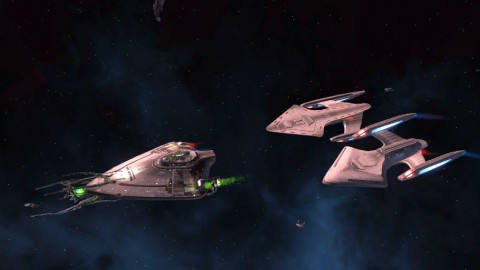
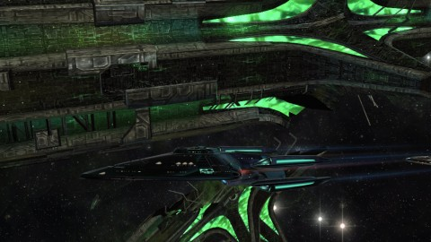

Back to: [West Karana](/posts/westkarana.md) > [2012](/posts/2012/westkarana.md) > [January](./westkarana.md)
# STO: I'd buy that for $138!

*Posted by Tipa on 2012-01-01 23:13:51*

[caption id="attachment\_9934" align="aligncenter" width="480" caption="Inside the Jem'Hadar bug ship."][/caption]

***Update:** There's a [thread on the Star Trek Online forums](http://forums.startrekonline.com/showthread.php?t=244540 "Forum discussion") tracking this. Apparently the percentage for winning a ship from a red box is 0.65%, making the average number of boxes to open (and hence dollars to pay) 153.*

The Jem'Hadar assault ship is one of the most desired ships in Star Trek Online. It has pretty awesome stats for an assault ship, has a unique exterior and interior. The Dominion War was fought on the bridge of ships like these.

You can win one by running a race during the STO winter event. You can win one race a day, but you can try as many times as you like until you win. They have even parked the ship on a cliff above the event just to give you a glimpse of what might be yours one day.

The red box in which the keys to the ship are contained is very rare. Further, the red box only very rarely gets you the ship. Someone talking in zone chat this evening said she'd opened thousands of red boxes on the test server and only gotten four ships; she estimated the chances of getting a ship were 1 in 200. And she guessed the odds of getting a red box for winning the race would be about that.

With those odds, the expected number of red boxes to open for a 50% chance at the ship would be 138 (0.5 = 1-(1/200)^n, solve for n). You can buy red boxes in the C-Store; they cost 80 points each. The best rate to buy Cryptic points is 5000 for $62.50, which works out to 80 points for a dollar. Each chance at the ship, then, costs you a dollar. $138 gets you a 50% chance at the ship. $459 gets you a 90% chance at the ship.

But you can get a chance for free. If the figures discussed were correct (and only Cryptic knows), then running 27,725 races will get you a 50% chance at the ship. I bought some Cryptic points and spent them all buying red boxes. No ship.

I wrote and ran a simulation, by the way. The average number of races that needed running at the given odds to win a ship was 41,348. At one try per character per day, well... I'll let you work that one out.

This sort of cash-fueled lotto machine is very common in Asian free to play games. People spend thousands of dollars buying chances to spin the wheel for awesome loot. Everyone points the finger at Cryptic's new owners. Perfect World Entertainment. Publisher of F2P grinding games worldwide.

You absolutely do not need to pay money in this lotto to play Star Trek Online. To quote the wise Admiral Akbar; it's a trap. And the thing is, by putting these sort of cash money sinks into the game, they are just going to end up driving people away because nobody can actually afford to get caught up in this sort of thing. Making a game that will tempt people into putting themselves in financial ruin is... well, it's pretty sick.

This is the face of Star Trek Online on the eve of its free-to-playness.

[caption id="attachment\_9935" align="aligncenter" width="480" caption="The Prometheus Multi-Vector Advanced Escort"][/caption]

I am absolutely willing to give money to a F2P game that plays honestly by me. After spending $25 on worthless red boxes, I went \_back\_ to the cash shop and spent money on the Prometheus Multi-Vector Advanced Escort for my latest max level character, Vice Admiral T'Pral. It separates into three sections; you choose which one to command, and the others follow behind and attack what you attack. Each section has different capabilities; the Alpha section is balanced; the Beta section focuses on weapon power; the Gamma section focuses on auxiliary effects -- buffs and debuffs in MMO lingo.

It's great fun, and Longasc, Talyn and I tore through some space-based Special Task Forces (STFs) and a couple runs of the Mirror Universe invasion event. It was absolutely worth the cash. I spend $X, I get Y. That's what I want from my F2P cash shops. I spend money and I get what I expected. Ship cost $9 or so.

I \_could\_ have gotten this for free. All STFs pay out unrefined dilithium ore. This can be refined (for free) and traded for Cryptic points in the Dilithium exchange (or used to buy non-cash shop ships and the best equipment). The exchange rate varies between 370 and 450 dilithium per Cryptic point. So you can eventually earn an elite ship with a lot of grinding -- or pay cash to get it now.

Remember that you will get every ship you \_need\_ for free as you level. The whole cash shop thing is only for special ships or if you decide to change tracks . Energy credits (the in-game gold) used to buy ordinary ships, but now trying a cruiser after you chose a science ship for your free ship will cost you dilithium or Cryptic points exchanged for same.

I wanted to write about the new leveling path (where the old Feature Episodes have been worked into the leveling path so that now every mission you run is a story mission, with no randomly-generated missions required at all). It was a lot of fun, and the duty officer/cow clicking mechanic helped out a great deal. Of my three characters, T'pral finished leveling with the best gear and skills, and I didn't spend a dime until the end. (Well, scratch that -- I bought the NX Enterprise months and months ago, but it was pure vanity as it only replaced her starter ship).

[caption id="attachment\_9936" align="aligncenter" width="480" caption="The Free-metheus"][/caption]

T'pral was previously in the free version of the Prometheus; nearly identical to the cash shop one, except it doesn't split apart. She's doing a victory flyby of a destroyed Borg mother ship from one of the random Borg incursion events. You get good dilithium for the victory.

There aren't that many space combat MMOs that let you decorate your ship and play dress-up with your crew. I think STO is pretty much alone in that space. So to speak. Cryptic has a good game going here, and the new leveling path brings you through the very best of the content while making the dull parts entirely optional.

Greedy lottos could bring the whole thing down.

(Python code for the simulation included!)

`from random import random

redChance = 1.0/200.0
shipChance = 1.0/200.0
winChance = redChance * shipChance

runningCount = 0
numTries = 1000

for i in range(numTries):
  count = 0
  won = False
  while not won:
    count += 1
    won = random() <= winChance
  runningCount += count

print "Average # tries was %d" % (runningCount/numTries)
`
## Comments!

**Pai** writes: I hate HATE HATE F2Ps with lotto boxes and loot wheels. I want to be able to pay and get what I want, period. Games with gambling just annoy me. I don't mind spending the money in a cash shop whenever I want, but I -strongly- mind being fleeced by a RNG.

---

**[Tipa](https://chasingdings.com)** writes: Absolutely. Tell me how much something costs, I'll decide if I want it that bad. Don't tell me "Well, it could cost infinity dollars." That's a sucker play.

---

**[bhagpuss](http://bhagpuss.blogspot.com/)** writes: This is one of the reasons why Free To Play is a good thing for me where it's a bad thing for others. I just don't have the gene for "must have", or not in this context, at least. In the subscription-based MMOs I've been playing for years there have been countless things that my characters were "meant" to have and that players felt they "must" get for them but I've never felt the slightest need to join in.

I played Everquest all through the introduction of Epics. I had very active characters at the level cap and I played 40+ hours a week for several years. I never did an epic quest on any of my own characters and never wanted to. In a game infamous for "camping" spawns I had a rule of thumb never to camp for anything for a moment longer than the point where it stopped being fun, which usually ran at about 20 to 30 minutes. I always felt that I was enjoying my gaming sessions more by *not* getting drawn into this kind of compulsive behavior and going without the items or abilities it would get me than my friends and guildmates were by participating in it. 

I see the kind of cash-shop item that you describe as a close analogy to the time-sink activities used by sub games to keep people subscribing. I've always aware that the sub games I play are largely being kept afloat by the hooks planted in people who may have issues with self-control and judgment. Subscription gaming is a morally dubious business at the best of times. It doesn't have a big impact on most people's finances directly but we all know the indirect effects it can have on income and the direct effects on both physical and mental health.

The F2P business model shortcuts some of that by going straight to the wallet and thereby potentially puts at risk a different segment of the population. As someone who is 100% certain he's never going to spend a single cent on a "chance" of getting any imaginary item, not even if that chance is 99%, my issue isn't how does the existence of these funding mechanisms in an MMO affect my gameplay. The issue is whether or not I feel sufficiently comfortable with the potential exploitation of possibly vulnerable individuals in order that my own gameplay be funded.

That was always an issue in sub games and it remains the same issue in F2Ps. I'm still playing both so I guess my moral compass is as unreliable as ever.

---

**[Tipa](https://chasingdings.com)** writes: @Bhagpuss -- that's how I enjoyed Zynga games, too. I, however, \_do\_ want some of the things available -- but I will not be putting one more cent into a lottery. I don't gamble in real life, and this is just gambling. With less hope of a payoff than in Vegas.

---

**[Warsyde](http://rpgwire.blogspot.com)** writes: I finally made Vice Admiral last night with my Engineer after pushing through the final six levels in order to be able to take advantage of the "last chance" sale. Of course, it ended up not mattering as I spent all my points on a Nebula refit (which I could have bought already) and a Dreadnaught (which will be the same price post F2P). Oops.

At least it got me motivated to actually play the game a bit rather than level via Duty Officers . . . which I have to say gives waaay to many skill points. I went from level 31 to 37 during the double skill point weekend back in December, then did 37 to 46 solely by Duty Officers while playing other games (and it was EASY), and then the final five as a mixture. I'd rather see the duty officer missions return more in credits and dilithium and get rid of the personal skill point gain entirely, and that despite the fact that I'd like to level a KDF character too. Make the duty officer assignments reward you with things that make you want to play the game rather than letting you level without playing at all.

Also, do you have any tips for a fresh Vice Admiral? I'll be using the Dreadnaught until I can properly equip the Nebula and see how that goes. Also thinking about re-rolling a science officer since it seems like they get more interesting skills. Respond to my e-mail if you like.

---

**[Tipa](https://chasingdings.com)** writes: Your first stop really needs to be the forums for build advice. My sci captain is in a sci ship (the Nebula), but my tac captain is in a carrier and my eng captain is in an escort, so you can mix stuff up pretty well.

I bought the Nebula because I really liked how it looked, but it isn't the best science ship. The Intrepid refit is probably better, as is probably the Vulcan D'kyr. But -- looks awesome. That works for me, and it turns pretty well, another consideration. Sci ships don't have the hull to just sit and take it.

As far as buffs go, if you want to make best use of a science ship, you need a couple of awesome science bridge officers with awesome level III abilities. Those will mostly run to support stuff, so a sci ship is best if you play with other people a lot. VERY useful in space special task forces if the captain knows how to play.

The Dreadnaught, I bought but don't like it. It lets you mount cannons and has that forward-directed Phaser Lance, but it doesn't turn fast enough to make it useful against anything but other large, slow ships. Good against Borg, though, famous flyers of large, slow ships.

Anyway for a Sci ship, you want to have a power setting with Aux set pretty high. Disable the enemy shields, then set power levels to favor weapons and ram torpedos down their hull. It's a timing issue, but done right, Sci ships can be pretty deadly. You just can't go in guns blazing, that's not how that ship works. You shut the enemy down, then take them down. Kill the shields (lots of sci abilities help with this) and blow them away with torps.

Since my Vulcan engineer leveled so fast, I skipped most of the story missions and pretty much just did cow clicking and STFs, with some story missions to get specific gear, like the Reman shields from that story arc. However, I've decided I want the Borg module from the first Undine mission, assimilated, and the linear nature of the storyline means I have to play every other arc to get to that one....

---

**[Randomessa](http://casualdoes.wordpress.com)** writes: Hey, Tipa, could you spell out what you are talking about in that last paragraph for the slower visitors among us (by which I mean me)? I'm not grasping how you can skip storyline missions but yet have to play every other arc to get the Borg module (I haven't reached anywhere near that point in the story yet, so I'm truly clueless).

---

**[Tipa](https://chasingdings.com)** writes: You can't skip ahead in the arc, but you don't need to do all the storyline missions in order to reach vice admiral and do special task forces.

---

**[Toldain](http://toldaintalks.blogspot.com)** writes: They are hunting whales. You, not being a whale, don't matter at all. The entire game is a honey trap, (krill trap?), meant to find those few whales that will throw dollar after dollar at it. 

I see this as corrosive to the entire genre, by the way. The value proposition is deeply damaged. If you, like me, aren't a whale, you stop being a valued customer, nothing is meant to be fun for the player that's like me.

---

**[Tipa](https://chasingdings.com)** writes: @Toldain absolutely. If you're gonna treat your customers like idiots with no impulse control, you're going to lose everyone else.

I'd have BOUGHT the darn ship if it had been reasonably priced. Now I will look at each new "contest" or "holiday celebration" as just another cash grab.

---

**[MrrX](http://togameforlife.wordpress.com)** writes: Thinking of reinstalling this one, but haven't found the time. Now that F2P is here I probably should, although any game that seeks to keep me captivated with gambling will definitely lose my attention. Seems all your commenters are in agreement !

---

**[Tipa](https://chasingdings.com)** writes: Well, nobody comes right out and proudly admits to being a 'whale'. That isn't when it happens. It happens when you decide to go for something, and it's taking too long, and you just think -- well, my time is worth more than this, and just buy it.

There's nothing wrong with that. This lotto thing, though, is new, and so far only for the bug ship. Lots of people are shining a light on this. We'll see how Cryptic goes forward. In the end, though, people choose to buy or not to buy on their own. It's their money.

---

