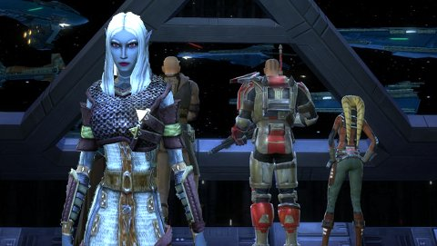

Back to: [West Karana](/posts/westkarana.md) > [2012](/posts/2012/westkarana.md) > [January](./westkarana.md)
# DDO: How to gimp your character

*Posted by Tipa on 2012-01-03 23:43:11*

[caption id="attachment\_9944" align="aligncenter" width="480" caption="Drow in Spaaaaace"][/caption]

My first Dungeons and Dragons character, I had no idea about. She was a dwarf cleric, a Hobbesian cleric -- solitary, poor, brutish, nasty and \_short\_. Healing was more fun when hirelings would do it, so I picked up a fighter level and made her into a melee cleric. I put points into whatever stats seemed good at the time. I had fun, but she was a horrid healer. No idea what I was doing.

When we all restarted, we decided to keep letting hirelings be our main healer, and I switched to rogue. Again, I just put points -- wherever. Took a level of fighter. I had fewer hit points than anyone, my dps was crappy, couldn't find traps well. I decided I was too stupid to level my character on my own, so I bought a +1 Lesser Heart of Wood (the +1 to remove the fighter level) and started over as a Rogue on the Mechanic Path -- a trap disarmer. Every time I went to the trainer to level, I'd just click "stay the course!" and the trainer would make all my choices for me.

A LITTLE better, but I still had fewer hit points than anyone, I couldn't hit monsters unless they were below my level, was usually killed in the first AE in boss battles. I proved to myself for the third time that I am too stupid to level a character in DDO on my own.

This weekend I went to the DDO forums, looked for a Drow Two Weapon Fighting Rogue build, bought a Lesser Heart of Wood (each time with real cash, of course, no free respecs in DDO) and followed the plan to the letter.

I now have comparable hit points to everyone else and did well on the dungeon score cards as we re-did the first three quests in the Harbingers of Madness line -- on hard mode. I actually was able to damage a boss. Wow. Also it turns out my previous build didn't have Two Weapon Fighting. So I was only hitting with my main hand weapon. I am slightly less able to find traps, but the build should keep me able to do that job, as long as I augment my character with Tomes of Stats that permanently raise your characteristics.

In DDO, it is required that you "eat" tomes to raise your stats. There's a sale now on a Tome that will raise ALL stats three points -- but it costs $35 and I just don't think it's worth it.

So anyway. I am too stupid to build my own character in DDO. I liked, in Rift, that I could experiment and try new things. DDO's F2P model requires that they get money from you however they can, and thus, players cannot experiment with different builds, and like me can end up with a horribly gimped character.

Team Spode has carried me for months, and I just felt sick at how little I contributed to the group. On normal mode dungeons, traps rarely hit hard, so the group would run straight through them to get to the next fight while I'd hang back disarming the traps nobody stopped for. Why should they? But since I couldn't fight or buff or do anything else useful, I could at least get the group 15% experience bonus for removing traps.

The only other game that has made me feel this stupid is EVE Online.

If you've played DDO, it's likely you're better at it than I am. But maybe you see some of yourself in my mistakes. Don't trust the game to lead you on to a good path. Don't trust yourself to figure out the best option. Just let someone else drive the car.

**For those who asked, this is the build I used to remake my Drow rogue: [Drow TWF Rogue Build](http://my.ddo.com/velluminous/2011/03/28/drow-twf-rogue-build/ "Drow TWF Rogue Build").**
## Comments!

**[Toldain](http://toldaintalks.blogspot.com)** writes: What made the difference with your to-hit? Did the rebuild put more into STR? 

Being good at traps (as in, HARD-level traps) requires that you focus a lot of skill points on it (as you've realized) and that you keep some gear with boosts around and hotkeyed. You can switch into it when you need to do a trap.

By the way, the DDO version of Toldain never, ever runs through a trap if he can help it. Even on normal difficulty. He's highly effective, but fragile. Whereas my daughter runs her paladin through them blithely. There's a groupthink thing going on here. That's endemic to 3rd edition D&D, not something introduced in the MMO version.

---

**[bhagpuss](http://bhagpuss.blogspot.com/)** writes: Team Spode wouldn't be famous if you weren't there to write about them, though.

Other than that, nice summary of some (although by no means all) of the things that make DDO a really annoying MMO.

---

**[pkudude99](http://nomadicgamer.com)** writes: "it turns out my previous build didn’t have Two Weapon Fighting. So I was only hitting with my main hand weapon"

Uh, no not really. Without the TWF feat you suffer a -6 to hit with your main hand as well as a -10 to your offhand, so you really weren't hitting anything with either hand (though your main hand did have a 20% higher chance to hit than your offhand, at least). With TWF that's now reduced to -2/-2, so it's not nearly as bad and you're hitting with both weapons. Hooray!

I'm with Toldain -- what does your build look like now? What stats, feats, and skills?

---

**[Tipa](https://chasingdings.com)** writes: I linked the build at the bottom of the post (should have remembered to do that when I posted). It's identical, except I started out with two less strength and two more dex. The Lesser Heart of Wood didn't allow me to change my starting stats that I noticed. I may have missed it.

All level up stat bonuses have gone to strength. Toughness taken twice, followed by combat skills, followed by feats that will allow me to take the Assassin enhancements eventually.

@pkdude99 I guess I should have gone out and bought all the 3rd edition books. Not that DDO sticks to those when it's inconvenient, unless every attack and damage roll had another handful of d100s to check on procs.

Evenr EQ allowed respecs. To respec in vanilla EQ you \_changed your gear\_, because once you got near level cap, most of your relevant stats came from your gear.

@bhagpuss actually, there's a way more famous blogger than me in Team Spode, and he has a whole website dedicated to our adventures :) http://happyduelingddo.blogspot.com/

---

**[Brian 'Psychochild' Green](http://psychochild.org/)** writes: Maybe it's because I played so much (A)D&D or because I'm a game developer, but I never had much problem with building characters in DDO. Not to say that my first character was great (I, too, build a Dwarf Cleric that had a level of Paladin, but I totally gimped my Charisma and put too many points into Intelligence), but almost every character since then has been pretty good. My favorite ismy Monk/Rogue (lots of damage and can almost do level 20 Epic level traps). But, I don't bother with tomes in general.

I suspect the problem is that there's a lot of info that you really need to have in order to really know what your character is doing. Not taking TWF is a big example; you pretty much can't hit anything if you decide to put a weapon in each hand, as pkdude99 points out. But, the other problem is that respecs cost a LOT, as you point out. Makes it harder to recover from a bad decision; at least in the tabletop version you could just beg the GM to let you change.

---

**Anakh** writes: I certainly gimped my share of characters when I was playing DDO - after a while I started building all my guys off pre-made builds like you eventually did. Not the greatest feeling but hey, it works.

---

**[Tipa](https://chasingdings.com)** writes: @Brian The not having TWF thing was from blindly following the Mechanic path given for the rogue. It never even occurred to me that a rogue wouldn't be built with TWF. I understand now that weapon+shield is the way I should have gone. I am still apparently laboring under how things are done in EverQuest. I just never paid attention when confirming the automatically chosen changes and that was entirely my fault, not the games. I just assumed my hand would be held.

@Anakh I did find a third-party DDO character builder utility which led to a slight adjustment in the enhancements I'd chosen. which fortunately costs only in-game platinum.

---

