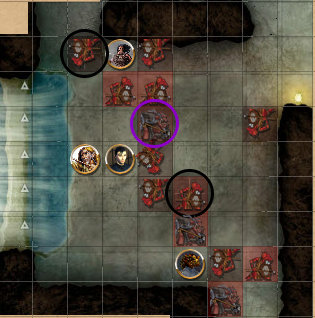
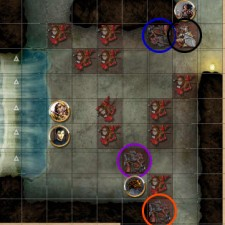
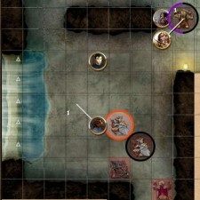

Back to: [West Karana](/posts/westkarana.md) > [2012](/posts/2012/westkarana.md) > [January](./westkarana.md)
# D&D4E: My Dinner with Irontooth

*Posted by Tipa on 2012-01-07 01:39:30*

By sunrise, the river had done the hard work of clearing away yesterday's battle with the kobold frolickers. Some kobold corpses were partially damming the river somewhat downstream, but the owlbears and dire wolves would soon have those cleared away. While any kobolds yet lived, though, the residents of Winterhaven would still be unable to safely trade with their brethren in Fallcrest. 

That's little to no concern of ours. The kobolds made it our problem when they ambushed Wenner on the road. Perhaps we could come to terms with this leader of theirs, this "Irontooth". Winterhaven would surely welcome such an industrious people into their fair city with open arms. Kobolds are tireless workers, after all, and take orders well. They do prefer the eating of living flesh, but then again, who doesn't?

We readied our weapons as we stood outside the waterfall-hidden cavern. Our strategy was simple. Throw the halfling in, wait for the screams, then cast Sleep on him and all his attackers.

Wenner vanished into the shadows and sneaked inside while the rest of us discussed force, lift and wind speed.

**Round 1**. Wenner pressed up against the north wall just inside the cave, but the morning light filtered through the waterfall made the interior too dark to make out anything other then the sounds of some creatures going about their business. A sharp whisper to Sheeoil had the elf treading in the noiseless manner of his kind along the wall to the south of the entrance. "Kobolds!"

Bryn and I followed, standing just inside the cave, surprisingly still unseen by the kobolds. We all took a second to let our eyes adjust (rolling against Perception to see what we could see). Bryn saw enough to get a target. He rushed in yelling a spell, casting Thunderwave at the closest of the minions. Bolts of thunder flew mostly harmlessly around the cave, finally hitting just one kobold, who was electrocuted to death and his corpse tossed against the rear wall.

Wenner slipped out of the shadows and detonated another minion with a Sly Flourish. Sheeoil engulfed a minion in the Sacred Flame. I charged a group of a minion and two skirmishers and let loose with acid breath, dissolving one of the minions to goo and harming one of the skirmishers. Out of range to bring Lifedrinker to bear on either of the skirmishers, I tossed a javelin -- badly.

**Round 2**. The kobolds were still trying to understand what was happening, but those nearest Bryn were getting the idea that this was Not A Good Thing. More kobolds poured in from the tunnels. Bryn took one out with a Magic Missile. Wenner detonated another with a further Sly Flourish. Sheeoil summoned his Sacred Flame once again, but this time it missed. I shouted a Divine Challenge at a kobold across the room, but without effect. Lifedrinker hit a skirmisher, but it only dealt a glancing blow.

**Round 3**. More skirmishers ran from the tunnels, weapons in hand. Bryn winged one with a Magic Missile. Wenner detonated another minion, then re-entered the shadows to take a look around to see where the kobolds were coming from. Sheeoil's Sacred Flame missed again. I readied a Bolstering Strike, but missed the skirmisher. I was taking steady damage from the kobolds attacking me, so I used my action point and tried the Bolstering Strike again -- it hit but did not kill a skirmisher, and it granted me a single temporary hit point that was instantly wiped away by a kobold attack.

**Round 4**. Bryn summons a Thunderwave, which hits a skirmisher and moves it back a bit but does not slay it. Wenner sneaks through a tunnel and sees a powerful kobold dragonshield about to enter the room. Ignoring it, he enters the main cavern through another tunnel and bloodies a skirmisher. Bryn and Sheeoil back slowly toward the waterfall at the entrance as I struggle to free myself from the clutches of filthy kobolds and the dragonshield watches a halfling appear from nowhere, stab a skirmisher, and disappear again. Sheeoil sends some Sacred Flame to scorch one of my skirmishers; I shift a space toward Sheeoil and try to slice that same skirmisher, and miss. I Lay Hands on my wounds and regain a small number of hit points, but my situation is dire.

**Round 5**. Another Thunderwave from the wizard, which misses a skirmisher and hits -- and kills -- the remaining minions in the room. Facing us now are the two skirmishers on me and the dragonshield who caught sight of Wenner as he zeroed in on the rogue's last position. Still no sign of Irontooth, and the encounter appears to be winding down. 

Wenner uses a Positioning Strike to harm the dragonshield and send it flying toward me! I expect to be Slept any moment now... Wenner re-enters the shadows while the dragonshield turns toward me.

A huge goblin appears in one of the corridors. This is Irontooth. The rest of the group runs to attack while I struggle with the skirmishers and dragonshield. Trying to bring the groups together, I begin to Shift toward Irontooth while taking care of my attackers. Sheeoil sends Sacred Flame at Irontooth, but it misses. I finally manage to slay a skirmisher; Lifedrinker feeds me five temporary hit points; I lay hands on wounds to regain seven more. I'm back in the fight.

**Round 6**. Things get a little more real as a second dragonshield and a wyrmpriest caster arrive from the southern corridors. Both are ready for war. Bryn uses a Force Orb against the first dragonshield, but misses. He uses an action point and tries again and hits, but doesn't bring it down. Wenner attacks Irontooth with a Trick Strike and hits. Irontooth laughs it off. Wenner burns a healing surge but it doesn't keep up with the damage Irontooth deals him as it swings its fetid axe and hits. Sheeoil casts a Beacon of Hope at Irontooth, weakening it and healing some of Wenner's most critical wounds. He then summons the Sacred Flame on to Irontooth, burning the goblin only very slightly. 

I use one of my dailies, Radiant Delerium, hoping to use its power to free me from one of the dragonshields. It misses but leaves the dragonshield dazed; I use the moment to shift another square closer to the rest of the group.

**Round 7**. Bryn uses an action point to send two Force Orbs at the wyrmpriest, leaving it bloodied. Wenner gets a decent hit to Irontooth with a Sly Flourish, then uses a Second Wind for a little more health; tanking wasn't part of the plan. Sheeoil connects Irontooth with another Sacred Flame, but the goblin STILL isn't showing many signs of weakness.

I roar myself to a fever pitch with a Channel Divinity: Divine Strength and attack a dragonshield with Lifedrinker. I hit, but the wyrmpriest has given all the kobolds attacking me temporary hit points and only two points of damage make it through. I shift another space closer to the others.

**Round 8**. Bryn fires another Energy Orb at the wyrmpriest, then runs so that I'm between him and the priest before the it can recover. Meanwhile, Wenner gets a good hit on Irontooth, leaving him bloodied. I didn't seem to write down what Sheeoil did this round, but it was probably a Sacred Flame. I used a Bolstering Strike against the now-unprotected dragonshield and hit it but did not kill it. I got a temporary hit point from the deal, but it didn't last long.

**Round 9**. The dragonshield didn't like how I was inching toward my allies, so... he immobilized me. No more shifting. 6 hit points left and nowhere to go. Bryn hit the wyrmpriest with another Force Orb. Wenner hit Irontooth with another Sly Flourish -- the goblin staggered but kept fighting. Sheeoil used a Healing Word on me, using one of my healing surges to bring me health I desperately needed. He then cast Sacred Flame and passed along some of its power to me as additional health. 

Irontooth came at me thinking to finish me and found himself instantly flanked by me, Wenner and Sheeoil. Oops. I managed a decent hit on Irontooth but did not kill him. I laid hands on my wounds and regained a little more health.

**Round 10**. The dragonshield immobilized me -- again. The combined attacks brought my health below zero, and I fell unconscious. One of the dragonshields on me turned instead to take Bryn on. Now that I was no longer in the way, Bryn cast Sleep on all the remaining monsters, hitting three of the four. Irontooth yawned, then fell asleep. Wenner took the opportunity to deal Irontooth one final, fatal blow.

Sheeoil used Healing Word on behalf of Bryn, trading one of Bryn's healing surges for more hit points. He then cast Sacred Flame on Irontooth, transferring some of its health to me. That got me conscious again; I swung at the wyrmpriest that had snuck up behind, did not kill it, then laid hands on my own wounds to regain a little more health.

**Round 11**. The wyrmpriest fell asleep, the dragonshield shrugged off the effects of Bryn's spell and attacked Bryn, immobilizing him and knocking him unconscious. Wenner whiffed a Sly Flourish against a dragonshield. Sheeoil missed a Healing Strike, but still managed to get a healing surge spent on Bryn with it. That wasn't enough to bring him back to consciousness, though.

...

My record keeping was getting really bad by the point. I think I killed the wyrmpriest, then got to Bryn just before he was about to die from his wounds and brought him back to life with lay on hands. By round 15, the remaining dragonshield and skirmisher were finally dead.

Loot was a good pile of experience and a decent amount of gold. We found a stash of treasure that looked suspiciously like items stolen from merchant caravans, which, unfortunately, meant it wasn't OURS. There was quite a lot of it. Sheeoil claimed some Dwarven Chainmail +1... to borrow while we walked back to Winterhaven. I volunteered to carry back one of the bolts of fine cloth to see if I could track down the merchants whose items these were so they could come back to this cave and claim it.

We started back to Winterhaven, when suddenly... well, we'll know in two weeks.

Until then!

