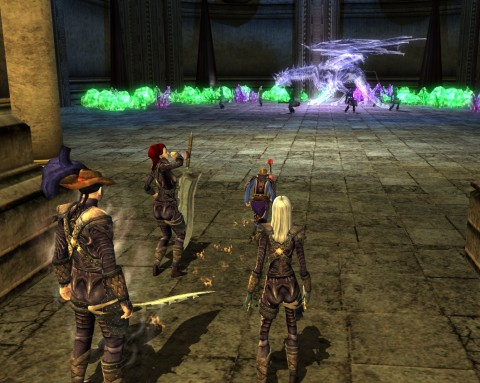

Back to: [West Karana](/posts/westkarana.md) > [2012](/posts/2012/westkarana.md) > [January](./westkarana.md)
# DDO: Buying Time

*Posted by Tipa on 2012-01-11 00:28:28*

[caption id="attachment\_9980" align="aligncenter" width="480" caption="Auraxyllon"][/caption]

None of Team Spode much liked working so hard on In The Flesh and failing it Sunday. We were so close, but we were just out of time. We decided to meet mid-week and try it again -- on normal mode -- to finish the quest series and get the rewards.

We grouped up on time, went into the instance, summoned the clerics, and thrashed the instance -- Yaulthoon for sure, and even the undead beholder that thrashed us again and again a few weeks back. First try. My respec definitely helped, but these instances have raised our level of gear, and they've also taught us how better to work as a team. It's a lesson we desperately need -- because there's no reason we can't win every instance we come across on normal mode. Losing a normal mode instance means we failed.

Anyway, we didn't fail tonight. I'm sure we would have succeeded as well on hard mode -- and maybe we'll have that chance. Spode missed talking to an NPC and missed out on the final quest arc reward so it might be worth another run.

I got the armor, though, AND the bow, so that worked out well. Now all us stabby slashy types have the Parasitic Breastplate. Spode thinks this would be a great fashion show. I think it would make a really boring one :)

With the instance out of the way, Gleek wanted to show us [some of the Cannith quests](http://happyduelingddo.blogspot.com/2011/12/extraplaner-mining-buying-time-soloed.html). Yeah, okay. But there's a DRAGON!

That's all it takes!

There's also a lot of experience, too. We did the Extraplanar Mining: Buying Time challenge adventure twice. The first time we tried it at level 17; Ulan and I, the lowbies, couldn't really do much to the mini bosses and so we died. We still got credit for finishing the first challenge of the adventure, though -- 8,121 xp. We went in again at level 14, completed it like a boss, met and killed the dragon, got nearly 12K xp. Plus some of the mephit wings we need to buy some of the faction gear, in particular some weapons with decent stats but procs like you wouldn't believe and pretty substantial elemental resists. 

Gleek has been gearing up with this challenge gear and it's easy to see how much it's improved his DPS (Sunday when I think he almost killed hard-mode Yaulthoon by himself).

Tonight I learned the drawback of my respec into the Assassin line -- we came to the trapped entrance to the undead beholder's lair, and I hadn't spotted the trap. [Yeebo](http://yfernbottom.blogspot.com/) mentioned that he'd had to keep a lot of +Spot etc gear around. I took some time before we started this evening to make a couple extra hot bars with all the swappable gear I thought I'd need. I hit the hot key for my +10 Spot goggles and the trap popped right up. Disabled it no problem and on we went.

I have some bids in the auction house for +Spot gear that also contains useful stats -- +6 clever goggles with a +3 spot, and some +11 goggles for when I just really need to know about traps before Spode the Human Trapfinder gets to them :)

## Comments!

**Jerry** writes: I can never remember which server you guys play on. Anyway, if you have a Cannith Crafter, you can make +spot items pretty easily. I'd suggest going for as high a spot as you can equip, to ensure you get the notices. I run around with spot +11 at the moment and find it quite useful.

---

**[Tipa](https://chasingdings.com)** writes: Well, I *should* have some Spot +11 goggles in the mail today, and it has some INT on it so I won't feel so bad about wearing them all the time. Priced out tomes on the auction house and -- no way. May end up buying a couple to fill out some trouble spots. 

I haven't gotten into crafting. Greek is a crafter, though. 

We're on Cannith server.

---

**Professer** writes: Hey there. I don't comment here much, but I really enjoy your DDO posts. DDO is one of those games I really enjoy but never have the time or dedication to play. Too busy playing PvP games. It makes for a great MMO on the side though. I can honestly say its one of the only two themepark games I can still tolerate (and enjoy). The other being Vanguard. Any other quest-based game makes me want to puke.

Anyways, keep the posts coming and happy gaming!

---

**[Tipa](https://chasingdings.com)** writes: Hey thanks! But I have to give all the credit for the posts and the reason I play to the great guys I play with. Along with. They know what I mean :)

---

