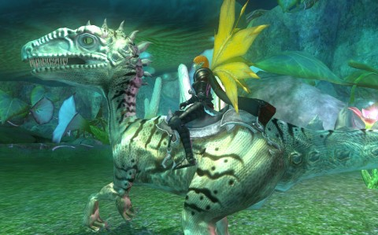

Back to: [West Karana](/posts/westkarana.md) > [2012](/posts/2012/westkarana.md) > [January](./westkarana.md)
# EQ2: I wonder what he eats...

*Posted by Tipa on 2012-01-18 08:14:04*

[caption id="attachment\_9987" align="aligncenter" width="480" caption="My lizard, Leapster"][/caption]

When you think about it, Fae are just the right size to be eaten in one gulp by the EverQuest 2 jumping lizard mounts. I'm too terrified to dismount, and so I leap from place to place within Lesser Faydark, death from above for the invader Tier'Dal who nonetheless managed to drag me from my mount last night and slaughter me.

Experience is slow in the Lesser Fay. Every EQ2 story I read tells of people hitting 60, 70, 85 before they realize it, in just a couple days, but I've been working on this zone for months, with breaks to do quests and some seasonal events. Clearly, this hasn't been my main game.

I cashed in all my station points to buy a month of "gold" membership, then almost immediately went back to Star Trek Online. STO, though, has become a mission grind to earn tokens from the three Borg space special task forces to equip my starship with the best gear. I'm just six missions from earning new engines. I'll finally be able to lose that worrying plasma leak.

[caption id="attachment\_9988" align="aligncenter" width="480" caption="The USS Manchester is ALMOST de-Borged"][/caption]

Last night was the first night of Star Trek Online's "free to play". Everything was busy. The STFs were AWFUL. One went pretty well, but the other two -- I don't want to insult anyone by suggesting that they have no idea what they are doing. But some of these people had no idea what they were doing.

All the STF missions have the main thing you're supposed to be doing, and some other things that someone needs to be in charge of. In "The Cure" space mission, someone needs to destroy the ships that the Borg shipyards keep launching while the rest of the group is destroying the shipyards. When a shipyard is destroyed, the other shipyards send out more powerful ships. This role is usually handled by a science ship, who can keep the NPC at the center healed. The rest of the group heads back to the center after each shipyard to take on the tough ships before proceeding.

Imagine my shock when four of the five of us stayed behind to take on the easy ships while I was the only one working on a shipyard. Imagine my further shock when they proved unable to kill them all speedily.

I guess this is my hint that I should be working on elite missions, except most of the elite missions I have tried have been with people just as clueless, except the enemies are much stronger.

And the reason I say nothing is because I don't want to be "that player" who makes all the other people in a random pickup group feel bad by dissecting their mistakes.
## Comments!

**[Scott](http://pumpingirony.net/)** writes: My science ship is setup for crowd control, etc. with only two hazard emitters so it's not exactly the healing powerhouse my assault cruiser (which, ironically, lacks much "assault") but either way, I might get aggro all the time in regular groups but in the STFs neither of my ships seem (maybe it's just DHC envy) to have the necessary firepower to solo the ships that come out to the Kang. I can keep them occupied and throw a heal on the Kang every so often, but I pretty much need a tactical to fly over and blow them up for me.

---

