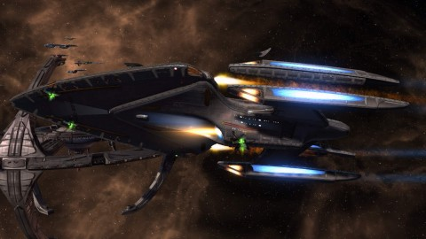

Back to: [West Karana](/posts/westkarana.md) > [2012](/posts/2012/westkarana.md) > [January](./westkarana.md)
# STO: Meet your Kellerun Infiltrator

*Posted by Tipa on 2012-01-18 23:07:10*

[caption id="attachment\_9995" align="aligncenter" width="480" caption="Fully functional"][/caption]

I had a run of luck; I got the rare borg deflector tech drop which went to replace my Mark XI MACO Deflector with an Omega Force Mark XI deflector; winning just five missions got me the rest of the Encrypted Data Chips (EDCs) I needed, 40 total, for the Omega Force Mark XI engines, and I already had the Omega Force Mark XI shields, so... full Kellerun Infiltrator set. 2 pieces give a boost to tetryon damage, and 3 pieces gives a power that makes enemies unable to turn for five seconds.

Not INCREDIBLY useful, but there you have it. Only my assimilated Borg console remains of the Borg components of my ship, but mostly the ship is clean once more. All good clean Federation/Klingon tech. I had a bunch of generic Rare Borg Salvage so I replaced all my non-tetryon ship weapons with tetryon ones for more damage.

Thing is now I have to do ground missions to finish my MACO armor set. And then I'll be done. Game over. Until the next feature episode. I came back to Star Trek Online and leveled a character from lieutenant to vice admiral, got the best escort I could afford, learned the tricks and what's left? Elite missions, I guess, but those take a really long time and I've only ever won once. So most of the time, no reward whatsoever.

Maybe now that Star Trek Online has gone free to play, it's time to stop paying.

The problem with pickup groups is nobody wants to step up and lead the group except for the jerks. And THEY'LL only speak up when you haven't done anything according to their secret unspoken plan. One guy made it his mission to rag on me. He apparently, during a Khitomer space, was hoping to kill both the transformers together by getting one to 1%, then the other. I only found out about this when I destroyed the first one.

So anyway, tonight I figured I'd start off with a quick description of what the optional objectives were (most people never bother to look). And we won that one, optional included. Next time we were coming close to missing a timer and I begged people to ignore the non-vital targets and help me burn the gate, one said, "we know, child. we have time." And they were right, we did and we won the optional again.

Has anyone noticed that the optional rewards have largely started to suck?

I figure it doesn't hurt to say something. I just don't want to be the kind of person who starts getting angry and yelling and stuff. It's supposed to be fun. And it really doesn't matter that much to me, but I just think that people sometimes just are too embarrassed to admit they have no idea in hell what they're supposed to do, but aren't bothered enough by it to actually find out on their own.

Look out for future posts on how to win the STFs... and adventures in ground missions.

## Comments!

**Longasc** writes: You can switch off the visual effect of your Borg console, it only looks bad combined with other sets.

---

**[Warsyde](http://rpgwire.blogspot.com)** writes: Your posts about end game STFs and the like have sort of discouraged me from trying any :P I know absolutely nothing about what to do in any of them and my ship has pretty basic equipment. Joining a pickup group and either causing a mission fail and/or getting yelled at for my performance doesn't exactly sound like a fun time :P

There's not much else to do though, unless I want to make another character. I guess it's a good thing STO just went F2P . . .

---

**[Tipa](https://chasingdings.com)** writes: Oh you should definitely try them. When in doubt, just do what everyone else is doing and you'll usually be fine.

I do plan to write up the STFs and that should at least give some shape to what's happening. Usually it's very simple.

---

