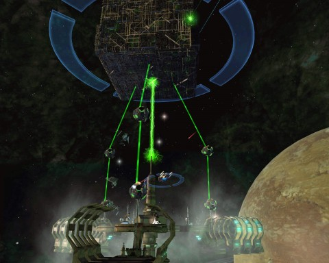
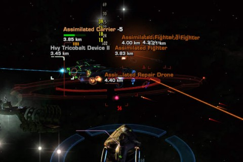

Back to: [West Karana](/posts/westkarana.md) > [2012](/posts/2012/westkarana.md) > [January](./westkarana.md)
# STO Special Task Force walkthrough: The Cure (Space)

*Posted by Tipa on 2012-01-20 00:51:52*

[caption id="attachment\_9998" align="aligncenter" width="480" caption="Killing the Cube"][/caption]

Before Star Trek Online implemented the PvE queuer, getting into special task forces was a matter of sitting in Gamma Orionis, spamming for groups. And the people wanting to fill groups would have insane pre-qualifications, like specific classes and builds, and they would kick you out if you didn't fit their narrow requirements. You also were obliged to stay for all parts of the special task force, all space parts and all ground parts.

The PvE queue splits the ground missions and space missions apart, gives separate rewards for each, and does all the role balancing automatically. Nobody is going to kick you out of an STF. But they will expect you to know what to do. They themselves might have no idea what to do, but they will expect YOU to.

The secret is: they're easy once you know what's happening.

The easiest space mission is The Cure. If you can master this one, you pretty much have all the skills to do Infected and Khitomer Accord. 

[caption id="attachment\_10002" align="aligncenter" width="386" caption="Map for "The Cure""][/caption]

In "The Cure" space STF, the captain and crew of the IKS Kang were sent to the Vorn system to check up on Borg movements but no word has come from them since. Our job is to head in, save the Kang and destroy the Borg.

The optional objectives (for the normal mode) are to make sure the Kang doesn't drop beneath 75% health, and to destroy all the Borg and hail the Kang within 15 minutes.

The Borg are using the Vorn system to assimilate and launch a Borg/Klingon armada. Their first target: the IKS Kang. There are three Borg cubes constructing and launching ships at the Kang. Each cube is being healed by four nanite probes. Each nanite probe is being healed by a matching nanite probe.

One ship needs to take charge of protecting the Kang from ships launched by the cubes marked 2 and 3. Usually a cruiser or science ship is best for this. Many people choose to tank the ships right at the Kang, but this is a mistake. Assimilated ships that are within weapons range of the Kang will fire upon it, so it's best if they never get that near. The assimilated Klingon ships move VERY SLOWLY for a reason. Secondly, if the protecting ship gets blown up, it can respawn and full impulse to intercept the ships before they finish making their way to the Kang. If they are already AT the Kang, they can likely do enough damage to ruin the optional before you get back.

If you're new to STFs, you'll probably want to follow everyone to the cube marked with a 1. That cube will have already launched a couple weak assimilated Birds of Prey. Kill them on the way in. It's the responsibility of the kill team to make sure no Borg ships escape to cause more trouble for the protector. 

Kill the bottom nanite probes, then the upper nanite probes, then the cube. Head immediately to the Kang, as the other two cubes are launching more powerful Negh'Var cruisers and the protector ship is going to need help clearing the swarm. Once all the enemies are dead, the strike team moves to the cube marked 2, while the protector moves between cube 3 and the Kang.

After cube 2, the strike team helps clear the newly launched Negh'Var warships and then kills the third cube, ignoring the weak raptors that are launched. The protector still deals with those. Once the third cube is dead, kill all the remaining Borg ships, fly to the Kang and hail it.

[caption id="attachment\_10003" align="aligncenter" width="480" caption="The Assimilated Carrier"][/caption]

Optional objectives should be done at this point if the cube killing went fast enough and the Kang didn't take significant damage. It is very hard to get the optional objective if there's more than one ship on intercept duty, or that ship can't take the damage. If you are a cruiser or science ship captain, it is your responsibility to ensure you have a lot of shield and hull heals because dying is bad. Interceptor ships should also be able to kill the two Borg birds of prey easily (they have almost no hull).

Once the Kang is away, an Assimilated Carrier will warp in. It's a tank and spank; burn it down. It launches fighters, drones and BoPs which will die to any cannon scatter or beam fire at will or can just be ignored. Don't get distracted by taking down the weak ships, just kill the carrier.

You can pick up your optional and mission rewards where the IKS Kang was parked.

Be sure to roll NEED on any Encrypted Data Chips or Rare Borg Salvage that randomly drop. You need EDCs for ship gear (40 per piece if you go for the Mark XI/Veteran stuff, and you should) and Borg Salvage for requisitions with which you can buy Mark XI weapons which are uniquely powerful against Borg ships. There is a very rare Borg Tech that can drop here, I can't remember which one, but it can be turned in and instantly get you a ship bit worth 40 EDCs.

If this is helpful, let me know! If it can be improved, definitely let me know!

## Comments!

**Yarr** writes: Thanks! It will be awhile before I get to doing these but it will be very helpful to already have an idea of what to do when I eventually progress that far.

---

