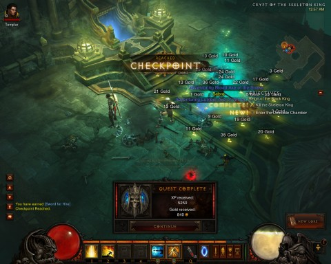

Back to: [West Karana](/posts/westkarana.md) > [2012](/posts/2012/westkarana.md) > [July](./westkarana.md)
# Diablo 3 Hardcore: Hedging my bets

*Posted by Tipa on 2012-07-25 06:47:24*

[caption id="attachment\_10239" align="aligncenter" width="480"] Tipa the Substitute Monk[/caption]

Am I the only one still writing about Diablo 3? Most (all?) of the people in my circles appear to have moved on. I admit to thinking of the game as a fairly wide miss before I went to hardcore. I just am not all that wild about games in which you grind and farm.

But now, I'm totally into it. The reason: because I don't want to lose my character and have to restart. I finally had a reason to look up information about my class, get advice and recommendations, all the sort of stuff I used to do in EverQuest but never had to do in Diablo 3 because, if you die, you just tweak something and try again.

[caption id="attachment\_10240" align="aligncenter" width="480"] The Death of the Skeleton King[/caption]

One of the very few down-sides of adventuring in a static group is, for me, not having a chance to really learn all the minutiae of the class. Running as a member of a team which is moving rapidly through a dungeon is an entirely separate set of skills than moving cautiously solo through that same maze.

I really wanted to get better at my group class -- Monk -- without risking my group character. I wanted to re-think some of my choices.

So I made a new hardcore monk, this time using "elective mode" from the start to set my abilities, and also this time training up the blacksmith to craft armor and weapons. This time also not gearing up through the auction house, which I really couldn't afford to do with two characters anyway.

If my main monk dies, the new monk can step in, of course. I was reluctant to go this route because I thought (and still think) it would make me incautious, especially if I managed to surpass my main monk's level at some point.

But for some reason and unlike DDO, I want to play D3 outside of our group night.

Last night I finished the first real boss fight of the game, the fight versus the Skeleton King. That quest series is for levels 4 through 13. One tip I picked up is to always have your character on the high side of the level range in order to lower the chance of being mobbed and killed. So, the skeleton king is going on farm mode until my monk is level 12 or 13.

In our main game, the suggested level for our current quest in Act II is 18 to 26, and we're level 21. I've suggested to the group we restart Act II to catch up in levels. I don't want anyone's character to die, least of all mine.

## Comments!

**Zygwen** writes: The must require an internet connection for solo play sorta killed it for me, plus if I want the hardcore experience, I can play NetHack or ADOM. Retro hardcore, so hardcore it doesn't even have 8bit graphics. If the price is right though, I might get Torchlight 2.

---

**[bhagpuss](http://bhagpuss.blogspot.co.uk/)** writes: I really enjoy reading your write-ups, whatever game you're playing and having fun playing is reason enough to play anything in my book. That said, I don't really get this Hardcore thing. If you can swap in another character that you've leveled, or if everyone pauses when someone loses a character while they level one up, how is that different from the actual character respawning? 

Isn't it just a slower and more inconvenient kind of respawn?

---

**[Tipa](https://chasingdings.com)** writes: @Zygwen Well, it's the group that makes it fun, and it's the group that makes me want to become better. As a solo game, as someone mentioned on G+ today, it's incredibly boring, at least on normal mode. They should never have made normal mode an option, just started off in what they call nightmare mode.

@bhagpuss the big money these days is on the GW2 beta :)

---

