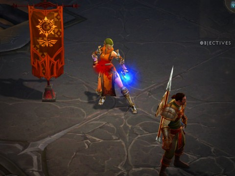

Back to: [West Karana](/posts/westkarana.md) > [2012](/posts/2012/westkarana.md) > [July](./westkarana.md)
# Diablo 3 Hardcore: More lives than Doctor Who

*Posted by Tipa on 2012-07-30 21:53:02*

[caption id="attachment\_10244" align="aligncenter" width="480"] Level 23[/caption]

The ironic part was when I was saying something stupid about avoiding dying, and Calrain said, "Like I just did?"

And I looked and yup, he was dead. The game removed his character from the party and deleted her, and the forces of Hell grew slightly weaker for a moment.

Calrain made a new character, and we did the shuffle which got the character up to us in Act II. For some reason I can't recall, we were back at the beginning of the Black Soulstone quest, though not all the way back to the beginning of Act II, as I'd suggested.

He was a barbarian this time... the wizard and the demon hunter were just a little too squishy, why not go for the most survivable class, right? I don't want Calrain to die again; I don't want any of our characters to die again. Even though Calrain managed to level to 10 by the end of the evening, the rest of us had gotten to level 23. The next quest is the Scouring of Some Castle, which is just a shitstorm of mobs, and then the Belial fight. That's level 28, but we should be level 25 or 26 by then so it should be okay, and assuming no more deaths, we should all sail into Act III in good fashion. I don't think I even died on the Belial fight on my normal mode demon hunter.

I saved all my deaths for Act IV.

Anyway. I re-read these posts and all I talk about is how much I don't want my character to die. Is that the entire raison d'être to play Diablo 3?

I gotta say that it is. Because of my character's mortality, I study the game, I shrewdly look for bargains in the auction house and post my own best loot there. I've leveled up the blacksmith on my hardcore alt. I practice my class out of group. 

I never did these things in Dungeons & Dragons Online because nothing mattered. The other three characters did all the heavy lifting and I was happy enough to let Gleek and Spode suss out the dungeons and goals of the day. I eventually was shamed enough by their expertise to do some studying and getting my rogue into a decent build with the bare minimum gear to do the job so that I felt like I was contributing more than a hireling, but it didn't matter because there was no risk.

\_That's\_ what drives me, I now know. In EverQuest, the risk and dependence on others gave the whole game an electric frisson. Since I played group classes (cleric, rogue), I had to be valuable to a group, had to make friends, had to do my share. A death in the early days could be a showstopper, especially when I started as a druid -- I could fulfill all the duties of a cleric, except the rezzing bit. Under no circumstances could I let someone die. If I did, my last job for the group would be airlifting a cleric to them.

Expectations matter. Having other people depending on you makes you matter, makes the entire \_game\_ matter.

So we're at that stage again. Each death is a setback. My expectations for myself could not be higher. 

I like being challenged.

I just don't understand how Blizzard could get away with the normal difficulty softcore mode. I understand that it was basically thirty levels of tutorial, but did they really think game mode without challenges or expectations would stand the test of time?

Picture on top is just my character; I was too paranoid to hit the screenshot key during the fun battles because I figured it would make some lag and someone would die. Since I'm the healer.

And yes, I know the Doctor's name is not Doctor Who. Except in the Peter Cushing movie.
## Comments!

**pasmith** writes: The normal difficulty softcore mode completely turned me off of the game, but your hardcore posts have me thinking about giving it another try. Do you think hardcore solo would be interesting? I mean, it works for rogue likes, right?

---

**[Tipa](https://chasingdings.com)** writes: As was pointed out by @Zygwen in the previous post, this merely brings Diablo 3 up to the difficulty and challenge of a really good Rogue-like -- but that happens to be a kind of game I like, so it's not an issue.

I'm playing hardcore solo with my alt, and it's pretty fun, in that it all leads up to the boss mobs and you have to be ready to defeat them first try.

---

