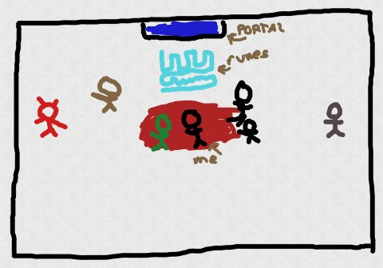

Back to: [West Karana](/posts/westkarana.md) > [2012](/posts/2012/westkarana.md) > [June](./westkarana.md)
# D&D4E: The Keep on the Shadowfell: the end.

*Posted by Tipa on 2012-06-28 06:48:57*

[caption id="attachment\_10220" align="aligncenter" width="480"] Kalarel's chamber[/caption]

We'd battled our way to nearly the deepest depths of the measureless halls and caverns beneath the demonic Keep on the Shadowfell. We'd met slimes and jellies and bug-lizards and drakes and gnomes and goblins and goblins of the hob variety. We'd fed Splug to a carnivorous pool. We'd waded through hordes of skeletons and waves of zombies and spoken to a ghost. I got trapped in a room that was filling with water with no escape.

All we had to do was climb down some sturdy chains, map whatever we found below (where a clay golem had escaped us), and our expedition for Winterhaven's Lord Padraig would finally finish, and we could claim the ten silver and free soup at the inn as our rightful reward.

That was the plan, anyway.

[caption id="attachment\_10221" align="aligncenter" width="480"] How I imagine this went.[/caption]

Nobody wanted to be the first to go down the hole. Enough of this. I'm the tank. It's my job to take the lead. The chains looked sturdy enough, easily able to support us all as we climbed down. I carefully swung myself on to one and -- missed my Athletics check -- splashed into a pool of warm blood, far below. Wizard Bryn landed, head first, next to me, quite hurt by the fall. Wenner and Sheeoil came down as fast and as safely as they could.

The clay golem who had fled from us down the hole turned creakily and might have smiled if it could have. Bryn, stunned and bleeding, gasping for air and on the edge of annihilation, grabbed his charcoal and bloodied paper and made a quick sketch of the room. "Mapped," he said. "We're done."

[caption id="attachment\_10222" align="aligncenter" width="480"] Bryn's final map[/caption]

Pool of blood in the middle, in which Bryn and I were floating prone; mysterious dark portal to the north, with glowing runes in front of it. To the east, a wight. To the west, Kalarel, guarded by two skeleton warriors and the clay golem. To the south, nothing. I guess we could have gone that way and done something, but getting Bryn alive was something we needed to work on immediately.

The odds weren't against us. We'd come through situations nearly as bad. It was the wight that did us in, oddly, with its screams that would push us like so many pawns around the room. Kalarel teleported to the portal and I charged after him, slamming him with the wrath of divine Bahamut and my sword, Lifedrinker.

A scream from the wight pushed me into the portal, though, and after that, I knew no more.

Bryn set off all his best spells, but they weren't quite enough, and he died, and then down went Wenner and Sheeoil and...

That was it.

Ironically, in some future time, some better party of adventurers may make their way down this keep, to this room, defeat Kalarel and free me from the shadow dimension behind the portal. I might be the lone survivor of this all. Or maybe I'll be freed only to die to the raised zombies of the rest of my party.

But for now -- we're all dead or missing (and presumed dead). We're probably going to start over with new characters and a new rules system, probably Pathfinder and perhaps moving to Tabletop Forge instead of the Fantasy Grounds II software we've been using.

Though our adventure ended badly, I still had an amazing amount of fun, and can't wait to start meeting again. Maybe we'll be a little more cautious this time....

## Comments!

**[oakstout](http://oakstout.blogspot.com)** writes: It was fun to watch on the live view. I have to say it brought back a lot of cool memories and I'm glad the DM decided to share the feed with the rest of us geeks, well.. actually just two of us, but it was fun. It would be nice if there was a way to chat with you guys while playing, but it was still fun non the less.

Thanks for letting some of us be a part of a cool game.

---

**[Tipa](https://chasingdings.com)** writes: We're still working the bugs out of the system. There was commentary going on in Google+, but I didn't even know about that until I was taken out of the fight and had a chance to catch up :)

---

**Ali** writes: We've not long started Pathfinder - the Smuggler's Shiv - it's being an interesting trip.

---

**[Sisca](http://GnomeDepot.net)** writes: Hmmm...tabletop gaming via G+ hangout. I wonder how viable that would be. Since Lore and I moved 1200 miles away from our normal gaming group over the summer it might be nice to try sometime.

---

