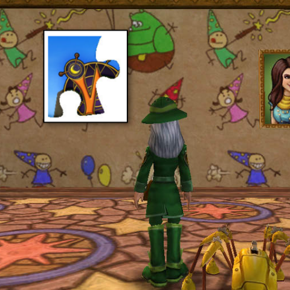
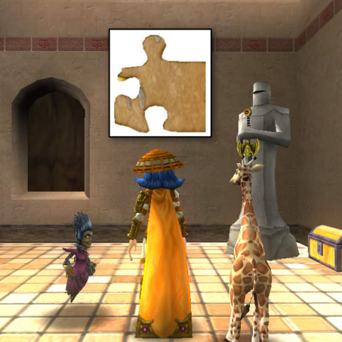
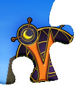
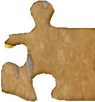

Back to: [West Karana](/posts/westkarana.md) > [2012](/posts/2012/westkarana.md) > [March](./westkarana.md)
# Wizard101: A Puzzle of a Puzzler

*Posted by Tipa on 2012-03-23 20:43:58*

I don't spend a LOT of time in my homes in Wizard101, so I'm not sure exactly when I got some new artwork. Maybe someone can help fit these pieces together?

[caption id="attachment\_10158" align="aligncenter" width="480" caption="The First Piece"][/caption]

This piece looks to be a corner piece... those are always the best pieces to start with! Definitely part of the Wizard101 logo; it kinda looks like a piece of the old Celestia art... but it couldn't be that.

[caption id="attachment\_10159" align="aligncenter" width="480" caption="The second piece"][/caption]

This one's a real mystery. It looks like sand or stone. Part of the right edge. Edge pieces are good, especially if they fit into a corner piece. These two pieces don't go together. Maybe if I turned the second one around... and used a hammer and some tape... hmmmm....

I've heard rumors of other pieces in other places... There's a mystery here!

## Comments!

**Justin Rainpants** writes: Thank you!

---

**[cassandra945](http://none)** writes: I think it is a new bundle pack...with a mount, pet, armor, and castle.

---

**[Tipa](https://chasingdings.com)** writes: Maybe...

---

**[cassandra945](http://none)** writes: okay I ammend my earlier comment about a bundle. A new world, yay! I base this change on having reviewed previous pre-world release by KIngs Isle. I am a very excited wizard, and a happy one, too.

---

