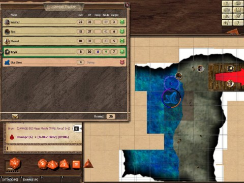

Back to: [West Karana](/posts/westkarana.md) > [2012](/posts/2012/westkarana.md) > [March](./westkarana.md)
# D&D4e: The Splug, The

*Posted by Tipa on 2012-03-30 21:19:45*

[caption id="attachment\_10171" align="aligncenter" width="480" caption="Wenn der blaue Schleim jemand angreifen, stirbt jemand"][/caption]

The screenshot tells the story. Me and Wenner unconscious, Sheeoil dead, only Bryn alive to finish the fight against the ravenous but somewhat stupid blue slime. And what of Splug? What of the goblin who gained our trust and betrayed us, literally backstabbing us?

What of Splug, indeed?

[caption id="attachment\_10172" align="alignright" width="300" caption="Splug"][/caption]

After we finished scraping off the lizard-bug juice from our boots (Bryn, Sheeoil) and feet (Wenner, myself), we decided to go have a look at the corroded bronze door near which Wenner had discovered some tasty and deadly pudding. The door had words scraped into it, "Do Not Enter!!!11!!! SRSLY!!!!", but we're not big on warnings and text speak just enrages Bryn, so we were hot to see just what was behind that green door.

We were stunned to see something in front of the door -- Splug. Splug, the goblin we saved from the hobgoblin torturer (who apparently was moonlighting as a goblin torturer, just for Splug). Splug, who offered to carry our stuff and heroically guard the rear of any battle. Splug, who stabbed our faithful wizard and ran off. Splug, who has had his name mentioned in this post enough to be the number one search result on his name from now until eternity. Let this be a warning to any future adventuring parties -- Splug is Bad News.

Now, I'm a paladin. Lawful good, totally crazy about Bahamut, hate Tiamat with a passion. If you behave honorably to me and my companions, I will defend you to the death. But if you betray me... well, justice demands you pay for your crime. When Splug decided to sink a dagger in Bryn's back, he made my list. My short list. We could map this place or not, but Splug was not going to live to spread his treachery.

When Splug saw us, he spun, ran through the metal door, slammed it behind him. We could hear the pitter patter of goblin feet stumble down some wooden stairs, a muffled scream, and then -- nothing.

Wenner listened at the door and heard nothing more. He opened it -- slightly -- slipping through and hiding in the darkness. We could all have hidden in that darkness, the only light was a dim blue phosphorescence coming from the water of an underground lake that cast no light by which to see. Even Sheeoil's keen elven eyes could not pierce the gloom.

Wenner tracked the footprints in the disturbed fungus to the bottom of the stairs, where it met the unmarked stone of the natural cavern floor. He calls the rest of us down. I lit a sun rod to illuminate the room. 

In the sun rod's light, we could no longer see the glow from the lake. It looked just like plain water. Nonetheless, we decided not to go swimming just yet. Wenner followed the cavern wall south... and then let out a yell.

Sounded like he yelled "SPLUG!"

We all rushed that direction. Wenner wasn't going to have the honor of killing Splug alone. Some kinds of fun must be shared!

When we get there, Splug was gasping and gurgling and obviously terrified, as he should be. His day of judgement had come. However, it wasn't us that frightened him. He begged our protection, he threw himself at our mercy, he stole glances at the water and tried to shrink back further into the nook in which he'd squeezed himself. Wenner deftly tied the goblin fast with his rope.

"Good," I said. I drew Lifedrinker from its scabbard. "Splug," I said, "You have lost your honor. You have come to the end of the path you have chosen; make your peace with whatever gods you worship, for you will soon meet them. Wenner, hold him still."

Wenner nodded curtly.

Splug didn't seem aware of his fate. Looking out past we who'd come to kill him to the water behind us, he let out a shriek and fainted.

Soundlessly, the dim blue glow of the lake coalesced and surfaced -- a blue slime appeared. With a gurgling sigh, it burped an explosive orb of acid at us all; the acid began to burn Wenner and Sheeoil.

We all turned and made a mad dash for the stairs, Wenner dragging Splug behind him. The blue slime was faster than we were. It formed two pseudopods, hit Wenner with one and curled the other around Splug. The goblin was slowly being dragged toward the slime.

I could not abide that. Splug deserved an honorable death. Wenner shrugged away the slime's acid and tried to stab Splug. I tried to decapitate the goblin. Sheeoil, burned by acid, seared Splug with sacred flame. Still he lived, awake again, screaming. It would be a mercy killing.

Bryn's force orb went wild, disappearing into the darkness. The slime slammed Splug to the ground and burped another stink bomb at us all. All except Bryn, who smartly stood well out of range on the stairs, casting from safety. Splug flailed desperately against the slime.

Wenner saved again against the acid, drank a health potion and ran away to the south, no longer part of this fight. Who does Wenner look out for? Wenner looks out for Number One.

That's our rogue, and we love him for it. Love him!

With Splug trying to fight the slime, I thought we should accept the help. If Splug survived, we could still kill him later.

Sheeoil and I, unhappily within range of the slime's pseudopods, do our best to bring the slime down, but it only seemed lightly damaged. Bryn hurled spell after spell from the stairs, but the slime just had too much health. This just did not look like a fight we were going to win.

The slime slammed Splug against the wall. Splug went limp. Freed by the slime, his still body fell to the ground.

Meanwhile, Wenner explored the rest of the cavern, as much of it as he could see without actually getting into the water. He could faintly hear waves lapping against the rear wall of the cavern, but it sounded as if there were a closer shore than the far wall.

Back at the slime, things were steadily going from bad to worse. I was knocked unconscious, but a miracle saving throw vs death brought me back to semi life. I crawled up the stairs to safety with Bryn. Sheeoil joined us, and it was clear the slime could not leave the water. We sat and discussed our task, Splug's fate and other cheerful subjects while Bryn cast various magics at the creature. I tossed a few javelins in the slime's direction.

Finally, the slime was bloodied. It disappeared into the water and into the darkness.

We couldn't just let it escape like that. I crept to the shore and splashed around a bit. The slime returned with incredible speed, knocking me nearly unconscious again. Bryn hit it with another spell and it disappeared. Bryn cast magic missiles blindly into the darkness without effect. Wenner returned from his explorations and made sounds in the water.

Again the slime came, knocked the thief into oblivion, left when fired upon by Bryn. I used my heal skill to stabilize Wenner, then made a noise in the water. The slime came back and knocked me out for good this time. Sheeoil stabilized me, then was knocked out by the slime. Unfortunately there was nobody to stabilize him.

Bryn used Cloud of Blades to churn the water and lure the slime back to the shore, then burned it with magic missiles. This was not a fast way to kill it. Unstabilized and with bad luck in saving throws, Sheeoil died. Eventually, so did the slime.

With the encounter ended, Bryn was able to get Wenner and me conscious again. There was nothing we could do about Sheeoil. Wenner and I cautiously explored the lake and discovered a small island, on which was a half-dissolved corpse, a small amount of gold, a goodly amount of silver, a shield that hummed with power and a sealed scroll case.

I claimed the shield... of course. I don't crave wealth, but I do feel a responsibility to keep the party safe, and to do that, I need better gear. We were no longer just fighting kobold minions.

I got Sheeoil's corpse on my shoulders, and we headed back to Winterhaven.

--

We met Splug, but his death was empty. Was justice served? We had our first death, due mostly to impatience. We figured out early on that the slime wouldn't leave the water. We could either just let Bryn kill it, or try to lure it into melee range and unleash hell on it. The result was 3/4 of the party out of the fight, and Bryn killing it anyway.

We played healing entirely by the rules, which was a problem. Back when we first started with D&D4E, we kinda thought Healing Surge was a kind of self heal you could pull out whenever you needed it. We were wrong. Healing Surges are a counter; it represents the number of times you can be healed between rest periods. It's not itself any sort of heal. Everyone gets Second Wind -- a heal they can cast on themselves. As a paladin, I get a second heal in Lay On Hands, which I can use a number of times per day as my Wisdom bonus, which is +1 -- so once a day. In earlier encounters, before I read this, I figured I could Lay on Hands as often as I liked as long as I had healing surges left, which was totally not the case.

Most of Sheeoil's attacks generate temporary hit points, which are useful but not real heals. He only has a few real heals. He ran out of those, I used both Second Wind and Lay on Hands just keeping myself alive, so basically, even with 1 1/2 healers, we can't really take the kind of damage long fights put out. Both the pink pudding and the blue slime couldn't be affected much with bladed weapons or acid spells, which took our DPS down quite a lot.

We did make it through -- barely -- but now we're forced to return to town, rest up, then head back to the Keep and finish the adventure. I kinda have to call that a bad ending. I don't know what the penalty for a resurrection will be for Sheeoil, but back in AD&D 1.0 it was a permanent loss of a constitution point, which is really nasty.

While in town, we'll have to figure out how we're going to survive other fights where we can't use bladed weapons or must fight from range. And deal with the wrath of Lord Padraig, who will likely wonder, loudly, why it has taken us so long to map the Keep.
## Comments!

**[Toldain](http://toldaintalks.blogspot.com)** writes: The group I ran through this did two things differently. First, with Splug: The party sorceror, with ridiculous high Charisma and ridiculously higher Bluff told Splug that back in Winterhaven there was a Rescue Society for Wayward Goblins, and he should go down there and talk to them. Splug having very little Insight, said "Really? I'll be going then..."

The second thing they did differently is they ignored the room you describe today completely.

---

**[Tipa](https://chasingdings.com)** writes: Once the slime killed Splug, we talked about just moving on, but I and a couple others felt we shouldn't leave the slime alive. It clearly was just a little bit beyond us, but it's really hard to judge these things at the beginning of a fight.

---

**[bhagpuss](http://bhagpuss.blogspot.co.uk/)** writes: Back when I played AD&D I always felt that an encounter had given its best value if our party just barely survived and had to withdraw to a town or other place of safety to recover. Even better if it could happen right at the end of the evening so that the next week's session would be mostly spent in town, discussing at inordinate length what we should have done and what we needed to do to next time.

We once spent an entire twelve-hour session discussing tactics and then repeatedly trying and failing to do something that our DM later told us was supposed to take about thirty seconds in which we would ask someone a question and get a reply. The question was, basically, "Excuse me, do you know where this building is?" and could have been asked of anyone we met in the entire town. Thirty years later it's the failures, near-failures and pratfalls that I remember. The great successes are long forgotten.

---

**[Tipa](https://chasingdings.com)** writes: I like hard-won battles to be sure, I just feel, looking back, we could have done things differently. But I guess that's part of the game.

Asking for directions? That's against the Adventurer's Code!!!

---

