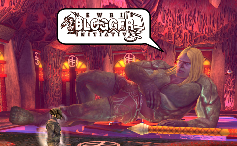

Back to: [West Karana](/posts/westkarana.md) > [2012](/posts/2012/westkarana.md) > [May](./westkarana.md)
# Newbie Blogger Initiative goes live!

*Posted by Tipa on 2012-05-01 07:16:30*

Games are *fun*.

Right?

It's only natural to want to share that fun with other people, as fun is multiplied by the number of friends with whom you share it.

A couple years ago, a bunch of people who were planning to have fun playing Mythic's Warhammer MMO had had so much fun being excited about the game before it was even released, that they just had to share it. They got together and all launched blogs and started writing about it -- and now many of them are among the top MMO bloggers in the industry.

We did the same sort of thing with Wizard101 blogs. There's been blog groups for EVE Online, World of Warcraft... pretty much every game out there.

It turns out that *writing* about the games you play is even *more fun*.

None of these new bloggers expected to find fame (though some did) or attract thousands of readers (though some do). They wanted a place to share their excitement and game experiences and thoughts about gaming with friends and other gamers, so they started a blog.

YOU can start a blog. You SHOULD start a blog. Right now. Try [Blogger](http://www.blogger.com/) (host of my [bridge blog](http://lifeonabridged.blogspot.com/)) or [Wordpress](http://wordpress.com/). Come up with a cool name for your blog, figure out what you're going to write about, and start writing.

So, now that you have a blog, you're a blogger. Grats! Your very next step is to head over to the [Newbie Blogger Initiative](http://nbihq.freeforums.org/) and check in. Through the month of May, over 70 bloggers will be writing about how and why they blog and giving tips for getting words on the page and eyes on your blog. Because the absolute best bit about blogging is talking with other fans.

Look for a couple posts about blogging here in the next month -- and check out the [Newbie Blogger Initiative](http://nbihq.freeforums.org/) forums for the dozens of other blogs who will be giving their own take on this whole blogger thing.

And in the meantime, check out [Google+](https://plus.google.com/), where a lot of great MMO discussion goes on every minute of every day :)
## Comments!

**Killington** writes: Thanks for the info, I have been wanting to start my own blog for a while now but I needed a little bit of a push. Maybe this is the push I needed to get it going! I'll definitely be checking it out.:)

---

**[Yeebo](http://yfernbottom.blogspot.com/)** writes: I think the graphic you came up with wins across the participating blogs I've visited.

---

**Tipa** writes: @Killington let me know when you get your blog set up!

@Yeebo probably my favorite DDO boss mob :)

---

**[Killington](http://wasdway.com)** writes: I set my blog up at wasdway.com and made my very first post just now. I still have to iron out how my blog will look, but I am excited to see what this month has in store for me.... It should be pretty fun. :)

I also posted my blog on the roll call at NBI.

---

