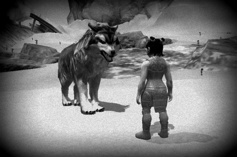

Back to: [West Karana](/posts/westkarana.md) > [2012](/posts/2012/westkarana.md) > [November](./westkarana.md)
# Game Log: EQ2 Age of Discovery

*Posted by Tipa on 2012-11-08 08:11:11*

[caption id="attachment\_10411" align="aligncenter" width="480"] Halfling Beastlord[/caption]

Those who [follow me on Google+](http://plus.google.com/108460561201888322767/) have been hearing about my problems with the Age of Discovery. It's the expansion that brought mercenaries and beastlords to the game, and is the one expansion not included in the forthcoming expansion, Chains of Eternity. I went ahead and bought Chains of Eternity assuming I would get all previous expansions that I'd missed (Velious, etc), but, wrong. I'd get all previous expansions except Age of Discovery.

The whole point of buying CoE, especially the collector's edition, was to get that elite mercenary as my new main, Scatterfall, finishes up Bonemire and looks ahead to Kunark.

I went and bought AoD. As with CoE, I'd gotten a discount with my All Access membership, so that saved a couple bucks, but still. Lots of money spent in the past couple days on a game I'm still not 100% certain I'll keep playing.

So; halfling beastlord. Years and years ago, in EQ1, I was kinda disappointed that halflings could not become beastlords. I had the perfect idea for their warder; a bixie! Everyone else was getting signature creatures from their homelands, and given halfling association with bixies in EQ and later, EQ2, it would be PERFECT. And unbearably CUTE.

So in a "what if" post, I put together a halfling monk and a bixie to see what they'd be like, because in EQ1, beastlords were related to monks. Problem: halflings couldn't be monks EITHER. I did have a human monk among my stable of alts, so I fed her a halfling potion in Misty Thicket and got the shot.

Why SOE didn't get immediate inspiration to add halfling beastlords with bixie warders to EQ1, I will never know. But they have added them to EQ2, and I just had to try it. My first night in AoD was not spent, then, learning about mercenaries, but playing in frozen New Halas and charming an endless selection of animals to be my warder.

I couldn't charm orcs or elementals, unfortunately, so already it's looking bad for an eventual bixie warder once I get to the Shattered Lands version of Rivervale.

Beastlords in EQ2 are related to scouts, not fighters, the archetype for monks. They wear chain armor, but still seem to prefer fist weapons. I dunno. Monks in EQ2 have some really cool moves, would have liked to have seen beastlords keep with that, and also the whole robes/leather armor look is fantastic on halflings.

So after a couple hours playing, no issues, easy leveling, New Halas is a no-challenge, high-reward starter zone meant only for familiarizing people with the game. I've gone through the place a couple times before, and there's really nothing new to talk about. I do have a few warders. They have different abilities depending upon their species, though some of the species classifications seem arbitrary (as, for instance, the widely reported, incorrect classification of hyenas with canines instead of felines).

[caption id="attachment\_10412" align="aligncenter" width="480"] Berserker bling[/caption]

Scatterfall, who was originally an alt from way back whose big day prior was when she dinged level 14 in the Laboratory of Lord Vyemm, a raid zone in the Bonemire in the Kingdom of Sky. Her epic journey was the subject of a comic (included below). It was a time when you couldn't just teleport straight to the Bonemire from the guild hall; I had to get her to Feerrott and take the spires there.

Anyway, she sat fallow until I partnered her up with a friend and we went through the Kunark Sarnak starting zones and then, when he stopped playing, I stopped playing. She was in her forties around then.

Fast forward to today, level 68, completed the cloud mount quest and got her class specific armor set for doing so. Her normal mount is the jumper mount. Very fast in the air, I love it. I did the quest for the glider mount, but it isn't as fast, doesn't stay in the air as long and is hard to maneuver, so ... not an upgrade. Sometimes, SOE gives away temporary, any level flying mounts. I've tried those and they are wonderful, but I can't do that quest until level 86. It's a long time away.

The cloud mount is super fast, on the ground. I like the jumper mount for letting me ignore groups of enemies, something hard to do if you're traveling right through them at high rates of speed.

Anyway. Bonemire, like the Barren Sky before it, has a love of ending quest lines in instanced dungeons or raids. I've heard from a lot of people that the instanced dungeons are possible if you get to max level in Kingdom of Sky (70), get decent gear, and use a mercenary to help. [A friend](http://mmoquests.com/) has volunteered to help with the raids when I get to that point, but if I can at least do the group dungeons alone, I'd like that option. 

Hence the reason I bought AoD and CoE. I probably could have skipped CoE, actually, but the collector's edition does come with a super merc (a healer or a paladin) which I want because if Kingdom of Sky likes ending quests in dungeons, Kunark likes it a lot more. And there's no guarantee I'd be able to find a group. I am in a guild, but it is a small guild and everyone is level 90+. However, they keep the lights on in the fully equipped guild hall and haven't kicked me out, so it's all good.

So anyway, between storms and trips to Florida and more storms, kinda been focused on EQ2 lately. I'd like to group. Last time I grouped was in Klak'anon, and the fights in the main, open part of the dungeon were trivial and awful xp in a group, while the fights in the instance overwhelmed people who just wouldn't listen as I tried to describe the encounters. Frustrating.

Been soloing since.

Here's the Scatterfall comic (she was named Scatter at the time, but lost the name in a server change).

## Comments!

**[bhagpuss](http://bhagpuss.blogspot.co.uk/)** writes: The thing about Age of Discovery (my favorite EQ2 expansion) is that it was supposed to be the model for all future expansions. From that point on, expansions would be about services and GUs would be about Content. That plan lasted precisely no more expansions.

Chains of Eternity is an anomaly that never should have happened and from some of the comments at Fan Faire recently it may well be the last expansion per se, with future content and/or services sold piecemeal through the SC Store. I hope so.

It has left them with a problem, in that AoD contains Premium services that should ideally have been sold separately but because they were packaged up can't economically be bundled with future expansions in the traditional way. Well, of course they could, but the decision has been made that they won't.

I am surprised that they don't bundle in the ability to use Mercs with an expansion that offers Mercs as content exclusive to that expansion. Well, I say surprised...this is SoE so not really. It is a mess. Obviously they should now unbundle Mercs, Beastlords, Dungeon Maker, Research Assistants and what-all from AoD and sell each of them separately in the Store, where I am willing to bet they'd make more money.

As for KoS raid zones, they are pretty easy to solo without a Merc when mentored down from anywhere in the 80-90 range, leave alone 92, except of course when they involve mechanics requiring more than one player to get some door open. Doing them at level might be a challenge, even with a Merc, I'd guess, although KoS mobs in general are notoriously feeble.

---

**[Tipa](https://chasingdings.com)** writes: "That plan lasted precisely no more expansions"... lol :)

Yeah, I remember reading about that. I remember hearing that level 90 would be the cap for a long time as they broadened the game instead of lengthening it. That wasn't quite what happened.

I'd have bought Mercs in the cash shop. But then I went and paid $30 for the whole AoD thing, even though it will be quite some time, if ever, before I can do the dungeons or quest lines. SOE has made their money off of me.

Not really worried about the raid zones, except that I want my claymore. Group zones are the ones I care about most. Time is coming when I'll have to go to Sebilis and Karnor's and get stuff done, and all I remember about those places was needing a full group.

---

